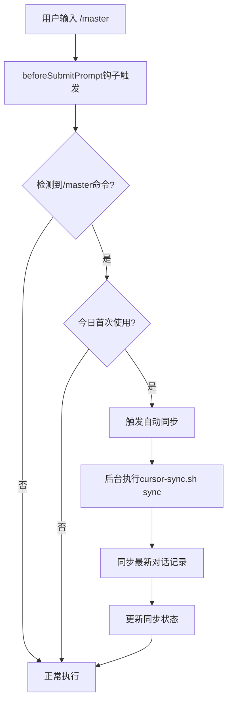

# 🎯 Master命令自动同步功能

## 概述

Master命令自动同步功能实现了**实时Cursor对话数据同步**，每当您在新的对话框中首次使用 `/master` 命令时，系统会自动同步最新的Cursor对话记录到 `.cursorGrowth` 目录中。

## 🎯 核心特性

### 🚀 智能触发机制
- **事件驱动**: 在 `beforeSubmitPrompt` 钩子事件中触发
- **命令检测**: 自动检测 `/master` 命令的使用
- **首次使用**: 只在当天首次使用时同步，避免重复操作
- **异步执行**: 同步过程不阻塞命令执行

### 📊 同步内容
- **对话记录**: 完整的用户与AI助手对话历史
- **Agent数据**: AI助手的响应模式和行为数据
- **上下文信息**: 代码编辑和项目状态信息
- **时间戳**: 精确的对话时间记录

### ⚡ 性能优化
- **增量同步**: 只同步新增的对话记录
- **状态跟踪**: 记录同步状态，避免重复同步
- **后台执行**: 同步在后台进行，不影响用户体验
- **错误容忍**: 同步失败不影响 `/master` 命令正常执行

## 🔧 工作流程



## 📁 同步数据结构

```
.cursorGrowth/
├── ai-conversation-cursor-{uuid}.json    # 同步的对话记录
├── integrations/sync/
│   └── cursor_sync_status.json          # 同步状态跟踪
└── growth_meta.json                     # 生长元数据
```

## ⚙️ 配置说明

### 钩子配置 (hooks.json)
```json
{
  "name": "master-sync",
  "description": "Master命令首次使用时自动同步Cursor对话记录",
  "command": "features/hooks/master-sync.sh",
  "timeout": 10000,
  "async": true,
  "enabled": true
}
```

### 同步状态文件
```json
{
  "sync_status": {
    "last_sync": "2026-01-22 15:23:37",
    "total_synced": 1,
    "cursor_transcripts_dir": "/path/to/agent-transcripts",
    "auto_sync_enabled": false,
    "sync_interval_minutes": 30
  },
  "synced_files": {
    "2824b486-c681-4ce8-a48d-5e664f8b4bd2": 1769047724
  }
}
```

## 🎯 使用体验

### 首次使用体验
1. **打开新对话框**
2. **输入 `/master` 命令**
3. **系统自动检测并同步** (用户无感知)
4. **同步完成后正常响应**

### 重复使用体验
1. **同一天再次使用 `/master`**
2. **系统检测到已同步，跳过重复操作**
3. **直接执行命令**

## 📊 监控与统计

### 同步状态检查
```bash
.cursor/core/cursor-sync.sh status
```

### 手动同步
```bash
.cursor/core/cursor-sync.sh sync      # 同步最新记录
.cursor/core/cursor-sync.sh sync-all  # 同步所有记录
```

### 查看同步日志
```bash
find .cursorGrowth -name "*sync*" -type f
```

## 🔒 安全与隐私

- **本地处理**: 所有同步都在本地进行
- **项目隔离**: 数据只存储在项目私有目录
- **Git忽略**: `.cursorGrowth` 目录被 `.gitignore` 保护
- **权限控制**: 只读访问Cursor缓存目录

## 🚀 优势

1. **实时同步**: 使用时同步，不用等到会话结束
2. **智能检测**: 只在需要时同步，避免性能浪费
3. **无缝体验**: 用户无感知的后台同步
4. **数据完整**: 确保所有对话数据都被捕获
5. **学习优化**: 为AI学习提供更及时的数据

## 🔧 故障排除

### 同步未触发
- 检查 `hooks.json` 中 `master-sync` 钩子是否启用
- 确认 `master-sync.sh` 脚本有执行权限
- 查看Cursor项目缓存目录是否存在

### 同步失败
- 检查同步状态文件权限
- 确认Cursor IDE正在运行
- 查看系统日志中的错误信息

### 性能问题
- 同步在后台进行，不会影响响应速度
- 大量对话记录时同步可能较慢，但不阻塞用户操作

---

*此功能由 `master-sync.sh` 钩子脚本实现，实现了真正的实时同步体验。*