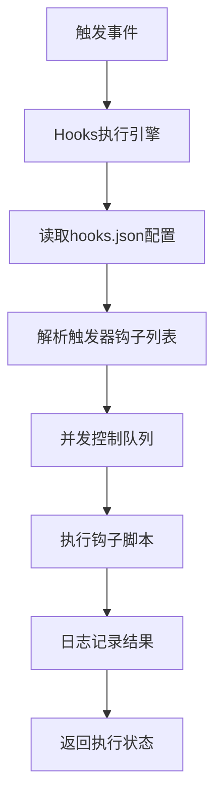

# 🔗 Cursor AI Rules 完整钩子系统集成指南

## ⚠️ 双系统区分（必读）

| 系统 | 配置文件 | 执行者 | 说明 |
|------|----------|--------|------|
| **Cursor 原生 Hooks** | `.cursor/hooks.json` | Cursor IDE | Cursor 1.7+ 内置，支持 beforeSubmitPrompt 等，需在 Settings 启用 |
| **hooks-engine** | `.cursor/features/hooks/hooks.json` | `core/hooks-engine.sh` | 自定义事件驱动，由脚本解析并调用钩子 |

- **Cursor 原生**：路径 `.cursor/hooks.json`，命令相对 `.cursor/`，如 `./hooks/ensure-growth-on-prompt.sh`
- **hooks-engine**：路径 `features/hooks/hooks.json`，命令相对项目根，如 `features/hooks/master-init.sh`

## 🎯 概述

Cursor AI Rules 现在提供了完整的钩子系统，包含8个专业钩子脚本，覆盖从初始化到监控的完整自动化流程：

### 核心钩子组件
1. **`master-init.sh`** - Master命令自动初始化
2. **`consistency-check.sh`** - 代码一致性检查
3. **`architecture-check.sh`** - 架构合规检查
4. **`performance-monitor.sh`** - 性能监控
5. **`env-perception.sh`** - 环境感知
6. **`event-logger.sh`** - 事件日志记录
7. **`growth-recorder.sh`** - 生长记录
8. **`session-optimizer.sh`** - 会话优化

### 扩展钩子组件
9. **`quality-check.sh`** - 统一质量检查
10. **`token-compression.sh`** - Token压缩优化
11. **`cursor-sync.sh`** - Cursor对话同步
12. **`config-validator.sh`** - 配置验证
13. **`dependency-check.sh`** - 依赖检查

这些钩子基于 `.cursor/core/` 和 `.cursor/config/` 中的核心脚本改造，适配了钩子系统的输入输出格式，实现了全面的自动化能力。

## 🚀 使用场景

### 1. **Cursor IDE 钩子系统** (当前配置)

```json
// .cursor/features/hooks/hooks.json
{
  "hooks": {
    "beforeSubmitPrompt": [
      {
        "name": "master-init",
        "command": "features/hooks/master-init.sh",
        "enabled": true
      }
    ]
  }
}
```

**触发条件**: 用户在 Cursor IDE 中输入包含 `/master` 或 `master` 关键词的内容

### 2. **独立脚本调用**

```bash
# 直接调用钩子脚本
echo '{"prompt": "/master 初始化项目"}' | bash .cursor/features/hooks/master-init.sh

# 在其他脚本中集成
source .cursor/features/hooks/master-init.sh
ensure_growth_directory "你的需求描述"
```

### 3. **脚本集成模式**

```bash
# 在任何需要 .cursorGrowth 目录的脚本中集成
ensure_growth_directory() {
    local user_input="$1"
    echo "{\"prompt\": \"/master $user_input\"}" | bash ".cursor/features/hooks/master-init.sh" >/dev/null 2>&1

    [ -d ".cursorGrowth" ] && return 0 || return 1
}
```

## 📋 集成示例

### 示例1: 在分析脚本中集成

```bash
#!/bin/bash
# 分析脚本示例

SCRIPT_DIR="$(cd "$(dirname "${BASH_SOURCE[0]}")" && pwd)"
HOOK_SCRIPT="$SCRIPT_DIR/../features/hooks/master-init.sh"

analyze_project() {
    # 确保生长目录存在
    echo "{\"prompt\": \"/master 项目分析\"}" | bash "$HOOK_SCRIPT" >/dev/null 2>&1

    if [ ! -d ".cursorGrowth" ]; then
        echo "❌ 无法初始化生长目录"
        return 1
    fi

    # 执行分析逻辑
    echo "📊 执行项目分析..."
    # ... 分析代码 ...
}

analyze_project
```

### 示例2: 在构建脚本中集成

```bash
#!/bin/bash
# 构建脚本示例

HOOK_SCRIPT=".cursor/features/hooks/master-init.sh"

build_project() {
    # 初始化生长目录（用于构建记录）
    echo "{\"prompt\": \"/master 项目构建\"}" | bash "$HOOK_SCRIPT" >/dev/null 2>&1

    # 记录构建开始
    mkdir -p ".cursorGrowth/builds"
    echo "{\"build_start\": \"$(date)\"}" > ".cursorGrowth/builds/current.json"

    # 执行构建
    echo "🔨 执行项目构建..."
    # ... 构建逻辑 ...

    # 记录构建结果
    echo "{\"build_end\": \"$(date)\", \"status\": \"success\"}" > ".cursorGrowth/builds/current.json"
}

build_project
```

### 示例3: 在测试脚本中集成

```bash
#!/bin/bash
# 测试脚本示例

HOOK_SCRIPT=".cursor/features/hooks/master-init.sh"

run_tests() {
    # 初始化生长目录（用于测试记录）
    echo "{\"prompt\": \"/master 运行测试\"}" | bash "$HOOK_SCRIPT" >/dev/null 2>&1

    # 创建测试记录目录
    mkdir -p ".cursorGrowth/tests"

    # 执行测试
    echo "🧪 运行测试套件..."

    # 记录测试结果
    local test_result="{\"timestamp\": \"$(date)\", \"status\": \"passed\"}"
    echo "$test_result" > ".cursorGrowth/tests/latest.json"
}

run_tests
```

## 🔧 高级配置

### 自定义触发关键词

```bash
# 修改钩子脚本中的检测逻辑
if [[ "$command_text" =~ "/(master|cursor|ai)" ]] || [[ "$prompt_text" =~ "(master|cursor|ai)" ]]; then
    # 支持更多关键词触发
fi
```

### 条件初始化

```bash
# 只在特定项目类型下初始化
if [[ "$command_text" =~ "react" ]] && [ -f "package.json" ]; then
    # React项目特有的初始化
fi
```

### 多环境支持

```bash
# 根据环境变量调整初始化行为
case "$CURSOR_ENV" in
    "development")
        # 开发环境配置
        ;;
    "production")
        # 生产环境配置
        ;;
esac
```

## 📊 性能优化

### 异步初始化

```json
// 在 hooks.json 中配置异步执行
{
  "hooks": {
    "onSessionStart": [
      {
        "name": "async-master-init",
        "command": "features/hooks/master-init.sh",
        "async": true,
        "timeout": 5000
      }
    ]
  }
}
```

### 缓存机制

```bash
# 在钩子脚本中添加缓存检查
if [ -f ".cursorGrowth/.init_complete" ]; then
    echo "✅ 生长目录已初始化，跳过" >&2
    return 0
fi

# 初始化完成后创建标记文件
touch ".cursorGrowth/.init_complete"
```

## 🛠️ 故障排除

### 问题1: 钩子没有触发

**检查**:
```bash
# 验证 hooks.json 配置
cat .cursor/features/hooks/hooks.json

# 测试钩子脚本
echo '{"prompt": "/master test"}' | bash .cursor/features/hooks/master-init.sh
```

### 问题2: 初始化失败

**检查**:
```bash
# 检查脚本权限
ls -la .cursor/features/hooks/master-init.sh

# 检查项目根目录计算
cd .cursor/features/hooks
SCRIPT_DIR="$(pwd)"
PROJECT_ROOT="$(cd "$SCRIPT_DIR/../../../.." && pwd)"
echo "PROJECT_ROOT: $PROJECT_ROOT"
```

### 问题3: 路径问题

**解决方案**:
```bash
# 使用绝对路径
HOOK_SCRIPT="$(cd "$(dirname "${BASH_SOURCE[0]}")" && pwd)/../features/hooks/master-init.sh"

# 或者使用相对路径
HOOK_SCRIPT="../../../features/hooks/master-init.sh"
```

## 🎯 最佳实践

1. **统一入口**: 在所有需要 `.cursorGrowth` 的脚本中集成相同的初始化逻辑

2. **错误处理**: 总是检查初始化结果，避免脚本在缺少生长目录时崩溃

3. **性能考虑**: 对于频繁调用的脚本，考虑添加缓存机制

4. **用户体验**: 初始化过程应该是透明的，不应该阻塞用户的主要操作

5. **向后兼容**: 确保在 `.cursorGrowth` 不存在时脚本仍能正常工作

## 🚀 扩展应用

### CI/CD 集成

```yaml
# .github/workflows/ci.yml
- name: Setup Cursor AI Rules
  run: |
    echo '{"prompt": "/master CI构建"}' | bash .cursor/features/hooks/master-init.sh
    # CI环境下的特殊配置
```

### Docker 集成

```dockerfile
# Dockerfile
COPY .cursor /app/.cursor
RUN echo '{"prompt": "/master 容器部署"}' | bash .cursor/features/hooks/master-init.sh
```

### IDE 插件集成

```javascript
// VS Code 插件中的集成
const { exec } = require('child_process');

function initializeCursorGrowth() {
    const command = 'echo \'{"prompt": "/master IDE集成"}\' | bash .cursor/features/hooks/master-init.sh';
    exec(command, (error, stdout, stderr) => {
        if (error) {
            console.error('初始化失败:', error);
            return;
        }
        console.log('Cursor AI Rules 初始化完成');
    });
}
```

---

## 🚀 高级集成：Hooks执行引擎

### 核心特性

从 v4.3.0 开始，Cursor AI Rules 提供了完整的 **Hooks执行引擎** (`core/hooks-engine.sh`)，支持：

- ✅ **基于配置驱动**: 自动读取 `hooks.json` 配置执行钩子
- ✅ **异步执行支持**: 支持同步和异步钩子执行
- ✅ **超时控制**: 每个钩子可配置执行超时时间
- ✅ **并发控制**: 限制同时执行的钩子数量
- ✅ **错误处理**: 完善的错误日志记录和处理
- ✅ **触发器系统**: 支持多种事件触发器

### 引擎架构



### 集成方式

#### 1. Cursor IDE 集成

在 `.cursor/features/hooks/hooks.json` 中配置触发器：

```json
{
  "hooks": {
    "onSessionStart": [
      {
        "name": "env-perception",
        "command": "features/hooks/env-perception.sh",
        "enabled": true,
        "async": true,
        "timeout": 5000
      }
    ]
  }
}
```

#### 2. 脚本集成

```bash
#!/bin/bash
# 在其他脚本中集成hooks执行引擎

HOOKS_ENGINE=".cursor/core/hooks-engine.sh"

# 执行会话开始钩子
"$HOOKS_ENGINE" onSessionStart

# 执行文件保存钩子
"$HOOKS_ENGINE" afterFileSave

# 执行自定义触发器
"$HOOKS_ENGINE" customTrigger /path/to/custom/hooks.json
```

#### 3. CI/CD 集成

```yaml
# .github/workflows/ci.yml
- name: Run Pre-commit Hooks
  run: |
    bash .cursor/core/hooks-engine.sh preCommitAnalysis

- name: Run Quality Checks
  run: |
    bash .cursor/core/hooks-engine.sh qualityReportGeneration
```

#### 4. Master命令集成

```bash
# 通过/master命令触发hooks
/master 执行会话优化钩子    # 自动调用 hooks-engine.sh onSessionStart
/master 运行质量检查钩子    # 自动调用 hooks-engine.sh qualityReportGeneration
```

### 触发器类型

| 触发器                        | 描述           | 使用场景               |
| ----------------------------- | -------------- | ---------------------- |
| `onSessionStart`              | 会话开始时     | 初始化环境、加载配置   |
| `afterFileSave`               | 文件保存后     | 代码检查、格式化、编译 |
| `afterShellExecution`         | Shell执行后    | 日志记录、性能监控     |
| `afterAgentResponse`          | AI响应后       | 学习记录、Token优化    |
| `beforeSubmitPrompt`          | 提交提示前     | 安全检查、上下文管理   |
| `preCommitAnalysis`           | 预提交分析     | 代码审查、测试验证     |
| `commitMessageValidation`     | 提交消息验证   | 格式检查、规范验证     |
| `preCommitOptimization`       | 预提交优化     | 代码优化、打包处理     |
| `postCommitLogging`           | 后提交日志     | 记录提交信息、通知     |
| `onSessionEnd`                | 会话结束时     | 清理资源、同步数据     |
| `onEnvironmentChange`         | 环境变化时     | 配置更新、适配调整     |
| `performanceReportGeneration` | 性能报告生成   | 性能分析、报告输出     |
| `onDebugSessionStart`         | 调试会话开始时 | 调试环境准备、模式分析 |
| `onErrorDetected`             | 错误检测时     | 错误分析、自动修复     |
| `tokenOptimization`           | Token优化      | 压缩优化、缓存管理     |
| `qualityReportGeneration`     | 质量报告生成   | 质量评估、报告生成     |
| `onComplexConversation`       | 复杂对话时     | 高级对话处理、协作编排 |

### 配置示例

#### 完整hooks.json配置

```json
{
  "version": 3,
  "description": "完整的钩子配置示例",
  "hooks": {
    "onSessionStart": [
      {
        "name": "env-perception",
        "description": "会话开始环境感知",
        "command": "features/hooks/env-perception.sh",
        "timeout": 5000,
        "async": true,
        "enabled": true
      },
      {
        "name": "session-optimizer",
        "description": "会话开始系统优化",
        "command": "features/hooks/session-optimizer.sh",
        "timeout": 10000,
        "async": true,
        "enabled": true
      }
    ],
    "afterFileSave": [
      {
        "name": "code-quality",
        "description": "代码质量检查",
        "command": "features/hooks/code-quality.sh",
        "timeout": 5000,
        "async": true,
        "enabled": true
      }
    ]
  },
  "global_config": {
    "max_execution_time": 30000,
    "error_handling": "log_and_continue",
    "logging_enabled": true,
    "telemetry_enabled": false
  }
}
```

### 性能优化

#### 异步执行配置

```json
{
  "hooks": {
    "afterFileSave": [
      {
        "name": "async-code-check",
        "command": "features/hooks/code-quality.sh",
        "async": true,
        "timeout": 10000
      }
    ]
  }
}
```

#### 超时控制

```json
{
  "hooks": {
    "performanceReportGeneration": [
      {
        "name": "performance-report",
        "command": "core/performance-dashboard.sh",
        "timeout": 15000,
        "async": true
      }
    ]
  }
}
```

### 故障排除

#### 问题1: 钩子未执行

**检查步骤**:
```bash
# 1. 验证hooks.json配置
jq '.hooks.onSessionStart[]?.enabled' .cursor/features/hooks/hooks.json

# 2. 检查钩子脚本权限
ls -la .cursor/features/hooks/

# 3. 测试引擎执行
bash .cursor/core/hooks-engine.sh onSessionStart

# 4. 查看日志
ls -la .cursorGrowth/logs/hooks/
```

#### 问题2: 钩子执行超时

**解决方案**:
```json
{
  "hooks": {
    "slowOperation": [
      {
        "name": "slow-hook",
        "command": "features/hooks/slow-operation.sh",
        "timeout": 60000,
        "async": true
      }
    ]
  }
}
```

#### 问题3: 并发控制

系统默认最大并发钩子数为5，可在引擎脚本中调整：
```bash
# 在hooks-engine.sh中修改
MAX_CONCURRENT_HOOKS=3  # 降低并发数
```

### 最佳实践

1. **合理使用异步**: 对于耗时操作使用异步执行
2. **设置合适超时**: 根据钩子复杂度设置合理的超时时间
3. **错误处理**: 总是检查钩子执行结果
4. **日志监控**: 定期检查钩子执行日志
5. **配置管理**: 使用版本控制管理hooks.json配置

### 扩展开发

#### 创建自定义钩子

```bash
#!/bin/bash
# custom-hook.sh
echo "执行自定义钩子逻辑..." >&2

# 钩子逻辑
# ...

exit 0
```

#### 添加新触发器

在 `hooks.json` 中添加自定义触发器：

```json
{
  "hooks": {
    "customTrigger": [
      {
        "name": "custom-hook",
        "command": "features/hooks/custom-hook.sh",
        "enabled": true
      }
    ]
  }
}
```

---

## 📚 完整总结

Cursor AI Rules 的钩子系统包含两个层次：

### 1. **传统钩子脚本**
- `master-init.sh` - 生长目录初始化
- `code-quality.sh` - 代码质量检查
- 其他专用钩子脚本

**特点**: 轻量级、专注特定功能、易于集成

### 2. **Hooks执行引擎**
- `hooks-engine.sh` - 统一钩子执行引擎
- `hooks.json` - 配置驱动的钩子管理
- 支持多种触发器和执行模式

**特点**: 功能全面、配置灵活、高度自动化

### 🎯 集成建议

| 场景       | 推荐方案          | 理由                                 |
| ---------- | ----------------- | ------------------------------------ |
| 简单集成   | 使用传统钩子脚本  | 轻量级，易于理解                     |
| 复杂自动化 | 使用Hooks执行引擎 | 功能全面，易于扩展                   |
| CI/CD集成  | 两者结合          | 传统钩子处理初始化，引擎处理复杂逻辑 |
| IDE插件    | Hooks执行引擎     | 支持多种触发器，适合事件驱动         |

通过这两个层次的钩子系统，Cursor AI Rules 提供了从简单到复杂的完整自动化解决方案！🚀