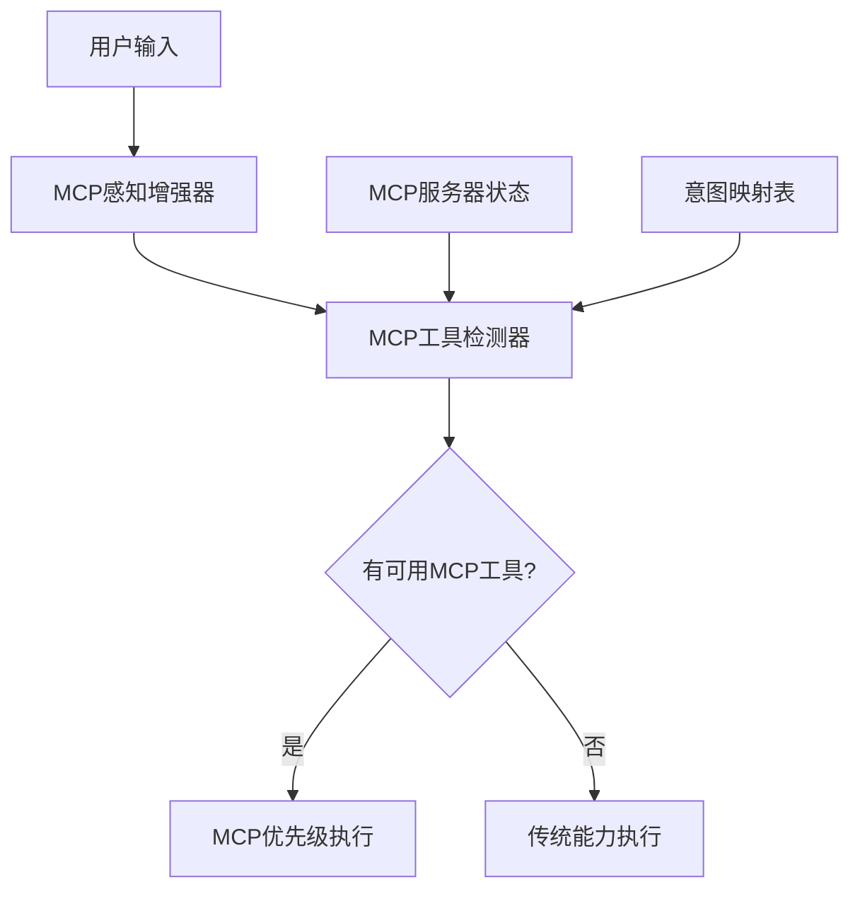

# 🎯 MCP优先级感知系统

*版本: v1.0.0 | 最后更新: 2026-01-16 | 作者: wangqiqi (https://github.com/wangqiqi)*

## 🧠 核心理念

**MCP Tools 优先调用机制**：在智能感知系统中，当用户输入意图时，优先检测并调用可用的 MCP tools，如果没有合适的 MCP tools 再回退到传统的 tools、skills、scripts 等能力。

## 🏗️ 系统架构

### 核心组件



### 组件说明

#### 1. MCP感知增强器 (`perception-enhancer.sh`)
- **功能**: 增强基础感知，集成MCP检测
- **输入**: 用户原始输入
- **输出**: 增强的感知结果（包含MCP可用性信息）

#### 2. MCP工具检测器 (`mcp-detector.sh`)
- **功能**: 检测MCP服务器和工具的可用性
- **输入**: 意图标识
- **输出**: MCP工具优先级信息

#### 3. 能力映射表 (`capability-map.json`)
- **功能**: 意图到能力的映射，支持MCP优先级
- **扩展**: 添加了 `mcp_tools` 字段支持优先级路由

## 🔄 工作流程

### 1. 意图感知阶段

```bash
# 用户输入
"提交代码"

# 基础意图分析
intent = "git_commit"

# MCP工具检测
mcp_tools = detect_mcp_tools_for_intent("git_commit")
# 返回: {"tool": "mcp_git_git_commit", "server": "git", "priority": "high", "available": true}
```

### 2. 优先级决策

```typescript
function determineExecutionStrategy(mcpTools: MCPToolInfo): ExecutionStrategy {
  if (mcpTools.available && mcpTools.priority === 'high') {
    return 'mcp_priority_execution';
  } else if (mcpTools.available && mcpTools.priority === 'medium') {
    return 'mcp_balanced_execution';
  } else {
    return 'traditional_capability_execution';
  }
}
```

### 3. 执行路由

```bash
# MCP优先级执行
if strategy === 'mcp_priority_execution':
  execute_mcp_tools(mcp_tools)

# 传统能力执行
else:
  execute_traditional_capabilities(intent)
```

## 📋 MCP工具映射表

| 意图 | MCP工具 | 服务器 | 优先级 | 说明 |
|------|---------|--------|--------|------|
| `git_status` | `mcp_git_git_status` | `mcp-git` | 高 | Git状态检查 |
| `git_add` | `mcp_git_git_add` | `mcp-git` | 高 | 添加文件到暂存区 |
| `git_commit` | `mcp_git_git_commit` | `mcp-git` | 高 | 创建提交 |
| `git_push` | `mcp_git_git_push` | `mcp-git` | 高 | 推送提交 |
| `run_tests` | `mcp_testing_run_tests` | `mcp-testing` | 高 | 运行测试 |
| `browser_navigate` | `mcp_cursor-ide-browser_browser_navigate` | `cursor-ide-browser` | 高 | 浏览器导航 |

## ⚙️ 配置选项

### 全局配置 (capability-map.json)

```json
{
  "global_config": {
    "mcp_priority_enabled": true,
    "mcp_fallback_enabled": true,
    "default_execution_timeout": 300000
  }
}
```

### 意图映射配置

```json
{
  "git_commit_mcp_priority": {
    "capabilities": {
      "mcp_tools": [
        {
          "intent": "git_status",
          "tool": "mcp_git_git_status",
          "server": "mcp-git",
          "priority": "high"
        }
      ],
      "rules": ["intelligent_evolution"],
      "scripts": ["core/git-commit.sh"]
    },
    "execution_order": ["mcp_tools", "rules", "scripts"]
  }
}
```

## 🛠️ 使用方法

### 检测MCP服务器可用性

```bash
# 检测所有MCP服务器
./.cursor/core/mcp-detector.sh detect

# 检查特定意图的MCP工具
./.cursor/core/mcp-detector.sh check git_commit

# 列出所有映射
./.cursor/core/mcp-detector.sh list
```

### 执行增强感知

```bash
# 分析用户输入
./.cursor/core/perception-enhancer.sh analyze "提交代码"

# 演示功能
./.cursor/core/perception-enhancer.sh demo
```

## 🔧 扩展开发

### 添加新的MCP工具映射

1. **更新映射表** (`mcp-detector.sh`)
   ```bash
   MCP_TOOLS_MAPPING["new_intent"]="mcp_server_tool_name"
   ```

2. **更新能力映射** (`capability-map.json`)
   ```json
   {
     "mcp_tools": [
       {
         "intent": "new_intent",
         "tool": "mcp_server_tool_name",
         "server": "server-name",
         "priority": "high"
       }
     ]
   }
   ```

3. **测试集成**
   ```bash
   ./.cursor/core/perception-enhancer.sh analyze "new intent input"
   ```

## 📊 优先级策略

### 高优先级 (High Priority)
- **确定性任务**: Git操作、文件系统操作、数据库查询
- **标准化接口**: 已有成熟MCP实现的领域
- **性能敏感**: 需要高效执行的任务

### 中优先级 (Medium Priority)
- **半确定性任务**: 数据处理、格式转换
- **新兴领域**: MCP实现相对较新的领域
- **上下文相关**: 需要一定智能判断的任务

### 低优先级 (Low Priority)
- **创造性任务**: 代码生成、设计创作
- **复杂决策**: 需要深度推理的任务
- **个性化需求**: 高度依赖上下文的任务

## 🚀 优势

### 性能优势
- **响应速度**: MCP tools 通常比传统脚本更快
- **资源效率**: 减少不必要的脚本调用
- **网络优化**: 直接调用远程服务，避免中间层

### 智能优势
- **意图准确性**: 更精确的意图理解和执行
- **错误处理**: MCP协议内置错误处理机制
- **标准化**: 统一的工具调用接口

### 用户体验
- **无缝集成**: 用户无需关心底层实现
- **智能回退**: 自动选择最合适的执行方式
- **透明执行**: 清晰的执行状态反馈

---

*🎯 MCP优先级感知系统 - 让AI智能助手更聪明地选择执行方式*