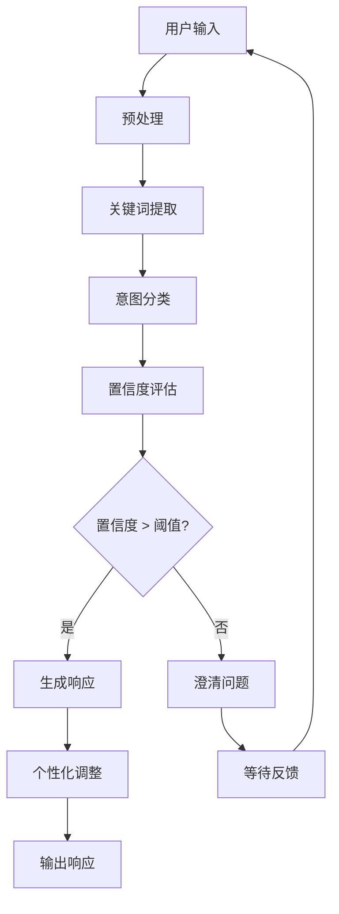

# 意图分类体系 (Intent Classification System)

> 本规则由 `@conversation_intent_analyzer` 引用，定义意图识别与分类逻辑

## 系统架构

```
对话意图分析器
├── 🎯 意图分类器 (Intent Classifier)     # 意图类型识别
├── 🔍 关键词分析器 (Keyword Analyzer)   # 多层次关键词分析
├── 🧠 响应策略引擎 (Response Engine)     # 智能响应生成
├── 📚 模板库 (Template Library)          # 响应模板管理
└── ⚙️ 配置管理器 (Config Manager)        # 动态配置管理
```

## 数据流



## 一级意图：操作类型

```yaml
intent_categories:
  creation:
    keywords: ["创建", "开发", "构建", "设计", "实现", "制作", "搭建", "建立"]
    confidence: 0.9
    description: "用户想要创建新项目或系统"

  optimization:
    keywords: ["优化", "改进", "提升", "增强", "重构", "重写", "升级", "完善"]
    confidence: 0.8
    description: "用户想要改进现有系统"

  analysis:
    keywords: ["分析", "评估", "检查", "诊断", "审计", "审查", "监控", "测试"]
    confidence: 0.7
    description: "用户需要分析或诊断问题"

  deployment:
    keywords: ["部署", "发布", "上线", "交付", "安装", "配置", "运维", "维护"]
    confidence: 0.8
    description: "用户关注部署和运维"

  learning:
    keywords: ["学习", "了解", "掌握", "教程", "指南", "文档", "帮助", "指导"]
    confidence: 0.6
    description: "用户需要学习和技术指导"

  refactor_sync:
    keywords: ["同步修改", "关联更新", "级联修改", "批量更新", "重构同步", "模块同步", "联动修改", "连锁更新"]
    confidence: 0.8
    description: "用户需要同步修改多个相关文件和模块"
```

## 二级意图：技术领域

```yaml
tech_domains:
  frontend:
    keywords: ["前端", "界面", "UI", "用户体验", "交互", "组件", "网页", "网站"]
    technologies: ["React", "Vue", "Angular", "TypeScript", "JavaScript", "HTML", "CSS"]
    confidence: 0.8

  backend:
    keywords: ["后端", "服务端", "API", "服务器", "微服务", "数据库"]
    technologies: ["Node.js", "Python", "Java", "Go", "Spring", "Django", "FastAPI"]
    confidence: 0.8

  data:
    keywords: ["数据", "存储", "缓存", "数据库", "大数据", "ETL", "数据仓库"]
    technologies: ["MySQL", "PostgreSQL", "MongoDB", "Redis", "Elasticsearch", "Kafka"]
    confidence: 0.7

  ai_ml:
    keywords: ["AI", "人工智能", "机器学习", "深度学习", "神经网络", "训练", "推理", "标注"]
    technologies: ["TensorFlow", "PyTorch", "Scikit-learn", "OpenCV", "Transformers"]
    confidence: 0.9

  devops:
    keywords: ["DevOps", "CI/CD", "自动化", "容器", "云服务", "监控", "日志"]
    technologies: ["Docker", "Kubernetes", "Jenkins", "GitLab CI", "AWS", "Azure"]
    confidence: 0.7

  security:
    keywords: ["安全", "认证", "授权", "加密", "隐私", "合规", "漏洞"]
    technologies: ["OAuth", "JWT", "SSL/TLS", "OWASP", "加密算法"]
    confidence: 0.8
```

## 意图响应策略

| 意图类型 | 置信度 | 响应策略 | 是否允许直接行动 |
|----------|--------|----------|------------------|
| `creation` | >0.7 | 讨论需求 + 方案建议 | ❌ **禁止** |
| `creation` | 0.5-0.7 | 澄清问题 + 初步建议 | ❌ **禁止** |
| `creation` | <0.5 | 提出澄清问题 | ❌ **禁止** |
| `optimization` | >0.7 | 分析现有代码 + 优化建议 | ✅ 允许（针对现有项目） |
| `analysis` | >0.7 | 执行分析 + 报告结果 | ✅ 允许（分析操作） |
| `refactor_sync` | >0.7 | 检测同步需求 + 生成提醒 | ✅ 允许（同步分析操作） |
| `refactor_sync` | 0.5-0.7 | 确认同步范围 + 初步分析 | ✅ 允许（需用户确认） |
| `refactor_sync` | <0.5 | 澄清同步需求 + 范围界定 | ✅ 允许（范围界定操作） |

**重要原则**：项目创建意图必须经过需求讨论和方案确认阶段，绝不允许直接开始开发！

## 智能匹配算法要点

1. **文本预处理** → 分词、归一化
2. **关键词提取** → 计算各意图/领域的匹配分数
3. **意图分类** → 选择最高分的一级意图 + 技术领域
4. **置信度计算** → 综合关键词得分与上下文验证
5. **上下文验证** → 避免误判，调整最终置信度

---

*引用: @conversation_intent_analyzer*
