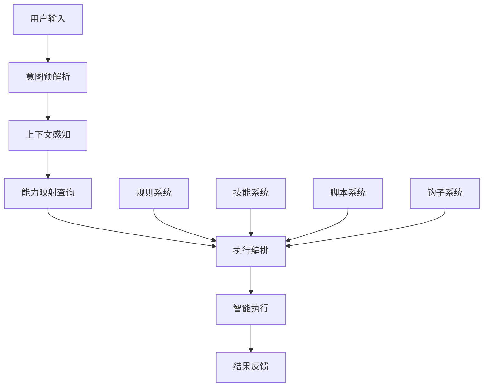

# 🎯 统一命令路由器 (Unified Command Router)

*版本: v4.3.0 | 最后更新: {{GENERATION_TIME}} | 作者: wangqiqi (https://github.com/wangqiqi)*

## 🧠 核心理念：意图驱动的统一执行引擎

**颠覆传统调用模式**：不再需要用户记忆各种规则、技能、脚本的调用语法，通过智能意图解析，自动路由到最合适的执行组合。

### 🎯 工作原理



## 🏗️ 系统架构

### 核心组件

```typescript
interface UnifiedCommandRouter {
  // 意图解析
  parseIntent(input: string): IntentAnalysis;

  // 能力映射
  mapCapabilities(intent: IntentAnalysis): CapabilitySet;

  // 执行编排
  orchestrateExecution(capabilities: CapabilitySet): ExecutionPlan;

  // 智能执行
  executePlan(plan: ExecutionPlan): ExecutionResult;
}

interface IntentAnalysis {
  primaryIntent: string;        // 主要意图
  secondaryIntents: string[];   // 次要意图
  confidence: number;           // 置信度
  context: ContextData;         // 上下文信息
  parameters: Record<string, any>; // 参数提取
}

interface CapabilitySet {
  rules: string[];             // 需要激活的规则
  skills: string[];            // 需要调用的技能
  scripts: string[];           // 需要执行的脚本
  hooks: string[];             // 需要触发的钩子
  workflows: string[];         // 需要执行的工作流
}
```

### 能力映射表设计

基于 `capability-map.json` 的智能映射：

```json
{
  "version": "1.0.0",
  "mappings": {
    "create_react_project": {
      "intents": ["create", "project", "react"],
      "confidence_threshold": 0.8,
      "capabilities": {
        "rules": ["conversation_intent_analyzer", "generator", "templates"],
        "skills": ["react", "node", "typescript"],
        "scripts": ["cursor-adaptation-setup.sh", "perception.sh"],
        "workflows": ["project-init", "dependency-install", "config-setup"],
        "hooks": ["after-project-init"]
      },
      "execution_order": ["perception", "rules", "scripts", "skills", "workflows"],
      "fallback_strategies": ["scaffold-basic", "manual-guide"]
    },

    "check_code_quality": {
      "intents": ["check", "quality", "code"],
      "confidence_threshold": 0.7,
      "capabilities": {
        "rules": ["eslint", "intelligent_evolution"],
        "skills": ["code-quality"],
        "scripts": ["check.sh"],
        "workflows": ["lint", "audit", "report"],
        "hooks": ["code-quality.sh"]
      },
      "execution_order": ["rules", "scripts", "hooks", "workflows"],
      "quality_gates": {
        "max_warnings": 10,
        "max_errors": 0,
        "coverage_min": 80
      }
    },

    "commit_code": {
      "intents": ["commit", "git", "save"],
      "confidence_threshold": 0.9,
      "capabilities": {
        "rules": ["git-workflow"],
        "scripts": ["git-commit.sh"],
        "hooks": ["commit-msg-check.sh", "pre-commit.sh"],
        "workflows": ["stage", "commit", "push"]
      },
      "execution_order": ["hooks", "scripts", "workflows"],
      "validation_rules": {
        "message_format": "type(scope): description",
        "max_line_length": 72,
        "require_tests": true
      }
    }
  },

  "global_config": {
    "default_execution_timeout": 300000,
    "max_parallel_executions": 3,
    "error_handling_strategy": "graceful_degradation",
    "logging_level": "info",
    "telemetry_enabled": false
  }
}
```

## 🎯 智能意图解析

### 多层次意图识别

```typescript
class IntentParser {
  // 第一层：关键词匹配
  private keywordMatching(input: string): KeywordMatches {
    const matches = {
      primary: [] as string[],
      secondary: [] as string[],
      context: [] as string[]
    };

    // 匹配意图关键词
    for (const [intent, keywords] of Object.entries(this.intentKeywords)) {
      const matched = keywords.filter(k => input.includes(k));
      if (matched.length > 0) {
        matches.primary.push(intent);
      }
    }

    return matches;
  }

  // 第二层：语义理解
  private semanticAnalysis(input: string, keywords: KeywordMatches): SemanticAnalysis {
    // 使用NLP技术进行语义分析
    return {
      intent: this.determinePrimaryIntent(keywords),
      confidence: this.calculateConfidence(keywords),
      entities: this.extractEntities(input),
      context: this.analyzeContext(input)
    };
  }

  // 第三层：上下文增强
  private contextEnhancement(analysis: SemanticAnalysis): EnhancedAnalysis {
    // 考虑项目状态、用户历史、环境因素
    const projectContext = this.getProjectContext();
    const userHistory = this.getUserHistory();
    const environment = this.getEnvironmentInfo();

    return {
      ...analysis,
      project_maturity: projectContext.maturity,
      user_expertise: userHistory.expertise,
      environment_type: environment.type,
      recommended_approach: this.recommendApproach(analysis, projectContext)
    };
  }
}
```

### 意图关键词库

```json
{
  "intent_keywords": {
    "project_creation": [
      "创建", "开发", "构建", "搭建", "初始化", "新建",
      "create", "build", "setup", "initialize", "new"
    ],
    "code_quality": [
      "检查", "质量", "规范", "优化", "重构", "修复",
      "check", "quality", "lint", "format", "fix", "refactor"
    ],
    "version_control": [
      "提交", "推送", "拉取", "合并", "分支", "标签",
      "commit", "push", "pull", "merge", "branch", "tag"
    ],
    "testing": [
      "测试", "单元测试", "集成测试", "端到端测试",
      "test", "unit", "integration", "e2e"
    ],
    "deployment": [
      "部署", "发布", "上线", "交付",
      "deploy", "release", "publish", "deliver"
    ],
    "learning": [
      "学习", "了解", "掌握", "教程", "文档",
      "learn", "understand", "master", "tutorial", "docs"
    ]
  },

  "tech_keywords": {
    "frontend": ["前端", "界面", "UI", "React", "Vue", "Angular"],
    "backend": ["后端", "服务端", "API", "Node.js", "Python", "Java"],
    "database": ["数据库", "存储", "MySQL", "PostgreSQL", "MongoDB"],
    "cloud": ["云服务", "AWS", "Azure", "Docker", "Kubernetes"]
  }
}
```

## ⚡ 执行编排引擎

### 智能执行编排

```typescript
class ExecutionOrchestrator {
  async orchestrate(capabilities: CapabilitySet): Promise<ExecutionPlan> {
    // 1. 依赖分析
    const dependencies = await this.analyzeDependencies(capabilities);

    // 2. 执行顺序规划
    const executionOrder = this.planExecutionOrder(capabilities, dependencies);

    // 3. 资源分配
    const resourceAllocation = this.allocateResources(executionOrder);

    // 4. 错误处理策略
    const errorHandling = this.planErrorHandling(executionOrder);

    // 5. 回滚计划
    const rollbackPlan = this.createRollbackPlan(executionOrder);

    return {
      steps: executionOrder,
      resources: resourceAllocation,
      errorHandling,
      rollbackPlan,
      estimatedDuration: this.estimateDuration(executionOrder)
    };
  }

  private analyzeDependencies(capabilities: CapabilitySet): Promise<DependencyGraph> {
    // 分析规则、技能、脚本之间的依赖关系
    const graph: DependencyGraph = {
      nodes: [],
      edges: []
    };

    // 添加规则依赖
    for (const rule of capabilities.rules) {
      graph.nodes.push({ type: 'rule', name: rule, dependencies: [] });
    }

    // 添加技能依赖
    for (const skill of capabilities.skills) {
      const skillDeps = this.getSkillDependencies(skill);
      graph.nodes.push({ type: 'skill', name: skill, dependencies: skillDeps });
    }

    // 构建依赖图
    this.buildDependencyGraph(graph);

    return Promise.resolve(graph);
  }
}
```

### 执行步骤定义

```typescript
interface ExecutionStep {
  id: string;
  type: 'rule' | 'skill' | 'script' | 'hook' | 'workflow';
  name: string;
  parameters?: Record<string, any>;
  timeout?: number;
  retryPolicy?: RetryPolicy;
  dependencies: string[];  // 依赖的步骤ID
  successCriteria?: SuccessCriteria;
  onFailure?: FailureAction;
}

interface ExecutionPlan {
  id: string;
  steps: ExecutionStep[];
  parallelGroups: ExecutionStep[][];  // 可并行执行的步骤组
  resourceRequirements: ResourceRequirements;
  estimatedDuration: number;
  timeout: number;
  retryPolicy: RetryPolicy;
}
```

## 🚀 智能执行引擎

### 执行状态管理

```typescript
class ExecutionEngine {
  private activeExecutions: Map<string, ExecutionContext> = new Map();

  async execute(plan: ExecutionPlan): Promise<ExecutionResult> {
    const executionId = this.generateExecutionId();
    const context: ExecutionContext = {
      id: executionId,
      plan,
      status: 'running',
      startTime: Date.now(),
      stepResults: new Map(),
      currentStep: 0
    };

    this.activeExecutions.set(executionId, context);

    try {
      // 预执行检查
      await this.preExecutionChecks(plan);

      // 执行步骤
      const result = await this.executeSteps(context);

      // 后执行处理
      await this.postExecutionProcessing(context, result);

      return result;

    } catch (error) {
      // 错误处理和回滚
      await this.handleExecutionError(context, error);
      throw error;
    } finally {
      this.activeExecutions.delete(executionId);
    }
  }

  private async executeSteps(context: ExecutionContext): Promise<ExecutionResult> {
    const results: StepResult[] = [];

    // 按执行计划执行步骤
    for (const step of context.plan.steps) {
      // 检查依赖
      if (!this.checkDependencies(step, context.stepResults)) {
        throw new Error(`Dependencies not satisfied for step ${step.id}`);
      }

      // 执行步骤
      const stepResult = await this.executeStep(step, context);
      context.stepResults.set(step.id, stepResult);
      results.push(stepResult);

      // 检查是否应该继续
      if (stepResult.status === 'failed' && step.onFailure === 'stop') {
        break;
      }
    }

    return {
      executionId: context.id,
      status: this.determineOverallStatus(results),
      stepResults: results,
      duration: Date.now() - context.startTime,
      summary: this.generateExecutionSummary(results)
    };
  }
}
```

## 📊 学习与优化

### 执行历史分析

```typescript
class ExecutionLearner {
  async learnFromExecution(result: ExecutionResult): Promise<void> {
    // 1. 记录执行数据
    await this.recordExecutionData(result);

    // 2. 分析执行模式
    const patterns = await this.analyzeExecutionPatterns(result);

    // 3. 识别改进机会
    const improvements = this.identifyImprovements(patterns);

    // 4. 更新能力映射
    await this.updateCapabilityMappings(improvements);

    // 5. 优化执行计划
    await this.optimizeExecutionPlans(improvements);
  }

  private async analyzeExecutionPatterns(result: ExecutionResult): Promise<ExecutionPatterns> {
    return {
      successfulSequences: this.extractSuccessfulSequences(result),
      failurePoints: this.identifyFailurePoints(result),
      performanceBottlenecks: this.findPerformanceBottlenecks(result),
      resourceUsagePatterns: this.analyzeResourceUsage(result),
      userSatisfactionIndicators: this.assessUserSatisfaction(result)
    };
  }
}
```

## 🛠️ 配置与扩展

### 路由器配置

```json
{
  "command_router": {
    "version": "1.0.0",
    "enabled": true,
    "intent_parsing": {
      "confidence_threshold": 0.7,
      "max_intent_candidates": 3,
      "context_window_size": 5,
      "learning_enabled": true
    },
    "execution_engine": {
      "max_parallel_executions": 3,
      "default_timeout": 300000,
      "retry_attempts": 2,
      "resource_limits": {
        "cpu_percent": 50,
        "memory_mb": 256,
        "disk_mb": 100
      }
    },
    "capability_mappings": {
      "auto_discovery": true,
      "version_checking": true,
      "dependency_validation": true,
      "cache_enabled": true,
      "cache_ttl": 3600000
    }
  }
}
```

---

*🎯 统一命令路由器让AI成为真正的智能助手，用户只需描述需求，系统自动编排和执行所有必要操作。*

*核心创新*: 从分散调用到统一入口，从被动响应到主动执行！