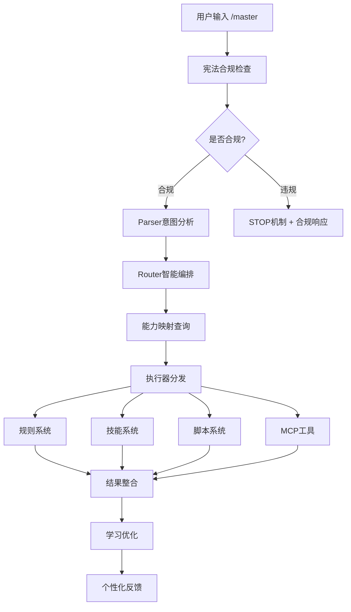
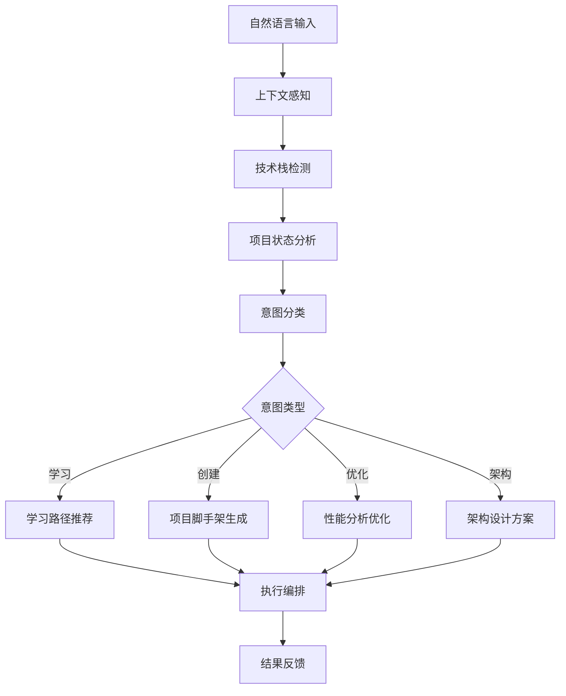

# 🎯 Master智能命令中心

## 概述
Cursor AI Rules的智能Master控制器 - 你的AI编程助手和命令中心，提供全方位的开发支持和智能指导。

## 🚀 核心功能

### 📚 学习与培训
- **技术学习路径**: 提供结构化的学习路线和资源推荐
- **最佳实践指导**: 分享行业标准和最佳实践
- **技能提升建议**: 基于当前水平的个性化提升计划

### 🛠️ 开发工具链
- **项目脚手架**: 智能推荐和生成项目模板
- **代码质量检查**: 自动化代码审查和质量评估
- **性能优化指导**: 识别瓶颈并提供优化方案

### 🎯 架构与设计
- **系统架构设计**: 从需求到实现的完整架构方案
- **技术栈选择**: 基于项目特点的智能技术栈推荐
- **设计模式应用**: 合适的设计模式和架构模式指导

### 🔧 运维与部署
- **CI/CD配置**: 自动化流水线设计和实现
- **容器化方案**: Docker和Kubernetes部署指导
- **监控告警**: 系统监控和日志收集方案

## 🔄 工作流程

### 🎯 Master智能处理流程



### 🧠 智能意图识别流程



## 📋 命令使用指南

### 基础语法
```
/master [具体需求描述]
```

### 智能意图识别
系统会自动识别你的意图并提供相应帮助：

#### 学习类意图
```
/master 学习JavaScript高级特性
/master 掌握React Hooks使用方法
/master 理解微服务架构设计
```

#### 项目创建意图
```
/master 创建一个电商网站后端API
/master 搭建React + Node.js全栈项目
/master 初始化Python数据分析项目
```

#### 代码分析意图
```
/master 分析这个函数的性能问题
/master 检查代码的安全漏洞
/master 优化数据库查询性能
```

#### 架构设计意图
```
/master 设计高并发系统架构
/master 规划微服务拆分方案
/master 设计API网关和认证系统
```

## 🎨 高级功能

### 多场景支持
- **新手入门**: 提供基础概念和简单示例
- **进阶提升**: 深入的技术原理和最佳实践
- **企业级应用**: 复杂系统设计和架构优化

### 上下文感知
- **项目环境**: 自动感知当前技术栈和项目结构
- **代码内容**: 分析选中的代码片段
- **历史记录**: 基于过往交互提供连续性帮助

### 个性化推荐
- **技能评估**: 根据你的提问难度调整回答深度
- **偏好学习**: 记住你的技术偏好和学习风格
- **渐进引导**: 从基础到高级的逐步指导

## 💡 智能提示系统

### 自动补全建议
当你输入 `/master` 时，系统会提供智能建议：
- 基于当前文件的编程语言
- 基于项目的技术栈
- 基于最近的开发活动

### 上下文增强
- **文件感知**: 知道你在编辑什么文件
- **选择感知**: 理解你选中的代码内容
- **项目感知**: 了解项目的整体架构

## 📊 系统能力

### 技术栈覆盖
- **前端**: React, Vue, Angular, TypeScript, JavaScript
- **后端**: Node.js, Python, Java, Go, PHP, .NET
- **数据库**: PostgreSQL, MySQL, MongoDB, Redis
- **云服务**: AWS, Azure, GCP, Vercel, Netlify
- **DevOps**: Docker, Kubernetes, Jenkins, GitLab CI

### 专业领域
- **Web开发**: 全栈应用开发和部署
- **移动开发**: React Native, Flutter应用开发
- **数据科学**: Python数据分析和机器学习
- **系统设计**: 高并发架构和微服务设计
- **安全开发**: 代码安全和系统安全最佳实践

## 🔄 工作流程

### 1. 需求分析
系统首先分析你的需求和当前上下文

### 2. 方案生成
基于分析结果生成针对性的解决方案

### 3. 分步指导
提供详细的实施步骤和代码示例

### 4. 最佳实践
融入行业最佳实践和标准规范

### 5. 持续优化
根据反馈持续改进和优化建议

## 🌟 实际应用场景

### 新项目启动
```
/master 创建一个现代化的博客系统
```
→ 系统会提供完整的技术栈选择、项目结构设计、开发计划

### 代码重构
```
/master 重构这个类的设计模式
```
→ 系统会分析现有代码，建议合适的设计模式，提供重构方案

### 性能优化
```
/master 优化这个API的响应速度
```
→ 系统会识别性能瓶颈，提供具体的优化建议和实现代码

### 架构咨询
```
/master 设计高可用微服务架构
```
→ 系统会提供完整的架构设计方案，包括服务拆分、通信方式、监控方案

## ⚙️ 高级配置

### 偏好设置
你可以通过描述来设置系统偏好：
- `/master 我更喜欢Python后端`
- `/master 我需要详细的代码注释`
- `/master 我关注性能优化`

### 领域定制
系统会根据你的项目类型自动调整：
- **创业项目**: 快速原型和MVP开发
- **企业项目**: 稳定性、安全性和可维护性
- **开源项目**: 社区标准和文档完整性

## 🎯 为什么选择 /master

### 智能程度
- **意图理解**: 准确识别你的真实需求
- **上下文感知**: 了解你的开发环境和习惯
- **个性化推荐**: 根据你的水平和偏好调整建议

### 功能全面
- **覆盖面广**: 从基础学习到企业级架构
- **技术栈全**: 支持主流和前沿技术
- **场景丰富**: 适用于各种开发场景

### 使用便捷
- **零配置**: 无需复杂设置，开箱即用
- **自然交互**: 用日常语言描述需求
- **即时响应**: 快速提供准确的帮助

## 🚀 立即开始

现在就开始使用强大的Master命令中心吧！

输入 `/master` 后描述你的需求，AI会为你提供最专业的开发指导和解决方案。

**示例**:
- `/master 学习现代前端开发技术栈`
- `/master 创建一个AI驱动的Web应用`
- `/master 设计高性能的后端API架构`

让Master成为你的智能编程伙伴！ 🎯✨