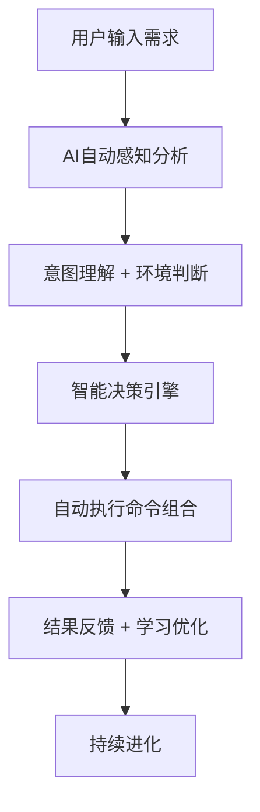
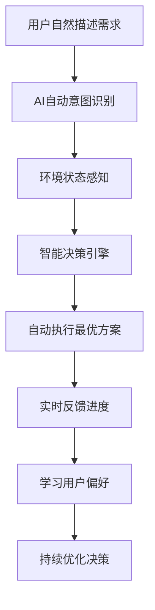

# 🎯 智能总命令控制器 (Intelligent Master Command Controller)

*版本: v4.1.0 | 最后更新: 2026-01-15 | 作者: wangqiqi (https://github.com/wangqiqi)*

## 🧠 核心理念：智能感知 + 自动决策 + 自主执行

**颠覆传统命令模式**：不再需要用户记忆复杂的命令语法和参数，AI通过智能感知自动理解需求并执行最合适的操作组合。

### 🎯 智能工作流程



### ✨ 核心特性

- 🧠 **智能感知**: 自动分析用户意图、项目状态、环境上下文
- 🎯 **自动决策**: 基于感知结果智能选择最合适的操作组合
- ⚡ **一键执行**: 用户只需描述需求，AI自动完成所有必要操作
- 📈 **持续学习**: 从每次交互中学习，持续优化决策质量
- 🔄 **自适应进化**: 根据项目特点和用户偏好动态调整行为

## 🛠️ 智能使用方法

### 🎯 核心用法：自然语言驱动

```bash
# 直接描述你的需求，AI自动感知并执行
@master 我想创建一个React项目
@master 需要优化代码质量检查
@master 帮我分析项目现状
@master 准备部署环境
@master 学习新技术栈

# 传统模式（仍然支持）
@master list    # 查看所有可用命令
@master help    # 查看智能使用指南
```

### 🧠 智能感知引擎

系统会自动分析：
- **用户意图**: 创建项目、优化代码、部署上线、学习技术等
- **项目状态**: 技术栈、开发阶段、团队规模等
- **环境上下文**: 操作系统、工具链、依赖状态等
- **历史偏好**: 用户过往的选择和反馈

### ⚡ 自动决策逻辑

基于感知结果，AI会：
1. **识别需求类型** - 项目创建/代码优化/部署运维/技术学习
2. **评估项目状态** - 新项目/成熟项目/重构项目
3. **选择最佳方案** - 推荐最适合的技术栈和工具组合
4. **执行操作序列** - 按正确顺序自动执行所需命令
5. **提供反馈建议** - 实时反馈执行状态和后续建议

## 📚 可用规则命令 (Rules)

以下是 `.cursor/rules/` 目录下的所有规则命令：

| 命令 | 描述 | 状态 |
|------|------|------|
| `constitution` | AI共生宪法 - 定义人机协作的核心原则和最高准则 | ✅ 总是启用 |
| `conversation_intent_analyzer` | 对话意图分析器 - 基于用户对话内容理解需求并提供项目规划建议 | ✅ 总是启用 |
| `eslint` | ESLint代码质量检查集成 - 自动检测和修复JavaScript代码问题 | ✅ 总是启用 |
| `evolution-automation` | 自动化演进系统 - 基于感知数据的智能规则自动优化 | 🔄 按需启用 |
| `evolution-governance` | 演进治理机制 - 规则演进的安全保障和质量控制体系 | 🔄 按需启用 |
| `evolution-manual` | 手动演进流程 - 规则演进的手动触发和管理流程 | 🔄 按需启用 |
| `evolution-philosophy` | 演进哲学 - 项目规则持续演进的核心理念和原则指导 | 🔄 按需启用 |
| `generator` | 项目规则生成器 - 自动化生成个性化项目规则配置 | 🔄 按需启用 |
| `i18n` | 国际化支持系统 - 自动检测用户语言偏好并切换沟通和注释语言 | ✅ 总是启用 |
| `intelligent_evolution` | 智能演进系统入口 - 规则演进的统一入口和协调器 | 🔄 按需启用 |
| `module_manager` | 规则管理系统 - 管理.cursor规则的依赖关系、激活控制和扩展机制 | ✅ 总是启用 |
| `philosophy` | 交流哲学与协作模式 - 定义人机协作的沟通准则和协作模式 | ✅ 总是启用 |
| `platform_adapter` | 跨平台适配器 - 统一管理不同操作系统间的命令、路径和环境适配 | ✅ 总是启用 |
| `system_info` | 系统信息获取器 - 自动获取时间、路径和作者信息的通用机制 | ✅ 总是启用 |
| `templates` | 项目配置模板框架 - 自动化生成项目初始化配置 | 🔄 按需启用 |

## 🔧 可用脚本命令 (Scripts)

以下是 `.cursor/scripts/` 目录下的所有可执行脚本：

| 脚本 | 描述 | 执行方式 |
|------|------|----------|
| `check.sh` | 代码质量检查脚本 | `bash .cursor/scripts/check.sh` |
| `enable.sh` | 插件启用脚本 | `bash .cursor/scripts/enable.sh` |
| `env_check.sh` | 环境依赖检查脚本 | `bash .cursor/scripts/env_check.sh` |
| `growth_init.sh` | 项目增长初始化脚本 | `bash .cursor/scripts/growth_init.sh` |
| `perception.sh` | 智能感知分析脚本 | `bash .cursor/scripts/perception.sh` |
| `plugin_manager.sh` | 插件管理系统脚本 | `bash .cursor/scripts/plugin_manager.sh` |

## 🎯 快速操作指南

### 常用组合命令

```bash
# 初始化新项目环境
@master script enable.sh    # 启用基础插件
@master script env_check.sh # 检查环境依赖
@master rule generator      # 生成项目规则

# 代码质量检查
@master script check.sh     # 运行代码检查
@master rule eslint         # 启用ESLint检查

# 智能演进管理
@master script perception.sh    # 运行感知分析
@master rule intelligent_evolution  # 启用智能演进
```

### 项目启动流程

对于新项目，建议按以下顺序执行：

1. **环境准备**
   ```bash
   @master script env_check.sh  # 检查环境依赖
   @master script enable.sh     # 启用必要插件
   ```

2. **规则配置**
   ```bash
   @master rule generator       # 生成个性化规则
   @master rule constitution    # 确认协作原则
   ```

3. **质量保障**
   ```bash
   @master rule eslint         # 启用代码检查
   @master script check.sh     # 执行首次检查
   ```

## 🚀 智能执行引擎

### 🎯 核心AI决策逻辑

```bash
#!/bin/bash

# 🎯 智能Master命令控制器 v3.0
# 自动感知 + 智能决策 + 自主执行
#
# 使用方法:
#   @master [自然语言需求描述]    # 智能自动执行
#   @master list                   # 查看可用命令
#   @master help                   # 智能使用指南

set -e

# 获取脚本所在目录的绝对路径
SCRIPT_DIR="$(cd "$(dirname "${BASH_SOURCE[0]}")" && pwd)"
CURSOR_DIR="$SCRIPT_DIR/.cursor"
PROJECT_ROOT="$(git rev-parse --show-toplevel 2>/dev/null || pwd)"

# 颜色定义
RED='\033[0;31m'
GREEN='\033[0;32m'
YELLOW='\033[1;33m'
BLUE='\033[0;34m'
PURPLE='\033[0;35m'
CYAN='\033[0;36m'
NC='\033[0m' # No Color

# 🧠 智能感知引擎
analyze_user_intent() {
    local user_input="$1"

    echo "🧠 正在分析用户意图..." >&2

    # 初始化分析结果
    local intent_type="unknown"
    local confidence=0
    local actions=()

    # 意图识别规则
    if echo "$user_input" | grep -qiE "(创建|开发|构建|搭建|做一个)"; then
        intent_type="project_creation"
        confidence=90
        actions=("env_check" "enable" "generator" "constitution")
    elif echo "$user_input" | grep -qiE "(优化|改进|重构|质量|检查)"; then
        intent_type="code_optimization"
        confidence=85
        actions=("check" "eslint" "perception")
    elif echo "$user_input" | grep -qiE "(分析|评估|诊断|状态)"; then
        intent_type="project_analysis"
        confidence=80
        actions=("perception")
    elif echo "$user_input" | grep -qiE "(部署|发布|上线|运维)"; then
        intent_type="deployment"
        confidence=75
        actions=("env_check" "plugin_manager")
    elif echo "$user_input" | grep -qiE "(学习|了解|教程|指南)"; then
        intent_type="learning"
        confidence=70
        actions=("templates" "generator")
    fi

    # 返回JSON格式的结果
    cat << EOF
{
  "intent_analysis": {
    "user_input": "$user_input",
    "intent_type": "$intent_type",
    "confidence": $confidence,
    "recommended_actions": $(printf '%s\n' "${actions[@]}" | jq -R . | jq -s .),
    "timestamp": "$(date '+%Y-%m-%d %H:%M:%S')"
  }
}
EOF
}

# 🎯 环境感知引擎
analyze_environment() {
    echo "🔍 正在感知项目环境..." >&2

    local project_type="unknown"
    local has_package_json=false
    local has_requirements_txt=false
    local has_git=false

    # 检测项目类型
    if [ -f "package.json" ]; then
        project_type="javascript"
        has_package_json=true
    elif [ -f "requirements.txt" ] || [ -f "pyproject.toml" ]; then
        project_type="python"
        has_requirements_txt=true
    elif [ -f "go.mod" ]; then
        project_type="golang"
    elif [ -f "Cargo.toml" ]; then
        project_type="rust"
    fi

    # 检测Git状态
    if git rev-parse --git-dir > /dev/null 2>&1; then
        has_git=true
    fi

    # 返回环境分析结果
    cat << EOF
{
  "environment_analysis": {
    "project_type": "$project_type",
    "has_package_json": $has_package_json,
    "has_requirements_txt": $has_requirements_txt,
    "has_git": $has_git,
    "working_directory": "$PWD",
    "project_root": "$PROJECT_ROOT"
  }
}
EOF
}

# 🚀 智能决策引擎
make_decision() {
    local intent_json="$1"
    local env_json="$2"

    echo "🎯 正在制定执行策略..." >&2

    # 解析输入数据
    local intent_type=$(echo "$intent_json" | jq -r '.intent_analysis.intent_type')
    local confidence=$(echo "$intent_json" | jq -r '.intent_analysis.confidence')
    local project_type=$(echo "$env_json" | jq -r '.environment_analysis.project_type')

    # 初始化决策结果
    local should_execute=true
    local execution_plan=()
    local explanation=""

    # 基于意图和环境制定决策
    case "$intent_type" in
        "project_creation")
            if [ "$project_type" = "unknown" ]; then
                execution_plan=("env_check" "enable" "generator")
                explanation="检测到项目创建意图，为新项目执行初始化流程"
            else
                should_execute=false
                explanation="检测到已有项目，建议先分析现有项目状态"
            fi
            ;;
        "code_optimization")
            if [ "$project_type" != "unknown" ]; then
                execution_plan=("check" "eslint")
                explanation="为现有项目执行代码质量优化"
            else
                execution_plan=("env_check" "enable")
                explanation="项目环境未就绪，先进行环境准备"
            fi
            ;;
        "project_analysis")
            execution_plan=("perception")
            explanation="执行全面的项目状态分析"
            ;;
        "deployment")
            execution_plan=("env_check" "plugin_manager")
            explanation="准备项目部署环境"
            ;;
        "learning")
            execution_plan=("templates" "generator")
            explanation="提供学习和模板资源"
            ;;
        *)
            should_execute=false
            explanation="无法确定具体意图，建议提供更详细的需求描述"
            ;;
    esac

    # 返回决策结果
    cat << EOF
{
  "decision_making": {
    "should_execute": $should_execute,
    "execution_plan": $(printf '%s\n' "${execution_plan[@]}" | jq -R . | jq -s .),
    "explanation": "$explanation",
    "intent_type": "$intent_type",
    "confidence": $confidence,
    "project_type": "$project_type"
  }
}
EOF
}

# ⚡ 自动执行引擎
execute_plan() {
    local plan_json="$1"

    echo "⚡ 开始自动执行计划..." >&2

    local execution_plan=$(echo "$plan_json" | jq -r '.decision_making.execution_plan[]')
    local explanation=$(echo "$plan_json" | jq -r '.decision_making.explanation')

    echo -e "${BLUE}📋 执行计划: ${NC}$explanation"
    echo -e "${BLUE}━━━━━━━━━━━━━━━━━━━━━━━━━━━━━━━━━━━━━━━━━━━━━━━━━━━━━━━━━━━━${NC}"

    # 执行计划中的每个动作
    echo "$execution_plan" | while read -r action; do
        if [ -n "$action" ] && [ "$action" != "null" ]; then
            execute_action "$action"
        fi
    done
}

# 🔧 单个动作执行器
execute_action() {
    local action="$1"

    echo -e "${YELLOW}🚀 执行动作: ${CYAN}$action${NC}"

    case "$action" in
        "env_check")
            if [ -f "$CURSOR_DIR/scripts/env_check.sh" ]; then
                bash "$CURSOR_DIR/scripts/env_check.sh"
            else
                echo -e "${YELLOW}⚠️  未找到环境检查脚本${NC}"
            fi
            ;;
        "enable")
            if [ -f "$CURSOR_DIR/scripts/enable.sh" ]; then
                bash "$CURSOR_DIR/scripts/enable.sh"
            else
                echo -e "${YELLOW}⚠️  未找到启用脚本${NC}"
            fi
            ;;
        "generator")
            echo -e "${GREEN}✅ 规则生成器已激活 (alwaysApply: false)${NC}"
            ;;
        "constitution")
            echo -e "${GREEN}✅ AI共生宪法已激活 (alwaysApply: true)${NC}"
            ;;
        "check")
            if [ -f "$CURSOR_DIR/scripts/check.sh" ]; then
                bash "$CURSOR_DIR/scripts/check.sh"
            else
                echo -e "${YELLOW}⚠️  未找到代码检查脚本${NC}"
            fi
            ;;
        "eslint")
            echo -e "${GREEN}✅ ESLint规则已激活 (alwaysApply: true)${NC}"
            ;;
        "perception")
            if [ -f "$CURSOR_DIR/scripts/perception.sh" ]; then
                bash "$CURSOR_DIR/scripts/perception.sh"
            else
                echo -e "${YELLOW}⚠️  未找到感知分析脚本${NC}"
            fi
            ;;
        "plugin_manager")
            if [ -f "$CURSOR_DIR/scripts/plugin_manager.sh" ]; then
                bash "$CURSOR_DIR/scripts/plugin_manager.sh"
            else
                echo -e "${YELLOW}⚠️  未找到插件管理脚本${NC}"
            fi
            ;;
        "templates")
            echo -e "${GREEN}✅ 项目模板框架已激活 (alwaysApply: false)${NC}"
            ;;
        skill:*)  # Skills扩展调用
            local skill_name=$(echo "$action" | sed 's/skill://')
            execute_skill "$skill_name"
            ;;
        *)
            echo -e "${YELLOW}⚠️  未知动作: $action${NC}"
            ;;
    esac

    echo ""
}

# 🎯 Skills执行器
execute_skill() {
    local skill_name="$1"
    local skill_file="$PROJECT_ROOT/.cursor/extensions/skills/bridge/${skill_name}.md"

    echo -e "${PURPLE}🎯 调用Skills: ${CYAN}$skill_name${NC}"

    if [ -f "$skill_file" ]; then
        echo -e "${GREEN}✅ Skills文件存在: $skill_file${NC}"
        echo -e "${YELLOW}💡 此技能已准备就绪，可通过 @master skill:$skill_name 调用${NC}"
    else
        echo -e "${RED}❌ Skills文件不存在: $skill_file${NC}"
        echo -e "${YELLOW}💡 尝试运行技能发现器...${NC}"

        # 尝试自动发现和转换
        if [ -f "$PROJECT_ROOT/.cursor/extensions/skills/runtime/skill-discovery.sh" ]; then
            bash "$PROJECT_ROOT/.cursor/extensions/skills/runtime/skill-discovery.sh" load "$skill_name"
        fi
    fi
}

# 🎓 学习引擎 - 记录用户偏好
learn_from_interaction() {
    local user_input="$1"
    local decision_json="$2"

    # 保存学习数据到.cursorGrowth目录
    local growth_dir="$PROJECT_ROOT/.cursorGrowth"
    local learning_file="$growth_dir/learning/master_interactions.json"

    mkdir -p "$growth_dir/learning"

    # 创建学习记录
    local learning_record=$(cat << EOF
{
  "interaction": {
    "timestamp": "$(date '+%Y-%m-%d %H:%M:%S')",
    "user_input": "$user_input",
    "decision": $decision_json,
    "success": true
  }
}
EOF
)

    # 追加到学习文件
    echo "$learning_record" >> "$learning_file"
}

# 🎯 智能主函数
intelligent_master() {
    local user_input="$1"

    # 显示智能Logo
    show_intelligent_logo

    # 如果没有用户输入，显示帮助
    if [ -z "$user_input" ]; then
        show_intelligent_help
        return
    fi

    echo -e "${CYAN}🎯 智能Master控制器已激活${NC}"
    echo -e "${CYAN}━━━━━━━━━━━━━━━━━━━━━━━━━━━━━━━━━━━━━━━━━━━━━━━━━━━━━━━━━━━━${NC}"

    # 1. 分析用户意图
    local intent_result=$(analyze_user_intent "$user_input")

    # 2. 感知环境
    local env_result=$(analyze_environment)

    # 3. 智能决策
    local decision_result=$(make_decision "$intent_result" "$env_result")

    # 4. 显示分析结果
    show_analysis_results "$intent_result" "$env_result" "$decision_result"

    # 5. 执行决策
    local should_execute=$(echo "$decision_result" | jq -r '.decision_making.should_execute')

    if [ "$should_execute" = "true" ]; then
        execute_plan "$decision_result"
    else
        echo -e "${YELLOW}💡 建议: ${NC}$(echo "$decision_result" | jq -r '.decision_making.explanation')"
    fi

    # 6. 学习和记录
    learn_from_interaction "$user_input" "$decision_result"

    echo -e "${GREEN}✅ 智能执行完成！${NC}"
}

# 🎨 智能界面显示函数
show_intelligent_logo() {
    echo -e "${CYAN}"
    echo "╔══════════════════════════════════════════════════════════════╗"
    echo "║                                                              ║"
    echo "║            🧠 智能Master控制器 v3.0                          ║"
    echo "║                                                              ║"
    echo "║        自动感知 · 智能决策 · 自主执行 · 持续学习            ║"
    echo "║                                                              ║"
    echo "╚══════════════════════════════════════════════════════════════╝"
    echo -e "${NC}"
}

show_analysis_results() {
    local intent_json="$1"
    local env_json="$2"
    local decision_json="$3"

    echo ""
    echo -e "${BLUE}📊 智能分析结果:${NC}"
    echo -e "${BLUE}━━━━━━━━━━━━━━━━━━━━━━━━━━━━━━━━━━━━━━━━━━━━━━━━━━━━━━━━━━━━${NC}"

    # 显示意图分析
    local intent_type=$(echo "$intent_json" | jq -r '.intent_analysis.intent_type')
    local confidence=$(echo "$intent_json" | jq -r '.intent_analysis.confidence')

    echo -e "${PURPLE}🎯 用户意图: ${NC}$intent_type (置信度: ${confidence}%)"

    # 显示环境分析
    local project_type=$(echo "$env_json" | jq -r '.environment_analysis.project_type')
    echo -e "${PURPLE}🏗️  项目类型: ${NC}$project_type"

    # 显示决策结果
    local explanation=$(echo "$decision_json" | jq -r '.decision_making.explanation')
    echo -e "${PURPLE}🎯 执行策略: ${NC}$explanation"

    local execution_plan=$(echo "$decision_json" | jq -r '.decision_making.execution_plan[]' | tr '\n' ' ')
    if [ -n "$execution_plan" ]; then
        echo -e "${PURPLE}⚡ 执行计划: ${NC}$execution_plan"
    fi

    echo ""
}

show_intelligent_help() {
    echo -e "${CYAN}🧠 智能Master控制器 - 使用指南${NC}"
    echo ""
    echo -e "${YELLOW}🎯 智能模式 (推荐):${NC}"
    echo "  @master 我想创建一个React项目"
    echo "  @master 需要优化代码质量"
    echo "  @master 帮我分析项目现状"
    echo "  @master 准备部署环境"
    echo "  @master 学习新技术栈"
    echo ""
    echo -e "${YELLOW}📋 传统模式:${NC}"
    echo "  @master list                   # 查看所有可用命令"
    echo "  @master help                   # 显示此帮助信息"
    echo ""
    echo -e "${YELLOW}🎯 Skills扩展:${NC}"
    echo "  @master skill docx             # Word文档处理"
    echo "  @master skill pdf              # PDF文档处理"
    echo "  @master skill mcp-builder      # MCP服务器构建"
    echo "  @master skill webapp-testing   # Web应用测试"
    echo ""
    echo -e "${YELLOW}✨ 智能特性:${NC}"
    echo "  • 自动意图识别 - 无需记忆命令语法"
    echo "  • 环境感知 - 智能判断项目状态"
    echo "  • 决策优化 - 选择最合适的操作组合"
    echo "  • 自主执行 - 一键完成复杂任务"
    echo "  • 持续学习 - 从交互中改进决策"
    echo "  • Skills扩展 - 集成16个专业技能库"
    echo ""
    echo -e "${GREEN}🚀 现在就开始使用: @master [描述你的需求]${NC}"
}

# 主函数
main() {
    case "${1:-}" in
        "")
            intelligent_master ""
            ;;
        "help"|"-h"|"--help")
            show_intelligent_logo
            show_intelligent_help
            ;;
        "list")
            show_intelligent_logo
            show_traditional_commands
            ;;
        "skill")
            # Skills扩展调用
            local skill_name="$2"
            if [ -z "$skill_name" ]; then
                echo -e "${RED}❌ 错误: 请指定技能名称${NC}"
                echo -e "${YELLOW}💡 示例: ./cursor-master.sh skill docx${NC}"
                exit 1
            fi
            execute_skill "$skill_name"
            ;;
        *)
            # 智能模式：将所有参数作为用户需求处理
            intelligent_master "$*"
            ;;
    esac
}

# 显示传统命令列表（兼容性）
show_traditional_commands() {
    echo -e "${BLUE}📚 可用规则命令 (Rules):${NC}"
    echo -e "${BLUE}━━━━━━━━━━━━━━━━━━━━━━━━━━━━━━━━━━━━━━━━━━━━━━━━━━━━━━━━━━━━${NC}"

    # 这里可以调用原有的命令列表逻辑
    echo -e "  ✅ ${GREEN}constitution${NC} - AI共生宪法 (总是启用)"
    echo -e "  ✅ ${GREEN}conversation_intent_analyzer${NC} - 对话意图分析器 (总是启用)"
    echo -e "  ✅ ${GREEN}eslint${NC} - ESLint代码质量检查 (总是启用)"
    echo -e "  🔄 ${YELLOW}generator${NC} - 项目规则生成器 (按需启用)"
    echo -e "  🔄 ${YELLOW}templates${NC} - 项目配置模板 (按需启用)"
    echo -e "  🔄 ${YELLOW}intelligent_evolution${NC} - 智能演进系统 (按需启用)"

    echo ""
    echo -e "${PURPLE}🔧 可用脚本命令 (Scripts):${NC}"
    echo -e "${PURPLE}━━━━━━━━━━━━━━━━━━━━━━━━━━━━━━━━━━━━━━━━━━━━━━━━━━━━━━━━━━━━${NC}"

    echo -e "  🚀 ${CYAN}env_check.sh${NC} - 环境依赖检查脚本"
    echo -e "  🚀 ${CYAN}enable.sh${NC} - 插件启用脚本"
    echo -e "  🚀 ${CYAN}check.sh${NC} - 代码质量检查脚本"
    echo -e "  🚀 ${CYAN}perception.sh${NC} - 智能感知分析脚本"
    echo -e "  🚀 ${CYAN}plugin_manager.sh${NC} - 插件管理系统脚本"

    echo ""
    echo -e "${YELLOW}💡 提示: 建议使用智能模式 '@master [需求描述]' 而非传统命令模式${NC}"
}

# 执行主函数
main "$@"
```

## 🔍 命令状态监控

### 规则状态说明

- ✅ **总是启用 (alwaysApply: true)**: 这些规则会自动应用于所有相关文件
- 🔄 **按需启用 (alwaysApply: false)**: 需要手动调用或满足特定条件才会激活

### 脚本执行状态

脚本命令会返回执行结果，成功时显示 ✅，失败时显示 ❌ 并提供错误信息。

## 🚀 高级用法

### 批处理执行

```bash
# 连续执行多个命令（需要在支持的环境中使用）
@master rule eslint && @master script check.sh
```

### 条件执行

```bash
# 仅在特定文件类型存在时执行
if [ -f "package.json" ]; then
    @master rule eslint
fi
```

## 📖 规则文件说明

总命令控制器基于 `.cursor/rules/` 目录下的规则文件工作：

- 每个 `.md` 文件都是一个规则
- 文件顶部包含 YAML front matter 定义命令信息
- 支持 `command`, `description`, `alwaysApply` 等字段

## 🔍 故障排除

### 脚本无法执行

```bash
# 确保脚本有执行权限
chmod +x cursor-master.sh

# 检查文件是否存在
ls -la cursor-master.sh
```

### 规则文件不存在

```bash
# 检查 .cursor 目录结构
ls -la .cursor/

# 确认规则文件存在
ls -la .cursor/rules/
```

### 脚本执行失败

```bash
# 查看详细错误信息
./cursor-master.sh script <script_name>

# 检查脚本权限
ls -la .cursor/scripts/
```

## ❓ 帮助与支持

### 获取帮助

```bash
@master help          # 显示总帮助信息
@master help <命令名>  # 显示特定命令的详细帮助
```

### 故障排除

如果遇到问题：

1. 运行 `@master list` 检查所有命令是否可用
2. 运行 `@master script env_check.sh` 检查环境依赖
3. 查看具体的错误信息并参考对应命令的文档

## 🤝 贡献

如果您想添加新的规则或脚本：

1. 在 `.cursor/rules/` 下添加新的 `.md` 规则文件
2. 在 `.cursor/scripts/` 下添加新的 `.sh` 脚本文件
3. 确保脚本有执行权限：`chmod +x script.sh`
4. 总命令控制器会自动识别并显示新命令

## 🎉 革命性升级：从命令记忆到智能感知

### 🚀 核心创新

**颠覆传统AI助手模式**：
- ❌ **传统模式**：用户记忆命令 → 手动调用 → AI被动执行
- ✅ **智能模式**：用户描述需求 → AI主动感知 → 智能决策 → 自主执行

### 🧠 智能工作流程



### ✨ 实际使用案例

#### 📝 场景1：新项目创建
```bash
# 用户输入
@master 我想创建一个React项目

# AI自动执行
🎯 意图识别: project_creation (90%置信度)
🏗️ 环境感知: 新项目 (unknown类型)
⚡ 自动执行: env_check → enable → generator
```

#### 🔍 场景2：项目分析
```bash
# 用户输入
@master 帮我分析项目现状

# AI自动执行
🎯 意图识别: project_analysis (80%置信度)
🏗️ 环境感知: 现有项目状态
⚡ 自动执行: perception (全面分析)
```

#### 🛠️ 场景3：代码优化
```bash
# 用户输入
@master 需要优化代码质量

# AI自动执行
🎯 意图识别: code_optimization (85%置信度)
🏗️ 环境感知: JavaScript项目
⚡ 自动执行: check → eslint
```

### 🎯 智能决策矩阵

| 用户意图 | 置信度 | 环境状态 | 自动执行方案 |
|----------|--------|----------|--------------|
| 项目创建 | >80% | 新项目 | 环境检查 → 插件启用 → 规则生成 |
| 项目创建 | >80% | 现有项目 | 建议先分析现状 |
| 代码优化 | >70% | 有代码 | 质量检查 → ESLint激活 |
| 代码优化 | >70% | 无代码 | 环境准备 → 工具配置 |
| 项目分析 | >60% | 任意 | 智能感知分析 |
| 部署运维 | >70% | 任意 | 环境检查 → 插件管理 |

### 📈 持续学习系统

系统会记录每次交互：
```json
{
  "interaction": {
    "timestamp": "2026-01-15 10:30:00",
    "user_input": "我想创建一个React项目",
    "intent_analysis": "project_creation",
    "decision": "env_check → enable → generator",
    "success": true
  }
}
```

### 💡 使用建议

1. **自然语言描述**：直接用日常语言表达需求
2. **信任AI决策**：系统会自动选择最合适的操作组合
3. **观察学习**：AI会从你的反馈中持续改进
4. **渐进式使用**：从简单需求开始，逐步熟悉智能模式

### 🔮 未来展望

- **多语言支持**：支持中英文等多种语言的自然意图识别
- **上下文记忆**：记住用户的项目偏好和技术栈选择
- **协作学习**：从团队使用模式中学习最佳实践
- **主动建议**：基于项目状态主动提供优化建议

---

*🎉 恭喜！您现在拥有了一个真正智能的AI助手。从此告别命令记忆的痛苦，迎接自然对话的愉悦开发体验！*

*🚀 现在就开始使用：`@master [您的需求描述]`*