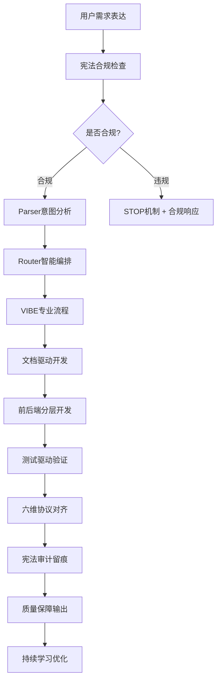
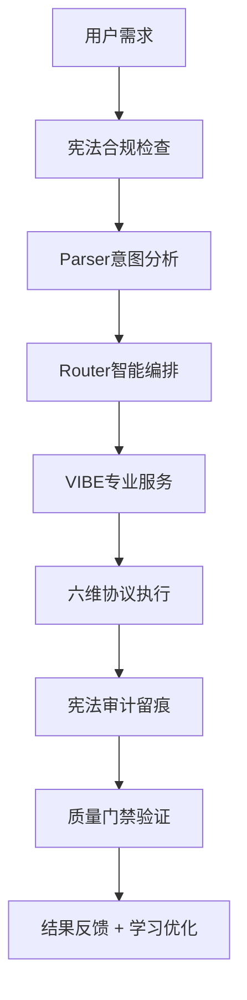

# 🚀 VIBE Coding - AI共生宪法系统下的专业开发模式

*版本: v6.0.0 | 最后更新: 2026-01-18 | 作者: AI共生宪法系统*

## 🧠 核心理念：AI共生宪法 + VIBE开发方法论

**🚀 宪法驱动的开发革命**
- ✅ **三大公理强制执行**：意图主权、信号可信、认知可审计
- ✅ **六维交互协议**：D1-D6完整协议支持
- ✅ **VIBE专业流程**：文档驱动、测试先行、前后端对齐
- ✅ **宪法质量保障**：AI共生下的开发质量全方位把控

**宪法赋能VIBE**：VIBE不再是独立的开发方法论，而是AI共生宪法系统下的专业开发模式，三大公理确保开发过程的合规性和质量。

### 🎯 AI共生宪法下的VIBE工作流程



### ✨ 宪法赋能的核心特性

- ⚖️ **三大公理强制**: 意图主权、信号可信、认知可审计的宪法保障
- 🧠 **六维交互协议**: D1-D6完整协议的智能协作体验
- 📚 **VIBE文档驱动**: 宪法合规下的文档先行开发模式
- 🏗️ **分层宪法开发**: 前端优先，后端跟随，宪法质量保障
- 🧪 **测试宪法先行**: 测试计划基于宪法审计的可靠性保障
- 🔗 **接口宪法对齐**: 前后端契约化开发，信号链可追溯
- 🎯 **智能宪法编排**: AI共生系统自动编排VIBE开发流程
- 📊 **宪法质量门禁**: 三大公理下的自动化质量保障

## 🛠️ 宪法驱动的智能使用方法

### 🎯 核心用法：宪法合规的VIBE开发（推荐）

```bash
# 🎉 在宪法保护下启动VIBE开发模式！AI自动确保合规性和质量
@vibe start 开发一个任务管理应用，支持团队协作和进度跟踪
@vibe prd 基于宪法审计设计电商平台产品需求文档
@vibe code 按照宪法协议生成用户登录模块的完整代码
@vibe test 为购物车功能生成宪法可追溯的测试用例
@vibe deploy 配置生产环境的宪法合规部署流程

# 🚀 AI共生宪法下的VIBE全生命周期管理
@vibe 初始化项目         # 宪法合规的项目脚手架
@vibe 需求分析           # 三大公理下的需求分析和文档化
@vibe 前端开发           # 六维协议下的前端优先分层开发
@vibe 后端开发           # 信号可信的接口开发
@vibe 接口对齐           # 宪法可审计的接口对齐验证
@vibe 测试驱动           # 意图主权的测试驱动开发
@vibe 对齐检查           # 六维协议下的全面对齐验证
@vibe 部署上线           # 宪法保障的生产环境部署

# 🎭 角色系统集成 - 选择最适合的AI人格进行开发指导
@vibe role switch 专家导师    # 切换到专家导师人格进行深度指导
@vibe role call 小妮          # 呼叫可爱萝莉进行创意开发
@vibe role set 女王姐姐        # 设置御姐女王进行架构设计
@vibe role current            # 查看当前激活的开发指导人格
```

### 🔄 AI共生宪法 + VIBE统一架构

**系统集成**: `constitution-enforcer.js` + `interaction-protocol.js` + `vibe-services-integration.sh`

**🎉 宪法VIBE + 角色系统支持**: `@vibe` 现在基于三大公理和六维协议，通过调用VIBE专业服务实现宪法保障的开发流程管理！不仅提供开发指导，还集成21种AI人格系统，让你可以选择最适合的AI伙伴进行开发协作。



**核心优势**:
- ⚖️ **宪法强制**: 三大公理确保开发过程合规
- 🧠 **六维智能**: D1-D6协议的完整交互体验
- 🎭 **角色系统**: 21种AI人格，支持昵称呼叫的个性化指导
- 📚 **VIBE文档先行**: 宪法审计下的文档驱动开发
- 🏗️ **分层宪法有序**: 前后端按宪法协议正确顺序开发
- 🧪 **测试宪法保障**: 测试驱动的质量把控，宪法可追溯
- 🔗 **接口宪法对齐**: 前后端契约化开发，信号链完整
- 📈 **宪法质量进化**: 持续宪法审计和质量优化

### 🧠 宪法增强的VIBE智能感知引擎

系统会自动分析并宪法合规验证：
- **项目意图合规**: 新建项目、功能开发、系统重构等意图的宪法检查
- **技术栈审计**: 前端框架、后端技术、数据库选择的信号可信验证
- **开发阶段追溯**: 需求分析、前端开发、后端开发、测试阶段的六维协议执行
- **质量要求审计**: 企业级、创业级、个人项目的宪法质量门禁标准
- **团队规模适配**: 个人开发、小团队、大型团队的不同宪法协作模式

### 🎭 角色系统在VIBE开发中的应用

#### 智能人格匹配
系统会根据开发阶段自动推荐最适合的AI人格：

- **需求分析阶段**: `专家导师` - 提供深入的技术指导和架构建议
- **前端开发阶段**: `创意艺术家` - 激发创新设计思路和用户体验优化
- **后端开发阶段**: `专业助手` - 提供稳定的技术实现和最佳实践
- **测试阶段**: `严格老师` - 确保代码质量和测试覆盖率
- **部署阶段**: `女王姐姐` - 提供权威的部署策略和运维指导

#### 手动人格切换
```bash
# 在VIBE开发的不同阶段切换人格
@vibe start 创建项目 --role 专家导师     # 项目启动阶段使用导师指导
@vibe code 前端开发 --role 创意艺术家    # 前端开发使用创意人格
@vibe test 质量检查 --role 严格老师      # 测试阶段使用严格人格
@vibe deploy 上线部署 --role 女王姐姐    # 部署阶段使用权威人格

# 或者独立切换人格
@vibe role switch 专家导师
@vibe role call 小妮
```

#### 🎯 IDE上下文宪法感知
- **当前文件合规**: 正在编辑文件的宪法状态分析
- **选中内容审计**: 选中代码片段的信号可信验证
- **光标位置追溯**: 光标所在位置的上下文合规检查
- **项目结构审计**: 整体项目架构的宪法合规评估
- **开发历史追溯**: 开发过程的完整审计留痕

### 🎯 VIBE开发场景支持

#### 🚀 宪法合规的项目创建系列
```bash
@vibe start 创建React电商平台      # 宪法强制下的完整VIBE项目脚手架
@vibe start 创建Vue.js管理系统     # 三大公理保障的Vue全栈应用模板
@vibe start 创建Node.js微服务      # 六维协议下的微服务架构项目
@vibe start 创建全栈博客系统       # 信号可信的前后端一体化应用
@vibe start 创建移动端App后端      # 认知可审计的API服务开发模板
```

#### 📋 需求分析系列
```bash
@vibe prd 设计在线教育平台产品需求文档
@vibe prd 分析社交媒体应用的核心功能
@vibe prd 为金融系统制定技术规格说明
@vibe prd 规划SaaS产品的多租户架构
```

#### 💻 代码生成系列
```bash
@vibe code 生成用户认证模块的完整代码
@vibe code 实现商品管理系统的CRUD接口
@vibe code 创建实时聊天功能的前后端代码
@vibe code 开发数据可视化图表的组件
```

#### 🧪 测试驱动系列
```bash
@vibe test 为用户注册流程编写完整测试
@vibe test 生成API接口的自动化测试用例
@vibe test 创建端到端用户旅程测试
@vibe test 验证数据库操作的测试覆盖
```

#### 🔗 对齐验证系列
```bash
@vibe align 检查前后端接口对齐状态
@vibe align 验证文档与代码的一致性
@vibe align 评估测试用例的完整性
@vibe align 生成对齐验证报告
```

#### 🚀 部署运维系列
```bash
@vibe deploy 配置生产环境CI/CD流程
@vibe deploy 设置容器化部署配置
@vibe deploy 实施蓝绿部署策略
@vibe deploy 配置应用监控和告警
```

### 💡 VIBE智能引导特性

#### 📝 实时开发指导
```bash
# 输入过程中系统会智能提示：
@vibe start 创建
# 系统提示: "检测到项目创建意图，建议按VIBE流程：需求分析→文档化→分层开发→测试验证→对齐检查"

@vibe code 开发
# 系统提示: "检测到代码生成意图，可选: 前端组件/后端API/数据库模型/测试代码"
```

#### 📊 执行状态反馈
```bash
# 执行过程中实时反馈：
🔄 正在分析项目需求...
✅ 已生成产品需求文档 (PRD)
🔄 正在初始化前端架构...
✅ 已完成前端界面开发
🔄 正在对齐前后端接口...
⚠️  发现接口不一致，正在修复...
✅ VIBE开发流程完成！质量评分: 95%
```

#### 🛟 智能质量保障
```bash
# 遇到问题时智能引导：
❌ 前后端接口对齐失败
💡 建议解决方案:
   1. 检查API契约文档
   2. 更新数据类型定义
   3. 同步错误处理逻辑
   4. 重新运行对齐检查

@vibe align fix 接口问题 --solution 2  # 自动修复方案
```

#### 🎓 VIBE学习与适应
```bash
# 系统会记住项目模式：
@vibe start 新项目  # 第一次使用
# 系统记录: 用户偏好React + TypeScript + PostgreSQL

@vibe code 生成组件  # 后续使用
# 系统自动应用: React组件 + TypeScript + 设计系统样式
```

### 🔧 VIBE高级配置选项

#### 执行模式控制
```bash
@vibe start 项目 --mode rapid      # 快速模式（原型开发）
@vibe start 项目 --mode standard   # 标准模式（生产就绪）
@vibe start 项目 --mode enterprise # 企业模式（全方位质量保障）

@vibe align 检查 --depth basic     # 基础检查
@vibe align 检查 --depth comprehensive # 全面对齐验证
@vibe test 验证 --focus e2e        # 专注端到端测试
```

#### 自定义技术栈
```bash
@vibe start 创建全栈应用 --frontend react --backend node --database postgres --testing playwright

@vibe code 生成API --framework express --auth jwt --validation joi --docs swagger

@vibe deploy 配置 --platform aws --ci github-actions --monitoring datadog --security owasp
```

### 📈 VIBE智能进化机制

#### 学习开发模式
- **项目模式**: 记住不同类型项目的开发流程
- **技术偏好**: 适应用户的技术栈选择习惯
- **质量标准**: 根据项目特点调整质量门禁
- **团队协作**: 理解不同规模团队的协作模式

#### 动态优化
- **流程效率**: 跟踪各阶段耗时和成功率
- **质量提升**: 持续改进对齐验证准确性
- **服务扩展**: 自动发现新VIBE服务和工具
- **最佳实践**: 根据行业标准更新开发模式

### ⚡ VIBE自动决策逻辑

基于感知结果，AI会：
1. **识别项目类型** - 新建/重构/功能扩展/系统集成
2. **评估技术复杂度** - 简单CRUD/复杂业务逻辑/高并发架构
3. **选择开发模式** - 快速原型/标准开发/企业级开发
4. **编排执行序列** - 按VIBE原则正确顺序执行开发任务
5. **质量把控** - 在关键节点进行对齐验证和质量检查

### 🎯 VIBE服务集成系统

**新架构**: `@vibe-coding` + `vibe-services-integration.sh` + `vibe-alignment-checker.sh`

#### 开发阶段到服务的智能映射

```json
{
  "frontend_development": {
    "stage": "frontend-first",
    "vibe_services": {
      "context_manager": "项目状态跟踪",
      "code_generator": "组件代码生成",
      "doc_generator": "API文档创建",
      "test_validator": "单元测试生成"
    },
    "alignment_checks": ["ui_design_consistency", "api_contract_ready"]
  },
  "backend_following": {
    "stage": "backend-second",
    "vibe_services": {
      "dependency_tracker": "依赖安全扫描",
      "code_generator": "API实现生成",
      "test_validator": "集成测试验证"
    },
    "alignment_checks": ["api_contract_alignment", "data_format_sync"]
  }
}
```

#### VIBE质量门禁体系

| 阶段         | 质量门禁   | 通过标准         | 验证工具               |
| ------------ | ---------- | ---------------- | ---------------------- |
| **需求分析** | 文档完整性 | PRD覆盖率 ≥ 90%  | vibe-prd-validator     |
| **前端开发** | 组件完成度 | 功能实现 100%    | vibe-frontend-checker  |
| **后端开发** | API实现度  | 接口覆盖率 ≥ 95% | vibe-backend-checker   |
| **测试验证** | 测试覆盖率 | 语句覆盖 ≥ 80%   | vibe-test-validator    |
| **对齐检查** | 一致性评分 | 对齐率 ≥ 90%     | vibe-alignment-checker |
| **部署上线** | 生产就绪   | 全量测试通过     | vibe-deploy-checker    |

#### 实时质量监控

```bash
# 执行状态和质量实时反馈
@vibe start 创建项目
# 🤖 检测到项目创建意图，启动VIBE开发流程
# 📋 阶段1/4: 需求分析 (进行中...)
#    ✅ 已生成PRD文档 (95% 完整)
#    🔄 正在分析技术架构...
# 📊 当前质量评分: 87%
# 🎯 下一阶段: 前端开发 (条件: PRD完成度 ≥ 90%)
```

### 🚀 VIBE最佳实践

#### 项目启动最佳实践
```bash
# 1. 需求确认
@vibe prd 详细描述你的项目需求和业务目标

# 2. 项目初始化
@vibe start 根据PRD创建项目结构

# 3. 分层开发
@vibe code 前端先行开发核心界面
@vibe code 后端跟随实现API服务

# 4. 测试驱动
@vibe test 生成完整的测试用例

# 5. 对齐验证
@vibe align 确保前后端完全对齐

# 6. 质量部署
@vibe deploy 配置生产环境部署
```

#### 质量保障最佳实践
```bash
# 定期对齐检查
@vibe align docs-code     # 文档代码对齐
@vibe align frontend-backend  # 前后端对齐
@vibe align test-function # 测试功能对齐

# 质量门禁验证
@vibe check quality-gate frontend  # 前端质量检查
@vibe check quality-gate backend   # 后端质量检查
@vibe check quality-gate deployment # 部署质量检查
```

#### 持续改进最佳实践
```bash
# 查看开发统计
@vibe stats show           # 显示开发效率统计
@vibe stats trends         # 分析质量趋势
@vibe stats recommendations # 获取改进建议

# 团队协作模式
@vibe team setup           # 配置团队开发环境
@vibe team review          # 团队代码审查流程
@vibe team standards       # 统一团队开发标准
```

### 🎯 VIBE命令路由系统

#### 意图到VIBE服务的智能映射

| 用户意图     | VIBE服务组合                                         | 执行流程                         |
| ------------ | ---------------------------------------------------- | -------------------------------- |
| **创建项目** | Context Manager + Code Generator + Doc Generator     | 需求分析 → 项目初始化 → 文档生成 |
| **开发功能** | Code Generator + Test Validator + Dependency Tracker | 代码生成 → 测试生成 → 依赖检查   |
| **接口对齐** | Context Manager + Alignment Checker                  | 状态同步 → 对齐验证 → 问题修复   |
| **质量检查** | Test Validator + Quality Manager                     | 测试执行 → 质量分析 → 问题报告   |
| **部署上线** | Deployment Manager + Context Manager                 | 环境配置 → 部署执行 → 状态更新   |

### 📚 VIBE学习资源

#### 快速入门指南
```bash
@vibe guide quick-start    # VIBE开发快速入门
@vibe guide best-practices # VIBE最佳实践指南
@vibe guide troubleshooting # 常见问题解决方案
```

#### 示例项目
```bash
@vibe example todo-app     # 任务管理应用示例
@vibe example blog-system  # 博客系统完整示例
@vibe example ecommerce    # 电商平台架构示例
@vibe example chat-app     # 实时聊天应用示例
```

---

*🚀 VIBE Coding v6.0.0 - AI共生宪法系统下的专业开发模式*

*核心创新*: 从传统开发到宪法驱动，从分离开发到AI共生，从被动测试到三大公理主动保障！

**立即开始你的宪法VIBE开发之旅**: `@vibe start 你的项目需求描述` - 在宪法保护下享受专业开发体验

*⚖️🧠💬 AI共生宪法 + VIBE专业流程，让高质量软件开发成为宪法保障的标准实践！*