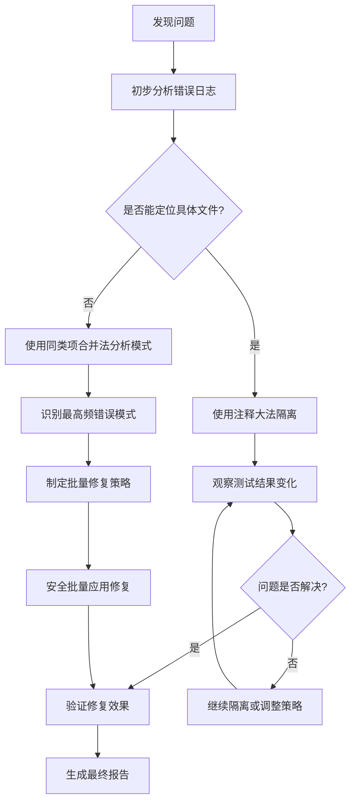

# 🔍 智能调试系统

基于用户工程经验实现的智能调试工具，集成了**注释大法**和**同类项合并法**两大核心调试策略。

## 🎯 核心理念

### 注释大法 (Isolation Method)
通过系统性地注释代码模块来定位问题根源：
- 🛡️ **安全隔离**: 注释而非删除，确保可恢复
- 🔍 **精准定位**: 逐步缩小问题范围
- ⚡ **快速验证**: 立即观察效果变化
- 🔄 **易于回滚**: 一键恢复原始代码

### 同类项合并法 (Pattern Analysis Method)
识别和批量修复相似错误模式：
- 📊 **模式识别**: 自动发现错误规律
- 🎯 **批量修复**: 高效处理重复问题
- 📈 **效果量化**: 统计修复前后改善程度
- 🛡️ **安全修复**: 验证修复效果后再应用

## 🚀 快速开始

### 安装和配置

```bash
# 1. 确保脚本有执行权限
chmod +x .cursor/core/core/debug/isolation-debugger.sh
chmod +x .cursor/core/core/debug/pattern-analyzer.sh

# 2. 查看帮助信息
.cursor/core/core/debug/isolation-debugger.sh help
.cursor/core/core/debug/pattern-analyzer.sh help
```

### 基本使用流程

```bash
# 第一阶段：隔离调试 (注释大法)
@master 隔离调试 [可疑文件]     # 自动注释模块并测试
@master 调试隔离模式           # 进入交互式调试

# 第二阶段：模式分析 (同类项合并法)
@master 分析错误模式           # 识别错误类型和频率
@master 批量修复 [错误模式]     # 安全批量修复

# 第三阶段：效果验证
@master 验证修复效果           # 量化修复改善程度
```

## 📖 详细使用指南

### 1. 注释大法详解

#### 自动隔离调试
```bash
# 隔离可疑的JavaScript文件
.cursor/core/core/debug/isolation-debugger.sh isolate src/utils.js

# 指定隔离深度和测试命令
.cursor/core/core/debug/isolation-debugger.sh isolate src/utils.js --depth 3 --test-cmd "npm run test:unit"

# 使用条件编译隔离
.cursor/core/core/debug/isolation-debugger.sh isolate config.js --type conditional
```

#### 恢复隔离的文件
```bash
# 恢复最新的备份
.cursor/core/core/debug/isolation-debugger.sh restore src/utils.js

# 恢复指定时间点的备份
.cursor/core/core/debug/isolation-debugger.sh restore src/utils.js --backup 20260116_143000
```

#### 分析文件结构
```bash
# 查看文件可隔离的代码块
.cursor/core/core/debug/isolation-debugger.sh analyze src/complex-module.js
```

### 2. 同类项合并法详解

#### 错误模式分析
```bash
# 分析当前项目的错误模式
.cursor/core/core/debug/pattern-analyzer.sh analyze

# 分析特定目录
.cursor/core/core/debug/pattern-analyzer.sh analyze --source src/

# 保存分析结果
.cursor/core/core/debug/pattern-analyzer.sh analyze --output error_analysis.json
```

#### 批量修复相似错误
```bash
# 修复调试日志 (安全操作)
.cursor/core/core/debug/pattern-analyzer.sh batch-fix "console.log"

# 修复TODO注释
.cursor/core/core/debug/pattern-analyzer.sh batch-fix "TODO"

# 预览修复效果 (不实际修改)
.cursor/core/core/debug/pattern-analyzer.sh batch-fix "console.log" --dry-run

# 限制修复文件数量
.cursor/core/core/debug/pattern-analyzer.sh batch-fix "undefined" --max-files 5
```

#### 生成分析报告
```bash
# 生成HTML格式的详细报告
.cursor/core/core/debug/pattern-analyzer.sh report error_analysis.json --format html

# 生成文本格式的简洁报告
.cursor/core/core/debug/pattern-analyzer.sh report error_analysis.json --format text
```

#### 验证修复效果
```bash
# 验证修复的实际效果
.cursor/core/core/debug/pattern-analyzer.sh validate-fix "console.log"

# 使用自定义测试命令
.cursor/core/core/debug/pattern-analyzer.sh validate-fix "undefined" --test-cmd "jest --coverage"
```

## 🔧 高级配置

### 调试系统配置

编辑 `.cursor/config/debug-config.json` 来调整系统行为：

```json
{
  "isolation_debug": {
    "backup_strategy": "timestamped",
    "max_backup_files": 50,
    "safety_limits": {
      "max_files_per_batch": 10,
      "forbidden_patterns": ["node_modules/**", "dist/**"]
    }
  },
  "pattern_analysis": {
    "batch_fix_limit": 10,
    "similarity_threshold": 0.8
  }
}
```

### 自定义修复策略

在配置中添加新的修复策略：

```json
"fix_strategies": {
  "custom_fix": {
    "description": "自定义修复策略",
    "risk_level": "medium",
    "requires_backup": true,
    "syntax_validation": true
  }
}
```

## 🛡️ 安全特性

### 自动备份系统
- 📁 **时间戳备份**: 每次修改前自动创建带时间戳的备份
- 🔄 **一键恢复**: 支持恢复到任意备份点
- 🧹 **自动清理**: 定期清理过期备份文件

### 风险控制机制
- ⚠️ **风险等级**: 自动评估操作风险等级
- ✅ **确认机制**: 高风险操作需要用户确认
- 🔍 **语法验证**: 修改后自动验证代码语法正确性
- 🧪 **测试验证**: 修复后运行测试确保功能正常

### 安全边界
- 🚫 **禁止模式**: 不会修改生产构建文件和依赖包
- 📏 **数量限制**: 每次操作限制处理的文件数量
- ⏱️ **超时控制**: 防止长时间运行的操作

## 📊 报告和监控

### 调试报告类型

1. **隔离调试报告**: 记录隔离操作的详细信息
2. **模式分析报告**: 统计错误类型和分布情况
3. **修复效果报告**: 量化修复前后的改善程度
4. **安全审计报告**: 记录所有安全检查结果

### 查看历史记录

```bash
# 查看所有调试报告
ls .cursor/debug/reports/

# 查看备份文件
ls .cursor/debug/backups/

# 查看分析数据
ls .cursor/debug/analysis/
```

## 🎯 最佳实践

### 调试工作流程



### 安全使用建议

1. **从小规模开始**: 先在单个文件上测试调试策略
2. **使用预览模式**: 利用 `--dry-run` 预览修复效果
3. **定期备份**: 重要修改前手动备份关键文件
4. **分批处理**: 不要一次性修复太多文件
5. **验证测试**: 每次修复后都运行完整的测试套件

### 性能优化

1. **缓存分析结果**: 系统会自动缓存分析结果以提高性能
2. **并行处理**: 支持同时处理多个文件（受配置限制）
3. **增量分析**: 只分析修改过的文件和相关依赖

## 🔧 故障排除

### 常见问题

#### 备份文件过多
```bash
# 清理7天前的备份
.cursor/core/core/debug/isolation-debugger.sh cleanup --retention 7
```

#### 语法验证失败
- 检查目标文件的语法是否原本就有问题
- 确认使用的修复策略是否适合该文件类型
- 查看详细的验证错误信息

#### 测试命令失败
- 确认测试命令在当前环境中能正常运行
- 检查测试依赖是否已正确安装
- 验证测试文件是否存在且格式正确

#### 权限不足
```bash
# 确保脚本有执行权限
chmod +x .cursor/debug/*.sh

# 确保对目标文件有读写权限
ls -la [target_file]
```

### 日志调试

启用详细日志来诊断问题：
```bash
# 修改配置启用调试日志
# 编辑 .cursor/config/debug-config.json
{
  "reporting": {
    "log_level": "debug"
  }
}
```

## 📈 扩展和集成

### 与Master命令集成

调试系统已集成到Master命令系统中：

```bash
@master 调试助手               # 调用调试助手技能
@master 隔离调试 [文件]         # 注释大法
@master 分析错误模式           # 同类项合并法
@master 批量修复 [模式]         # 安全批量修复
```

### CI/CD集成

支持在持续集成中自动运行调试分析：

```yaml
# .github/workflows/debug-analysis.yml
name: Debug Analysis
on: [push, pull_request]

jobs:
  debug-analysis:
    runs-on: ubuntu-latest
    steps:
      - uses: actions/checkout@v3
      - name: Run Debug Analysis
        run: .cursor/core/core/debug/pattern-analyzer.sh analyze --output debug-report.json
      - name: Upload Debug Report
        uses: actions/upload-artifact@v3
        with:
          name: debug-report
          path: debug-report.json
```

### IDE集成

通过Cursor命令集成到开发环境中：

```json
// .cursor/commands/debug-commands.json
{
  "commands": [
    {
      "name": "isolate-debug",
      "description": "隔离调试当前文件",
      "command": ".cursor/core/core/debug/isolation-debugger.sh isolate $FILE"
    },
    {
      "name": "pattern-analyze",
      "description": "分析错误模式",
      "command": ".cursor/core/core/debug/pattern-analyzer.sh analyze"
    }
  ]
}
```

## 🎯 自动提交功能

### 智能提交触发器
系统会在检测到重大调试进展时自动提交代码：

#### 批量修复自动提交
- ✅ **高成功率触发**: 修复成功率 ≥80% 且成功修复 ≥3个文件
- ✅ **大量修复触发**: 成功修复 ≥10个文件
- ✅ **中等规模触发**: 成功率 ≥50% 且处理 ≥5个文件

#### 验证结果自动提交
- ✅ **重大改善触发**: 错误减少幅度 ≥30%
- ✅ **显著减少触发**: 绝对错误减少 ≥10个
- ✅ **中等改善触发**: 改善幅度 ≥20% 且基准错误 ≥5个

#### 隔离测试自动提交
- ✅ **测试通过触发**: 隔离后测试完全通过
- ✅ **有效隔离触发**: 注释隔离且错误数量 ≤5个

### 自动提交的Commit Message
```bash
# 批量修复提交示例
fix: 批量修复错误模式 'console.log'

修复统计:
- 成功修复: 8/10 个文件
- 成功率: 80%
- 失败数量: 2

修复策略: 移除调试日志

🤖 自动提交 - 高成功率批量修复

# 验证结果提交示例
fix: 验证修复错误模式 'undefined'

修复验证结果:
- 修复前错误数: 45
- 修复后错误数: 12
- 错误减少数量: 33
- 改善幅度: 73%

🎉 重大改善 - 错误减少 ≥30%

🤖 自动提交 - 重大错误减少 (≥30%)
```

### 自动提交配置
在 `debug-config.json` 中调整自动提交触发条件：

```json
{
  "auto_commit": {
    "enabled": true,
    "batch_fix_triggers": {
      "success_rate_threshold": 80,
      "min_success_count": 3,
      "min_files_threshold": 5
    },
    "validation_triggers": {
      "error_reduction_percentage": 30,
      "error_reduction_absolute": 10
    }
  }
}
```

### 安全保障
- 🛡️ **条件验证**: 只有在满足安全条件时才自动提交
- 🔍 **更改检查**: 确认有实际更改才提交
- 📝 **详细记录**: 提交信息包含完整的修复统计
- 🔄 **可回滚**: 所有自动提交都可以正常回滚

## 🤝 贡献和反馈

### 扩展调试策略

添加新的调试策略：

1. 在 `debug-config.json` 中定义新策略
2. 实现对应的处理逻辑
3. 添加安全验证规则
4. 更新文档和示例

### 报告问题

如果遇到问题或有改进建议：

1. 查看调试日志：`.cursorGrowth/monitoring/logs/`
2. 生成诊断报告：运行分析命令并附上报告
3. 描述问题场景和期望行为
4. 提供相关的配置文件和错误信息

## 📚 相关资源

- **注释大法详解**: 基于二分法定位问题的系统化方法
- **同类项合并法**: 模式识别和批量处理的最佳实践
- **安全调试原则**: 保障调试过程不会破坏现有功能的准则
- **自动化测试**: 验证调试效果的量化方法

---

*🎯 Cursor AI Rules v4.3.0 - 智能调试系统*

*核心创新*: 将工程调试经验转化为AI驱动的自动化工具，实现安全、高效、智能的调试体验！

*🚀 现在就开始使用: `@master 调试助手`*