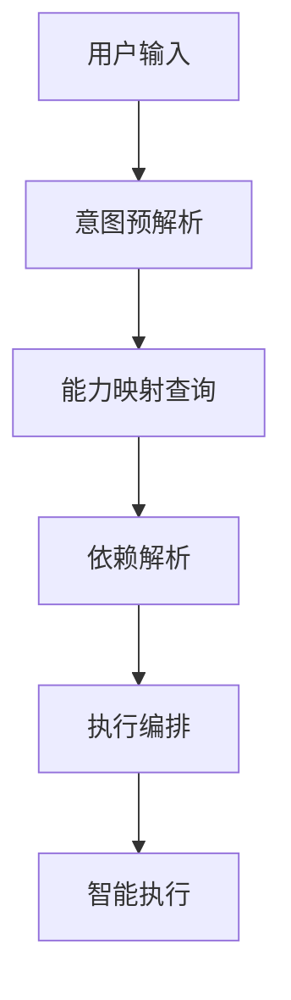
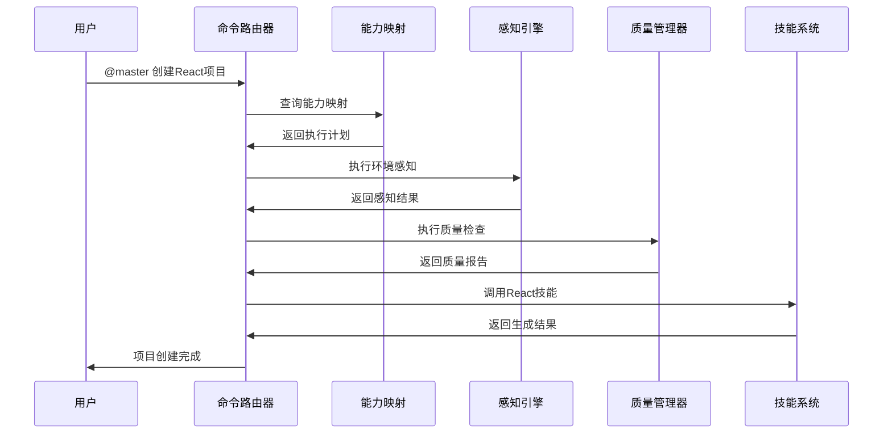
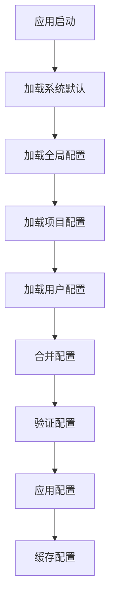

# 🏗️ 系统架构 - Cursor AI Rules

这个文档详细介绍了Cursor AI Rules的系统架构设计，帮助开发者理解系统的组织结构和设计理念。

## 📊 架构概览

Cursor AI Rules采用了分层架构设计，将复杂的AI协作功能分解为清晰的层次结构：

```
┌─────────────────────────────────────┐
│          用户界面层                  │
│   @master 命令 + 智能感知            │
└─────────────────────────────────────┘
                    │
┌─────────────────────────────────────┐
│        命令路由层                    │
│   意图解析 + 能力映射 + 执行编排     │
└─────────────────────────────────────┘
                    │
┌─────────────────────────────────────┐
│        核心功能层                    │
│   感知引擎 + 配置管理 + 质量保障     │
└─────────────────────────────────────┘
                    │
┌─────────────────────────────────────┐
│        扩展功能层                    │
│   自动化工具 + 技能库 + 钩子系统     │
└─────────────────────────────────────┘
                    │
┌─────────────────────────────────────┐
│        基础设施层                    │
│   规则系统 + 平台适配 + 系统信息     │
└─────────────────────────────────────┘
```

## 🧱 核心组件详解

### 1. 命令路由层 (Command Router)

**职责**: 统一命令入口，智能解析和路由用户请求

**核心组件**:
- `command-router.md`: 路由规则和映射逻辑
- `capability-map.json`: 意图到能力的映射表
- 执行编排引擎: 依赖解析和顺序规划

**工作流程**:


### 2. 核心功能层 (Core Layer)

#### 感知引擎 (Perception Engine)
```typescript
interface PerceptionEngine {
  // 环境检测
  detectEnvironment(): EnvironmentInfo;

  // 项目分析
  analyzeProject(): ProjectAnalysis;

  // 意图识别
  recognizeIntent(input: string): IntentAnalysis;

  // 高级洞察
  generateInsights(analysis: AnalysisResult): Insights;
}
```

**功能特性**:
- 单步多任务分析（显著降低Token消耗）
- 上下文感知的项目理解
- 智能趋势预测和风险评估

#### 配置管理系统 (Configuration Manager)
```typescript
interface ConfigurationManager {
  // 配置层级
  loadConfig(level: ConfigLevel): Config;

  // 配置合并
  mergeConfigs(configs: Config[]): MergedConfig;

  // 配置验证
  validateConfig(config: Config): ValidationResult;

  // 配置更新
  updateConfig(key: string, value: any, level: ConfigLevel): void;
}
```

**配置层级**:
1. **系统默认**: 内置的基础配置
2. **全局配置**: 用户级别的通用设置
3. **项目配置**: 项目特定的配置
4. **运行时配置**: 动态生成的配置

#### 质量保障系统 (Quality Assurance)
```typescript
interface QualityManager {
  // 代码检查
  lintCode(files: string[]): LintResult;

  // 格式化
  formatCode(files: string[]): FormatResult;

  // 安全审计
  auditSecurity(files: string[]): SecurityResult;

  // 质量报告
  generateReport(results: QualityResults): QualityReport;
}
```

### 3. 扩展功能层 (Features Layer)

#### 自动化工具 (Automation)
- **钩子系统**: 事件驱动的自动化处理
- **脚本库**: 可执行的自动化脚本
- **工作流引擎**: 复杂任务的编排执行

#### 技能库 (Skills)
- **技术技能**: 编程语言和框架支持
- **工具技能**: 开发工具和平台集成
- **创意技能**: 设计和内容生成
- **生产力技能**: 文档和协作工具

#### 钩子系统 (Hooks)
```json
{
  "hooks": {
    "afterFileEdit": [
      {"command": "run_linter", "async": false}
    ],
    "beforeCommit": [
      {"command": "security_check", "async": false},
      {"command": "test_run", "async": true}
    ]
  }
}
```

### 4. 基础设施层 (Infrastructure Layer)

#### 规则系统 (Rules System)
```markdown
# 规则文件结构
---
command: rule_name
description: "规则功能描述"
alwaysApply: true/false
---

# 规则内容
## 功能说明
## 使用方法
## 配置选项
```

**规则分类**:
- **核心规则**: constitution, philosophy, intelligent_evolution
- **系统规则**: platform_adapter, system_info, i18n
- **工作流规则**: git-workflow, code-inspection, project-scaffolding
- **技术规则**: javascript, python, go, rust等

#### 平台适配器 (Platform Adapter)
```typescript
interface PlatformAdapter {
  // 命令执行
  executeCommand(command: string, args: string[]): Promise<CommandResult>;

  // 路径处理
  normalizePath(path: string): string;
  joinPaths(...paths: string[]): string;

  // 环境变量
  getEnvironmentVariable(name: string): string | undefined;
  setEnvironmentVariable(name: string, value: string): void;

  // 权限管理
  checkPermissions(path: string): PermissionResult;
  requestElevation(): Promise<boolean>;
}
```

## 🔄 数据流设计

### 请求处理流程



### 配置加载流程



## 🛡️ 安全与权限设计

### 权限模型
- **文件访问**: 基于项目根目录的相对路径
- **命令执行**: 白名单机制，只允许安全命令
- **网络访问**: 限制为可信域名
- **资源限制**: CPU、内存、磁盘使用限制

### 安全措施
- **输入验证**: 所有用户输入的验证和清理
- **输出过滤**: AI生成内容的审核和过滤
- **审计日志**: 所有操作的完整记录
- **错误隔离**: 单个组件错误不影响整个系统

## 📊 性能优化策略

### 缓存机制
- **配置缓存**: 减少重复的配置加载
- **结果缓存**: 避免重复的分析计算
- **文件缓存**: 加速文件操作

### 异步处理
- **非阻塞执行**: 耗时操作异步处理
- **并行执行**: 独立任务并行处理
- **队列管理**: 请求队列和优先级管理

### 资源管理
- **内存管理**: 大对象的及时释放
- **连接池**: 网络请求的连接复用
- **垃圾回收**: 临时文件的自动清理

## 🔧 扩展机制

### 插件架构
```typescript
interface Plugin {
  name: string;
  version: string;
  capabilities: string[];
  activate(): Promise<void>;
  deactivate(): Promise<void>;
  execute(command: string, params: any): Promise<any>;
}
```

### 钩子扩展
```typescript
interface HookExtension {
  eventType: string;
  priority: number;
  handler: (eventData: any) => Promise<void>;
  conditions?: HookCondition[];
}
```

### 技能扩展
```typescript
interface SkillExtension {
  name: string;
  category: string;
  inputs: SkillInput[];
  outputs: SkillOutput[];
  execute(inputs: any): Promise<any>;
}
```

## 📈 演进规划

### 当前版本 (v4.3.0)
- ✅ 统一命令入口
- ✅ 智能配置管理
- ✅ 分层质量保障
- ✅ 高级感知分析

### 未来规划
- 🚀 多模型支持
- 🚀 分布式部署
- 🚀 实时协作
- 🚀 云端同步

## 🎯 设计原则

### SOLID原则
- **单一职责**: 每个组件职责清晰
- **开闭原则**: 对扩展开放，对修改封闭
- **里氏替换**: 子类可以替换父类
- **接口隔离**: 客户端不依赖不需要的接口
- **依赖倒置**: 依赖抽象而非具体实现

### 其他原则
- **渐进增强**: 基础功能稳定，高级功能可选
- **向后兼容**: 保持API的向后兼容性
- **用户中心**: 一切设计以用户体验为优先
- **性能优先**: 在功能和性能之间寻求平衡

---

*这套架构设计确保了系统的可扩展性、可维护性和高性能，是Cursor AI Rules能够持续演进的基础。*