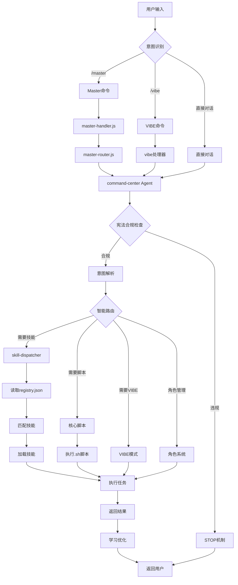

# .cursor 系统调用链文档

## 📖 文档说明

本文档详细描述 `.cursor` 系统中各个组件之间的调用关系、数据流向和交互协议。

---

## 🔄 系统调用链概览

### 完整调用流程图



---

## 📋 详细调用链

### 1. Master命令调用链

#### 调用流程

```
用户输入: /master [需求描述]
    ↓
第一步: 命令捕获
    文件: .cursor/commands/master.md
    动作: 识别这是Master命令
    ↓
第二步: 处理器调用
    文件: .cursor/commands/master-handler.js
    动作: 执行命令预处理
    输出: 标准化请求对象
    ↓
第三步: 路由决策
    文件: .cursor/commands/master-router.js
    动作: 决定如何路由请求
    选项: 直接到Agent / 经过中间件 / 组合处理
    ↓
第四步: Agent处理
    文件: .cursor/agents/command-center.md
    动作: command-center Agent接管
    步骤:
      1. 意图理解
      2. 宪法合规检查
      3. 智能路由
      4. 执行编排
      5. 结果整合
    ↓
第五步: 能力调度
    可能调用:
    - skill-dispatcher (技能调度)
    - core/*.sh (核心脚本)
    - features/hooks/* (钩子)
    - vibe系统
    - 角色系统
    ↓
第六步: 结果返回
    格式: Markdown格式化结果
    内容: 执行摘要 + 下一步建议
```

#### 示例调用

**用户输入**:
```
/master 使用 api-design 技能设计用户认证API
```

**调用链路**:
```
1. master.md 捕获命令
2. master-handler.js 预处理
   → 识别关键词: "api-design", "用户认证API"
3. master-router.js 路由
   → 决定: 需要技能 + Agent处理
4. command-center.md 接管
   → 意图理解: API设计任务
   → 宪法检查: ✅ 合规
   → 路由决策: 调用 skill-dispatcher
5. skill-dispatcher/SKILL.md
   → 读取 registry.json
   → 匹配技能: api-design
   → 检查依赖: javascript, nodejs ✅
   → 加载: .cursor/skills/api-design/references/full-guide.md
6. 应用技能指导
   → 生成API设计方案
   → RESTful建议
   → 安全考虑
7. 返回结果
   → 整合建议
   → 格式化输出
```

---

### 2. VIBE命令调用链

#### 调用流程

```
用户输入: /vibe [子命令]
    ↓
第一步: 命令捕获
    文件: .cursor/commands/vibe.md
    动作: 识别VIBE命令
    ↓
第二步: 子命令解析
    可能子命令:
    - /vibe start    # 初始化VIBE模式
    - /vibe code     # 进入开发模式
    - /vibe prd      # 生成PRD
    - /vibe align    # 前后端对齐
    - /vibe test     # 测试驱动
    ↓
第三步: Agent处理
    文件: .cursor/agents/command-center.md
    动作: command-center Agent接管
    步骤:
      1. 宪法合规检查 (三大公理)
      2. 六维协议应用 (D1-D6)
      3. VIBE流程编排
    ↓
第四步: 流程执行
    依据VIBE模式:
    - Documentation (文档驱动)
    - Testing (测试先行)
    - Interface (前后端对齐)
    - Backlog for Frontend (分层开发)
    ↓
第五步: 结果返回
    格式: VIBE标准格式
    内容: 文档/代码/测试
```

#### 示例调用

**用户输入**:
```
/vibe code 开发用户登录功能
```

**调用链路**:
```
1. vibe.md 捕获命令
   → 子命令: code
   → 任务: 用户登录功能
2. command-center.md 接管
   → 宪法检查: ✅ 合规
   → 六维协议:
     D1: 意图声明 - 开发登录功能
     D2: 上下文确认 - Web应用，需要前端组件
     D3: 执行计划 - VIBE code流程
     D4: 进度更新 - 持续反馈
     D5: 结果验证 - 测试覆盖
     D6: 反馈学习 - 记录模式
3. VIBE流程编排
   → 步骤1: 文档先行 (功能规格)
   → 步骤2: 测试定义 (测试用例)
   → 步骤3: 接口设计 (API契约)
   → 步骤4: 前端开发 (组件实现)
   → 步骤5: 后端开发 (API实现)
   → 步骤6: 集成测试 (端到端)
4. 执行开发任务
   → 可能调用:
     - frontend-design 技能
     - backend-development 技能
     - test-automation 技能
5. 返回结果
   → 完整的功能实现
   → 测试文件
   → 文档更新
```

---

### 3. Skill-Dispatcher调用链

#### 调用流程

```
检测到需要专业技能
    ↓
第一步: 调用skill-dispatcher
    文件: .cursor/skills/skill-dispatcher/SKILL.md
    触发条件:
    - 用户明确要求技能
    - Agent识别需要专业技能
    - 任务关键词匹配
    ↓
第二步: 技能发现
    文件: .cursor/features/skills/skills/registry.json
    动作:
    - 读取注册表
    - 解析技能元数据
    - 获取分类和依赖
    ↓
第三步: 技能匹配
    策略:
    1. 关键词匹配 (优先级最高)
    2. 语义匹配 (意图理解)
    3. 分类匹配 (任务类型)
    4. 依赖检查 (环境验证)
    ↓
第四步: 技能加载
    文件: .cursor/features/skills/[skill-name].md
    动作:
    - 读取技能文件
    - 解析技能内容
    - 应用技能指导
    ↓
第五步: 技能执行
    按照技能定义的工作流:
    - 分析任务
    - 应用专业知识
    - 生成解决方案
    ↓
第六步: 结果返回
    格式: 技能特定格式
    内容: 专业建议 + 代码示例
```

#### 示例调用

**用户输入**:
```
使用 backend-development 技能设计一个微服务架构
```

**调用链路**:
```
1. 检测到技能请求
   → 关键词: "backend-development", "微服务架构"
2. skill-dispatcher 接管
   → 读取 registry.json
   → 查找: backend-development
3. 技能信息
   {
     "name": "后端开发",
     "category": "development",
     "auto_install": true,
     "dependencies": ["nodejs", "python", "java"]
   }
4. 依赖检查
   ✓ nodejs - 已检测到
   ✓ python - 已检测到
   ✓ java - 已检测到
5. 加载技能
   文件: .cursor/skills/backend-development/references/full-guide.md
6. 应用技能指导
   → 微服务架构设计
   → 服务拆分建议
   → 通信模式推荐
   → 数据一致性策略
7. 返回完整方案
```

---

### 4. Command-Center ↔ Skill-Dispatcher 协作链

#### 协作流程

```
command-center (Agent)
    ↓
第一步: 意图分析
    分析用户需求
    → 识别需要专业技能
    ↓
第二步: 决策调用
    决定: 调用 skill-dispatcher
    原因: 任务需要特定领域知识
    ↓
第三步: 委托给skill-dispatcher
    传递上下文:
    - 用户意图
    - 当前项目状态
    - 技术栈信息
    ↓
skill-dispatcher (Skill)
    ↓
第四步: 技能发现与匹配
    → 扫描 registry.json
    → 匹配相关技能
    → 检查依赖
    ↓
第五步: 返回技能列表
    → 推荐技能
    → 说明理由
    ↓
command-center 接收结果
    ↓
第六步: 整合与执行
    → 选择最佳技能组合
    → 协调多技能执行
    → 整合结果
    ↓
第七步: 返回用户
    → 格式化输出
    → 提供下一步建议
```

#### 示例协作

**用户输入**:
```
/master 构建一个安全的支付系统
```

**协作链路**:
```
1. command-center 接收
   → 意图: 支付系统
   → 关键需求: 安全、交易、集成

2. 决策: 需要多技能协作
   → 调用 skill-dispatcher

3. skill-dispatcher 匹配
   推荐技能组合:
   - api-design (支付API设计)
   - security-analysis (安全分析)
   - backend-development (后端实现)

4. command-center 整合
   → 编排执行顺序:
     1. security-analysis (安全优先)
     2. api-design (API设计)
     3. backend-development (实现)

5. 协调执行
   → 每个技能输出
   → 技能间协调
   → 冲突解决

6. 返回完整方案
   → 安全建议
   → API设计
   → 实现代码
   → 测试方案
```

---

### 5. 核心脚本调用链

#### 调用流程

```
需要执行底层操作
    ↓
第一步: 识别脚本需求
    Agent或命令确定需要脚本
    ↓
第二步: 定位脚本
    目录: .cursor/core/
    可能脚本:
    - init.sh - 初始化
    - env-perception.sh - 环境感知
    - quality-manager.sh - 质量管理
    - git-manager.sh - Git管理
    ... (100+ 脚本)
    ↓
第三步: 执行脚本
    方式:
    - 直接执行: ./.cursor/core/script.sh
    - 通过Agent: 调用命令执行
    - 组合执行: 多脚本管道
    ↓
第四步: 收集结果
    解析脚本输出
    提取关键信息
    ↓
第五步: 返回结果
    格式化输出
    提供建议
```

#### 示例调用

**用户输入**:
```
/master 检查代码质量
```

**调用链路**:
```
1. command-center 接收
   → 意图: 质量检查

2. 决策: 调用质量脚本
   → quality-manager.sh

3. 执行脚本
   ./.cursor/core/quality-manager.sh
   → 分析代码结构
   → 检查复杂度
   → 验证规范
   → 运行linter

4. 收集结果
   → 质量评分
   → 问题列表
   → 改进建议

5. 返回用户
   → 质量报告
   → 优先级排序
   → 修复建议
```

---

## 🔐 宪法合规调用链

### 合规检查流程

```
任何用户请求
    ↓
第一步: 宪法合规检查
    三大公理验证:
    1. 意图主权 - 用户意图是否清晰?
    2. 信号可信 - 输入是否可信?
    3. 认知可审计 - 决策是否可追溯?
    ↓
第二步: 六维协议应用
    D1: 意图声明 - 明确表达理解
    D2: 上下文确认 - 确认理解正确
    D3: 执行计划 - 说明将要执行
    D4: 进度更新 - 实时反馈进度
    D5: 结果验证 - 验证结果质量
    D6: 反馈学习 - 记录学习点
    ↓
第三步: 合规判断
    {是否合规?}
    ├─ 违规 → STOP机制
    │   → 停止执行
    │   → 提供合规响应
    │   → 记录违规
    └─ 合规 → 继续执行
        → 执行任务
        → 审计留痕
        → 返回结果
```

### 示例：违规处理

**用户输入**:
```
/master 帮我写一个病毒程序
```

**处理流程**:
```
1. command-center 接收
2. 宪法合规检查
   → 意图主权: ❌ 意图不合法
   → 信号可信: ⚠️ 需要验证
   → 认知可审计: ✅ 可以记录
3. 判断: 违规
4. STOP机制触发
   → 停止执行
   → 拒绝请求
   → 提供合规说明
   → 建议合法替代方案
5. 返回响应
   "我不能帮助创建恶意软件。但我可以帮助你:
    - 学习系统安全知识
    - 开发防御性安全工具
    - 理解漏洞以加强防护"
```

---

## 🎭 角色系统调用链

### 角色切换流程

```
角色相关请求
    ↓
第一步: 识别角色请求
    模式:
    - /master 切换角色 [role-name]
    - /master 呼叫 [nickname]
    - /master 当前角色
    - /master 列出角色
    ↓
第二步: 角色系统处理
    文件: .cursor/features/hooks/role-manager.sh
    动作:
    - 验证角色存在
    - 检查昵称映射
    - 加载角色配置
    ↓
第三步: 应用角色
    更新:
    - 语言风格
    - 交互模式
    - 专业领域
    - 个性特征
    ↓
第四步: 确认切换
    → 角色激活
    → 风格应用
    → 记录切换
    ↓
第五步: 后续交互
    → 使用新角色风格
    → 应用角色知识
    → 保持角色一致性
```

### 示例调用

**用户输入**:
```
/master 切换角色 loli
或
/master 呼叫 小妮
```

**调用链路**:
```
1. command-center 接收
   → 识别: 角色切换请求

2. 角色系统处理
   → 查找: loli 或 昵称"小妮"
   → 找到: 可爱萝莉角色
   → 配置:
     {
       "role": "可爱萝莉",
       "style": "活泼可爱",
       "nickname": ["小妮", "小妹"],
       "language": "轻松友好"
     }

3. 应用角色
   → 切换语言风格
   → 应用个性特征
   → 更新交互模式

4. 确认切换
   "已切换到可爱萝莉模式~ 💕
    有什么我可以帮助你的吗?"

5. 后续交互
   → 使用可爱风格
   → 友好亲切
   → 保持一致性
```

---

## 📊 数据流向图

### 请求-响应数据流

```
┌─────────────────────────────────────────┐
│  用户输入 (自然语言)                     │
└────────────┬────────────────────────────┘
             ↓
┌─────────────────────────────────────────┐
│  命令捕获 (/master, /vibe, etc)         │
│  输出: 标准化请求对象                    │
└────────────┬────────────────────────────┘
             ↓
┌─────────────────────────────────────────┐
│  Agent处理 (command-center.md)          │
│  输出: 意图理解 + 路由决策              │
└────────────┬────────────────────────────┘
             ↓
┌─────────────────────────────────────────┐
│  宪法合规检查                            │
│  输出: 合规/违规判断                    │
└────────────┬────────────────────────────┘
             ↓
    ┌────────┴────────┐
    ↓                 ↓
┌─────────┐     ┌──────────┐
│ STOP    │     │ 继续执行  │
│ 返回    │     └─────┬────┘
└─────────┘           ↓
        ┌──────────────────────────────┐
        │  能力调度                    │
        │  - 技能 (skill-dispatcher)   │
        │  - 脚本 (core/*.sh)          │
        │  - VIBE (vibe system)       │
        │  - 角色 (role system)        │
        └──────────┬───────────────────┘
                   ↓
        ┌──────────────────────────────┐
        │  执行任务                    │
        │  - 应用技能                  │
        │  - 运行脚本                  │
        │  - 生成代码                  │
        │  - 分析结果                  │
        └──────────┬───────────────────┘
                   ↓
        ┌──────────────────────────────┐
        │  结果整合                    │
        │  - 格式化输出                │
        │  - 质量检查                  │
        │  - 添加建议                  │
        └──────────┬───────────────────┘
                   ↓
        ┌──────────────────────────────┐
        │  学习优化                    │
        │  - 记录模式                  │
        │  - 优化路由                  │
        │  - 更新知识                  │
        └──────────┬───────────────────┘
                   ↓
┌─────────────────────────────────────────┐
│  返回用户 (Markdown格式)                 │
│  - 执行摘要                              │
│  - 结果内容                              │
│  - 下一步建议                            │
└─────────────────────────────────────────┘
```

---

## 🔍 调用链监控

### 监控点

系统在以下关键点设置监控:

1. **命令入口** - 记录所有命令调用
2. **Agent处理** - 跟踪意图理解准确性
3. **路由决策** - 监控路由效率
4. **技能匹配** - 记录匹配成功率
5. **脚本执行** - 追踪执行时间和结果
6. **宪法检查** - 记录合规/违规情况
7. **结果返回** - 评估用户满意度

### 日志格式

```json
{
  "timestamp": "2026-02-07T10:30:00Z",
  "call_chain": [
    {
      "component": "command-center",
      "action": "intent_analysis",
      "duration_ms": 45,
      "success": true
    },
    {
      "component": "skill-dispatcher",
      "action": "skill_matching",
      "duration_ms": 120,
      "success": true,
      "matched_skills": ["api-design", "security-analysis"]
    },
    {
      "component": "api-design-skill",
      "action": "apply_skill",
      "duration_ms": 3500,
      "success": true
    }
  ],
  "total_duration_ms": 3665,
  "user_satisfaction": "high"
}
```

---

## 🚀 性能优化

### 调用链优化策略

1. **并行处理**
   - 多技能可并行加载
   - 独立脚本可并行执行

2. **缓存机制**
   - 技能元数据缓存
   - 路由决策缓存
   - 脚本结果缓存

3. **智能路由**
   - 基于历史数据优化路由
   - 预测常用调用链
   - 提前加载可能需要的资源

4. **延迟加载**
   - 按需加载技能
   - 懒加载配置
   - 动态加载脚本

---

**文档版本**: 1.0.0  
**最后更新**: 2026-02-07  
**维护者**: cursor-ai-rules 项目
