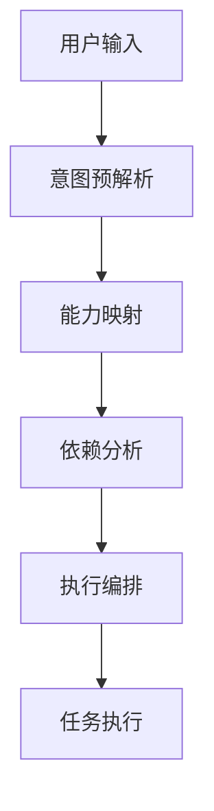

# 🏗️ 系统架构详解 - Cursor AI Rules

*开发者视角的完整架构设计*

## 📊 架构概览

Cursor AI Rules采用了分层架构设计，将复杂的AI协作功能分解为清晰的层次结构：

```
┌─────────────────────────────────────┐
│          用户界面层                  │
│   @master 命令 + 智能感知            │
└─────────────────────────────────────┘
                │
┌─────────────────────────────────────┐
│        命令路由层                    │
│   意图解析 + 能力映射 + 执行编排     │
└─────────────────────────────────────┘
                │
┌─────────────────────────────────────┐
│        核心功能层                    │
│   感知引擎 + 配置管理 + 质量保障     │
└─────────────────────────────────────┘
                │
┌─────────────────────────────────────┐
│        扩展功能层                    │
│   自动化工具 + 技能库 + 钩子系统     │
└─────────────────────────────────────┘
                │
┌─────────────────────────────────────┐
│        基础设施层                    │
│   规则系统 + 平台适配 + 系统信息     │
└─────────────────────────────────────┘
```

## 🧱 核心组件详解

### 1. 命令路由层 (Command Router)

**职责**: 统一命令入口，智能解析和路由用户请求

**核心组件**:
- `command-router.md`: 路由规则和映射逻辑
- `capability-map.json`: 意图到能力的映射表
- 执行编排引擎: 依赖解析和顺序规划

**工作流程**:


### 2. 感知引擎 (Perception Engine)

**职责**: 智能感知项目环境和用户意图

**核心能力**:
- **环境感知**: 自动检测技术栈、依赖关系、项目结构
- **意图理解**: 自然语言处理，准确识别用户需求
- **上下文关联**: 智能关联相关文件和代码片段

**感知类型**:
```typescript
interface PerceptionMatrix {
  // 对话意图感知
  conversationIntent: IntentAnalysis;

  // 上下文感知引用
  contextReference: FileReference[];

  // 个性化学习引擎
  learningEngine: UserProfile;

  // 模块同步感知
  moduleSync: DependencyGraph;

  // 性能监控系统
  performanceMonitor: MetricsCollector;
}
```

### 3. 规则系统 (Rules System)

**职责**: 基于规则的自动化执行和质量保障

**规则类型**:
- **质量规则**: ESLint、Prettier配置
- **安全规则**: 漏洞扫描和修复规则
- **性能规则**: 优化建议和性能监控
- **协作规则**: 团队规范和流程规则

**规则执行引擎**:
```typescript
class RulesEngine {
  async executeRules(context: ExecutionContext): Promise<RuleResult[]> {
    const applicableRules = await this.findApplicableRules(context);
    const results = await this.runRulesInParallel(applicableRules);
    return this.aggregateResults(results);
  }
}
```

## 🔧 技术架构

### 双目录架构设计

#### .cursor/ 目录 (核心系统)
```
.cursor/
├── commands/          # 命令处理器
├── core/             # 核心引擎
├── rules/            # 规则体系
├── skills/           # 技能库
├── docs/             # 文档系统
├── features/         # 高级功能
├── config/           # 系统配置
└── web/              # Web界面
```

#### .cursorGrowth/ 目录 (生长数据)
```
.cursorGrowth/
├── perception/       # 环境感知数据
├── user_data/        # 用户偏好数据
├── analytics/        # 分析数据
├── monitoring/       # 监控数据
├── cache/           # 缓存数据
└── integrations/    # 第三方集成
```

### 模块化设计原则

#### 高内聚低耦合
- 每个模块职责单一，接口清晰
- 通过标准接口进行模块间通信
- 支持热插拔和动态加载

#### 可扩展架构
```typescript
interface ExtensionPoint {
  name: string;
  type: 'skill' | 'rule' | 'hook' | 'command';
  interface: ExtensionInterface;
  metadata: ExtensionMetadata;
}

// 插件注册机制
class ExtensionManager {
  register(extension: ExtensionPoint): void {
    this.validateExtension(extension);
    this.loadExtension(extension);
    this.integrateExtension(extension);
  }
}
```

## 🎯 设计理念

### 三大公理实现

#### 1. 意图主权公理 (Intent Sovereignty)
- **实现机制**: 强制的人类确认流程
- **技术保障**: STOP机制和宪法保护
- **用户体验**: 透明的决策过程展示

#### 2. 信号可信公理 (Signal Trustworthiness)
- **实现机制**: 完整的信号溯源链
- **技术保障**: 区块链式的信号验证
- **用户体验**: 可点击的溯源展示

#### 3. 认知可审计公理 (Cognitive Auditability)
- **实现机制**: 结构化日志和审计记录
- **技术保障**: 3秒回溯能力和历史追踪
- **用户体验**: 直观的操作历史查看

### 四层架构模型

#### L1: 信号层 (Signal Layer)
- **职责**: 输入世界的可信映射
- **组件**: Context收集器、Index构建器、Rules加载器
- **技术**: 环境感知、文件分析、规则匹配

#### L2: 协议层 (Protocol Layer)
- **职责**: 人机交互的语义总线
- **组件**: MCP协议、Tools注册、Intent声明
- **技术**: 模型控制、工具调用、意图解析

#### L3: 代理层 (Agency Layer)
- **职责**: 目标导向的自治单元
- **组件**: Agent管理器、Model执行器、Plan生成器
- **技术**: 自主决策、模型调用、计划执行

#### L4: 主权层 (Sovereignty Layer)
- **职责**: 人类决策的终极界面
- **组件**: 哲学引擎、治理系统、5D规则界面
- **技术**: 宪法执行、决策追踪、人类干预

### 六维交互协议

#### D1: 意图声明协议
- **保真度评分**: 0-100分的意图理解准确度
- **约束检测**: 自动识别未覆盖的约束条件
- **澄清机制**: 评分<85时自动触发补充确认

#### D2: 信号校验协议
- **点击溯源**: 一键查看支撑决策的原始信号
- **Context展示**: 相关上下文片段的可视化
- **规则透明**: 激活规则的状态和优先级展示

#### D3: 边界设定协议
- **委托深度**: 1-5级的AI能力范围控制
- **权限确认**: 提升委托级别的强制确认
- **范围可视**: AI能力的边界实时展示

#### D4: 审计留痕协议
- **会话摘要**: Ctrl+Shift+A生成完整会话摘要
- **结构化存储**: 标准化格式的审计日志
- **历史回溯**: 支持任意时间段的交互历史查询

#### D5: 认知演进协议
- **进化报告**: 每周自动生成认知进化报告
- **学习成果**: 量化展示学习进步和能力提升
- **里程碑庆祝**: 识别和庆祝成长里程碑

#### D6: 多文件协作协议
- **序列规划**: 自动规划多文件编辑执行序列
- **依赖追踪**: 文件间依赖关系的自动识别
- **原子操作**: 支持多文件变更的原子性保证

## 🚀 性能优化

### 智能缓存系统
```typescript
class SmartCache {
  // 三级缓存架构
  private memoryCache: Map<string, CacheEntry>;
  private fileCache: Map<string, CacheEntry>;
  private networkCache: Map<string, CacheEntry>;

  async get(key: string, fetcher: () => Promise<any>): Promise<any> {
    // 1. 内存缓存 (最快)
    // 2. 文件缓存 (持久化)
    // 3. 网络获取 (最后手段)
  }
}
```

### 异步处理架构
- **全面异步化**: 所有I/O操作使用Promise/async-await
- **并发控制**: 避免资源竞争和死锁
- **错误处理**: 优雅的错误传播和恢复机制

### 资源管理优化
- **内存管理**: 自动垃圾回收和大对象池化
- **CPU优化**: 任务队列和负载均衡
- **网络优化**: 连接池复用和请求合并

## 🔒 安全架构

### 数据隔离设计
- **双目录分离**: 核心系统与用户数据严格隔离
- **权限控制**: 最小权限原则和沙箱执行
- **加密存储**: 敏感数据的加密存储和传输

### 审计与监控
- **操作审计**: 所有用户操作的完整记录
- **异常检测**: 基于机器学习的异常行为识别
- **安全告警**: 实时安全威胁检测和响应

## 📈 扩展机制

### 插件系统架构
```typescript
interface Plugin {
  name: string;
  version: string;
  capabilities: PluginCapability[];
  lifecycle: PluginLifecycle;
}

// 插件生命周期
enum PluginLifecycle {
  INSTALL = 'install',
  ACTIVATE = 'activate',
  DEACTIVATE = 'deactivate',
  UNINSTALL = 'uninstall'
}
```

### API生态建设
- **开放API**: 第三方应用集成的标准接口
- **GraphQL支持**: 灵活的数据查询和操作
- **SDK开发**: 多语言SDK快速集成支持

---

## 📚 相关文档

- [项目生长架构](project-growth.md) - 用户数据和学习机制
- [API参考](api-reference.md) - 开发者接口文档
- [扩展开发指南](extension-guide.md) - 自定义功能开发
- [宪法规范](../reference/specifications/constitution.md) - 设计哲学和原则

---

*最后更新: 2026-01-22 | 版本: v9.0.0 | 状态: 🏗️ 架构设计完成*