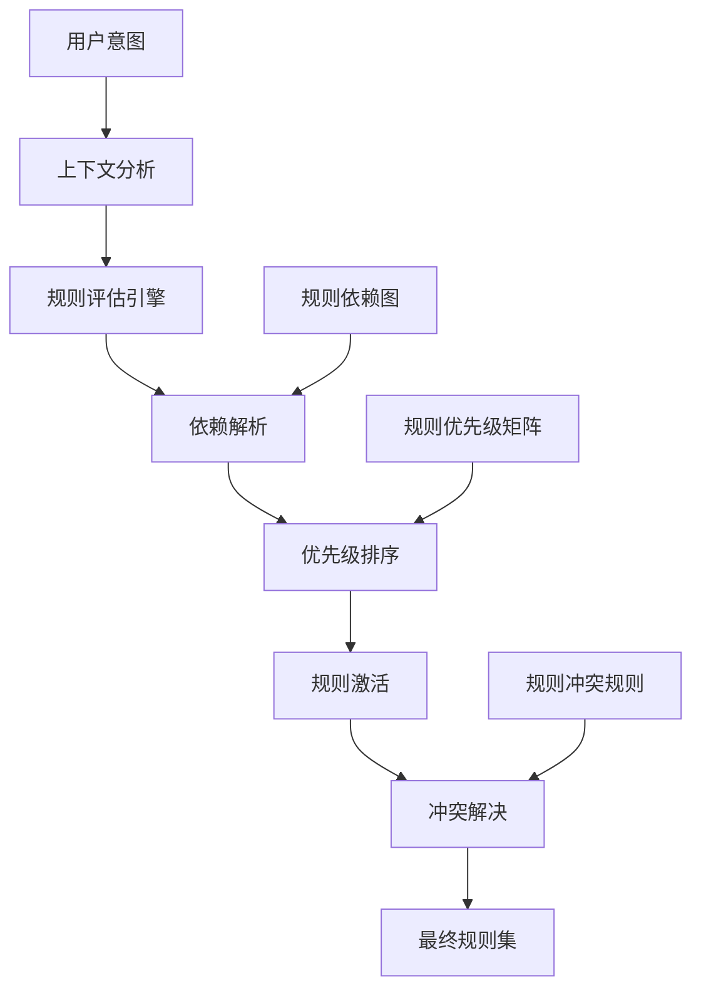

# 🎯 规则路由器 (Rules Router)

*版本: v4.3.0 | 最后更新: {{GENERATION_TIME}} | 作者: wangqiqi (https://github.com/wangqiqi)*

## 🧠 核心理念：智能规则编排引擎

**统一规则管理系统**：基于上下文感知、依赖关系和优先级自动激活最合适的规则组合，实现规则间的智能协作。

### 🎯 工作原理



## 🏗️ 规则体系架构

### 规则分类体系

```
rules/
├── core/           # 核心规则 - 始终激活
│   ├── constitution.md           # AI共生宪法
│   ├── philosophy.md             # 协作哲学
│   └── intelligent_evolution.md  # 智能进化系统
├── system/         # 系统规则 - 环境相关
│   ├── system_info.md            # 系统信息获取
│   ├── platform_adapter.md       # 跨平台适配
│   ├── module_manager.md         # 模块管理
│   └── i18n.md                   # 国际化支持
├── workflow/       # 工作流规则 - 开发流程
│   ├── generator.md              # 项目生成器
│   ├── templates.md              # 模板管理
│   ├── eslint.md                 # 代码质量
│   └── conversation_intent_analyzer.md  # 意图分析
├── evolution/      # 进化规则 - 系统优化
│   ├── evolution-philosophy.md   # 进化哲学
│   ├── evolution-manual.md       # 手动进化
│   ├── evolution-automation.md   # 自动进化
│   └── evolution-governance.md  # 进化治理
├── team/           # 团队规则 - 协作相关
│   └── collaboration.md          # 团队协作
└── tech/           # 技术栈规则 - 语言特定
    ├── javascript.md             # JavaScript/TypeScript
    └── python.md                 # Python开发
```

## 🎯 智能规则激活引擎

### 上下文感知激活

```typescript
interface RuleActivationContext {
  userIntent: string;                    // 用户意图
  projectType: string;                   // 项目类型
  techStack: string[];                   // 技术栈
  teamSize: number;                      // 团队规模
  developmentStage: string;              // 开发阶段
  environment: string;                   // 运行环境
  userPreferences: Record<string, any>;  // 用户偏好
}

interface RuleActivationResult {
  activeRules: string[];                 // 激活规则列表
  priorityOrder: string[];               // 优先级顺序
  conflicts: RuleConflict[];             // 冲突规则
  dependencies: RuleDependency[];        // 依赖关系
}
```

### 规则激活映射表

```json
{
  "rule_activation_map": {
    "project_creation": {
      "description": "项目创建场景",
      "required_rules": [
        "conversation_intent_analyzer",
        "generator",
        "templates"
      ],
      "conditional_rules": {
        "javascript_project": ["javascript"],
        "python_project": ["python"],
        "team_project": ["collaboration"]
      },
      "priority_order": [
        "conversation_intent_analyzer",
        "generator",
        "templates",
        "javascript",
        "python",
        "collaboration"
      ]
    },

    "code_quality_check": {
      "description": "代码质量检查场景",
      "required_rules": [
        "eslint",
        "intelligent_evolution"
      ],
      "conditional_rules": {
        "javascript_files": ["javascript"],
        "python_files": ["python"]
      },
      "priority_order": [
        "intelligent_evolution",
        "eslint",
        "javascript",
        "python"
      ]
    },

    "team_collaboration": {
      "description": "团队协作场景",
      "required_rules": [
        "collaboration",
        "intelligent_evolution"
      ],
      "conditional_rules": {
        "large_team": ["evolution-governance"],
        "distributed_team": ["platform_adapter"]
      },
      "priority_order": [
        "collaboration",
        "platform_adapter",
        "intelligent_evolution",
        "evolution-governance"
      ]
    },

    "system_maintenance": {
      "description": "系统维护场景",
      "required_rules": [
        "system_info",
        "platform_adapter",
        "module_manager"
      ],
      "conditional_rules": {
        "evolution_enabled": ["intelligent_evolution"],
        "international_team": ["i18n"]
      },
      "priority_order": [
        "system_info",
        "platform_adapter",
        "module_manager",
        "i18n",
        "intelligent_evolution"
      ]
    }
  },

  "global_activation_rules": {
    "always_active": [
      "constitution",
      "philosophy"
    ],
    "context_sensitive": [
      "intelligent_evolution",
      "system_info",
      "platform_adapter"
    ]
  }
}
```

## 🔗 规则依赖关系图

### 依赖关系定义

```typescript
interface RuleDependency {
  rule: string;                    // 规则名称
  depends_on: string[];           // 依赖规则
  conflicts_with: string[];       // 冲突规则
  priority: number;               // 优先级 (1-10, 10最高)
  activation_condition: string;   // 激活条件
}

const RULE_DEPENDENCIES: Record<string, RuleDependency> = {
  // 核心规则 - 无依赖
  "constitution": {
    rule: "constitution",
    depends_on: [],
    conflicts_with: [],
    priority: 10,
    activation_condition: "always"
  },

  "philosophy": {
    rule: "philosophy",
    depends_on: ["constitution"],
    conflicts_with: [],
    priority: 9,
    activation_condition: "always"
  },

  // 系统规则
  "system_info": {
    rule: "system_info",
    depends_on: ["platform_adapter"],
    conflicts_with: [],
    priority: 8,
    activation_condition: "context_available"
  },

  "platform_adapter": {
    rule: "platform_adapter",
    depends_on: [],
    conflicts_with: [],
    priority: 8,
    activation_condition: "multi_platform"
  },

  // 工作流规则
  "generator": {
    rule: "generator",
    depends_on: ["conversation_intent_analyzer", "templates"],
    conflicts_with: [],
    priority: 7,
    activation_condition: "project_generation"
  },

  "conversation_intent_analyzer": {
    rule: "conversation_intent_analyzer",
    depends_on: [],
    conflicts_with: [],
    priority: 7,
    activation_condition: "natural_language_input"
  },

  // 技术栈规则
  "javascript": {
    rule: "javascript",
    depends_on: ["intelligent_evolution"],
    conflicts_with: ["python"],
    priority: 6,
    activation_condition: "javascript_files_present"
  },

  "python": {
    rule: "python",
    depends_on: ["intelligent_evolution"],
    conflicts_with: ["javascript"],
    priority: 6,
    activation_condition: "python_files_present"
  },

  // 团队规则
  "collaboration": {
    rule: "collaboration",
    depends_on: ["intelligent_evolution"],
    conflicts_with: [],
    priority: 5,
    activation_condition: "team_size > 1"
  },

  // 进化规则
  "evolution-governance": {
    rule: "evolution-governance",
    depends_on: ["intelligent_evolution", "evolution-philosophy"],
    conflicts_with: [],
    priority: 4,
    activation_condition: "evolution_enabled && team_size > 5"
  }
};
```

### 依赖解析算法

```typescript
class DependencyResolver {
  resolveDependencies(
    requestedRules: string[],
    context: RuleActivationContext
  ): RuleActivationResult {

    const resolvedRules = new Set<string>();
    const conflicts: RuleConflict[] = [];
    const dependencyChain: string[] = [];

    // 递归解析依赖
    const resolveRule = (ruleName: string): void => {
      if (resolvedRules.has(ruleName)) return;
      if (dependencyChain.includes(ruleName)) {
        throw new Error(`Circular dependency detected: ${dependencyChain.join(' -> ')} -> ${ruleName}`);
      }

      const rule = RULE_DEPENDENCIES[ruleName];
      if (!rule) {
        throw new Error(`Unknown rule: ${ruleName}`);
      }

      dependencyChain.push(ruleName);

      // 检查激活条件
      if (!this.checkActivationCondition(rule, context)) {
        dependencyChain.pop();
        return;
      }

      // 递归解析依赖
      for (const dep of rule.depends_on) {
        resolveRule(dep);
      }

      // 检查冲突
      for (const conflict of rule.conflicts_with) {
        if (resolvedRules.has(conflict)) {
          conflicts.push({
            rule1: ruleName,
            rule2: conflict,
            reason: "explicit_conflict"
          });
        }
      }

      resolvedRules.add(ruleName);
      dependencyChain.pop();
    };

    // 解析所有请求的规则
    for (const rule of requestedRules) {
      resolveRule(rule);
    }

    // 按优先级排序
    const sortedRules = Array.from(resolvedRules)
      .sort((a, b) => RULE_DEPENDENCIES[b].priority - RULE_DEPENDENCIES[a].priority);

    return {
      activeRules: sortedRules,
      priorityOrder: sortedRules,
      conflicts,
      dependencies: this.buildDependencyGraph(sortedRules)
    };
  }

  private checkActivationCondition(rule: RuleDependency, context: RuleActivationContext): boolean {
    switch (rule.activation_condition) {
      case "always":
        return true;
      case "context_available":
        return !!context;
      case "multi_platform":
        return context.environment !== "single_platform";
      case "project_generation":
        return context.userIntent.includes("create") || context.userIntent.includes("generate");
      case "natural_language_input":
        return !context.userIntent.startsWith("@");
      case "javascript_files_present":
        return context.techStack.includes("javascript") || context.techStack.includes("typescript");
      case "python_files_present":
        return context.techStack.includes("python");
      case "evolution_enabled":
        return context.userPreferences?.evolution_enabled ?? false;
      default:
        return false;
    }
  }
}
```

## 🎯 规则优先级矩阵

### 优先级计算模型

```typescript
interface RulePriority {
  basePriority: number;     // 基础优先级
  contextBoost: number;     // 上下文提升
  userPreference: number;   // 用户偏好
  recencyBonus: number;     // 最近使用奖励
  finalPriority: number;    // 最终优先级
}

class PriorityCalculator {
  calculatePriorities(
    rules: string[],
    context: RuleActivationContext
  ): Record<string, RulePriority> {

    const priorities: Record<string, RulePriority> = {};

    for (const rule of rules) {
      const basePriority = RULE_DEPENDENCIES[rule]?.priority ?? 5;

      // 上下文提升
      let contextBoost = 0;
      if (this.isHighlyRelevant(rule, context)) {
        contextBoost += 3;
      } else if (this.isModeratelyRelevant(rule, context)) {
        contextBoost += 1;
      }

      // 用户偏好
      const userPreference = context.userPreferences?.rule_preferences?.[rule] ?? 0;

      // 最近使用奖励 (模拟)
      const recencyBonus = Math.random() * 2; // 0-2的随机值

      const finalPriority = basePriority + contextBoost + userPreference + recencyBonus;

      priorities[rule] = {
        basePriority,
        contextBoost,
        userPreference,
        recencyBonus,
        finalPriority
      };
    }

    return priorities;
  }

  private isHighlyRelevant(rule: string, context: RuleActivationContext): boolean {
    const highRelevanceMap: Record<string, string[]> = {
      "javascript": ["javascript", "typescript", "react", "vue", "node"],
      "python": ["python", "django", "fastapi", "flask"],
      "collaboration": ["team", "collaboration", "git", "merge"],
      "generator": ["create", "new", "init", "generate"],
      "eslint": ["lint", "quality", "check", "fix"]
    };

    const relevantContexts = highRelevanceMap[rule] ?? [];
    return relevantContexts.some(ctx =>
      context.userIntent.includes(ctx) ||
      context.techStack.includes(ctx) ||
      context.projectType.includes(ctx)
    );
  }

  private isModeratelyRelevant(rule: string, context: RuleActivationContext): boolean {
    // 中等相关性逻辑
    return false; // 简化实现
  }
}
```

## ⚡ 规则冲突解决

### 冲突检测和解决

```typescript
interface RuleConflict {
  rule1: string;
  rule2: string;
  reason: "explicit_conflict" | "resource_conflict" | "priority_conflict";
  resolution: "keep_higher_priority" | "keep_both" | "remove_lower_priority";
}

class ConflictResolver {
  resolveConflicts(
    activeRules: string[],
    conflicts: RuleConflict[],
    priorities: Record<string, RulePriority>
  ): string[] {

    const resolvedRules = new Set(activeRules);

    for (const conflict of conflicts) {
      const priority1 = priorities[conflict.rule1]?.finalPriority ?? 0;
      const priority2 = priorities[conflict.rule2]?.finalPriority ?? 0;

      switch (conflict.resolution) {
        case "keep_higher_priority":
          if (priority1 > priority2) {
            resolvedRules.delete(conflict.rule2);
          } else {
            resolvedRules.delete(conflict.rule1);
          }
          break;

        case "keep_both":
          // 允许共存
          break;

        case "remove_lower_priority":
          if (priority1 > priority2) {
            resolvedRules.delete(conflict.rule2);
          } else {
            resolvedRules.delete(conflict.rule1);
          }
          break;
      }
    }

    return Array.from(resolvedRules);
  }
}
```

## 📊 规则性能监控

### 激活统计和优化

```typescript
interface RuleActivationStats {
  rule: string;
  activationCount: number;
  averageActivationTime: number;
  successRate: number;
  userSatisfaction: number;
  lastActivated: Date;
}

class RulePerformanceMonitor {
  private stats: Map<string, RuleActivationStats> = new Map();

  recordActivation(
    rule: string,
    activationTime: number,
    success: boolean,
    userFeedback?: number
  ): void {
    const existing = this.stats.get(rule) ?? {
      rule,
      activationCount: 0,
      averageActivationTime: 0,
      successRate: 0,
      userSatisfaction: 0,
      lastActivated: new Date()
    };

    const newCount = existing.activationCount + 1;
    const newAvgTime = (existing.averageActivationTime * existing.activationCount + activationTime) / newCount;
    const newSuccessRate = ((existing.successRate * existing.activationCount) + (success ? 1 : 0)) / newCount;
    const newSatisfaction = userFeedback ??
      ((existing.userSatisfaction * existing.activationCount) / newCount);

    this.stats.set(rule, {
      ...existing,
      activationCount: newCount,
      averageActivationTime: newAvgTime,
      successRate: newSuccessRate,
      userSatisfaction: newSatisfaction,
      lastActivated: new Date()
    });
  }

  getPerformanceReport(): RuleActivationStats[] {
    return Array.from(this.stats.values())
      .sort((a, b) => b.activationCount - a.activationCount);
  }

  optimizeRulePriorities(): Record<string, number> {
    const optimizations: Record<string, number> = {};

    for (const [rule, stats] of this.stats) {
      // 基于性能数据调整优先级
      let priorityAdjustment = 0;

      if (stats.successRate > 0.9) priorityAdjustment += 1;
      if (stats.userSatisfaction > 4.0) priorityAdjustment += 1;
      if (stats.averageActivationTime < 100) priorityAdjustment += 0.5;

      if (stats.successRate < 0.7) priorityAdjustment -= 1;
      if (stats.userSatisfaction < 3.0) priorityAdjustment -= 1;

      optimizations[rule] = priorityAdjustment;
    }

    return optimizations;
  }
}
```

## 🔧 集成接口

### 与Master命令的集成

```typescript
// 集成到 master.md 的规则路由接口
interface RulesRouterIntegration {
  // 规则路由入口
  routeRules(context: RuleActivationContext): Promise<RuleActivationResult>;

  // 规则性能反馈
  reportRulePerformance(rule: string, metrics: RulePerformanceMetrics): void;

  // 动态规则学习
  learnFromInteraction(context: RuleActivationContext, result: RuleActivationResult): void;
}

// Master命令中的集成使用
class MasterCommandController {
  private rulesRouter: RulesRouterIntegration;

  async executeUserRequest(userInput: string): Promise<ExecutionResult> {
    // 1. 解析用户意图
    const intent = await this.parseIntent(userInput);

    // 2. 构建规则激活上下文
    const context: RuleActivationContext = {
      userIntent: userInput,
      projectType: await this.detectProjectType(),
      techStack: await this.detectTechStack(),
      teamSize: await this.detectTeamSize(),
      developmentStage: await this.detectDevStage(),
      environment: await this.detectEnvironment(),
      userPreferences: await this.getUserPreferences()
    };

    // 3. 路由规则
    const ruleResult = await this.rulesRouter.routeRules(context);

    // 4. 执行规则激活的逻辑
    const executionResult = await this.executeWithRules(ruleResult);

    // 5. 报告性能
    for (const rule of ruleResult.activeRules) {
      this.rulesRouter.reportRulePerformance(rule, {
        activationTime: executionResult.duration,
        success: executionResult.success,
        userSatisfaction: executionResult.userFeedback
      });
    }

    // 6. 学习优化
    this.rulesRouter.learnFromInteraction(context, ruleResult);

    return executionResult;
  }
}
```

## 🎯 使用示例

### 基本规则路由

```typescript
// 示例：React项目创建
const context: RuleActivationContext = {
  userIntent: "我想创建一个React项目",
  projectType: "frontend",
  techStack: ["javascript", "react"],
  teamSize: 1,
  developmentStage: "initialization",
  environment: "development",
  userPreferences: { language: "zh-CN" }
};

const result = await rulesRouter.routeRules(context);
// result.activeRules = ["conversation_intent_analyzer", "generator", "templates", "javascript"]
// result.priorityOrder = ["conversation_intent_analyzer", "generator", "templates", "javascript"]
```

### 高级规则路由

```typescript
// 示例：团队代码审查
const context: RuleActivationContext = {
  userIntent: "团队需要进行代码审查",
  projectType: "webapp",
  techStack: ["typescript", "react"],
  teamSize: 5,
  developmentStage: "development",
  environment: "ci/cd",
  userPreferences: { collaboration: true }
};

const result = await rulesRouter.routeRules(context);
// result.activeRules = ["collaboration", "eslint", "intelligent_evolution", "javascript", "evolution-governance"]
// result.priorityOrder = ["collaboration", "eslint", "intelligent_evolution", "javascript", "evolution-governance"]
```

## 📋 规则路由配置

### 规则路由配置文件

```json
{
  "rules_router_config": {
    "version": "1.0.0",
    "enable_performance_monitoring": true,
    "enable_learning": true,
    "conflict_resolution_strategy": "priority_based",
    "max_activation_depth": 5,
    "cache_enabled": true,
    "cache_ttl_seconds": 3600,

    "custom_activation_rules": {
      "enterprise_mode": {
        "condition": "team_size > 10",
        "additional_rules": ["evolution-governance", "platform_adapter"],
        "priority_boost": 2
      },

      "strict_quality_mode": {
        "condition": "quality_gate_enabled",
        "additional_rules": ["eslint", "intelligent_evolution"],
        "priority_boost": 3
      }
    },

    "rule_overrides": {
      "javascript": {
        "priority": 8,
        "activation_condition": "javascript_or_typescript_files"
      }
    }
  }
}
```

---

*🎯 规则路由器让AI能够智能地编排和激活最合适的规则组合*
*最后更新: {{GENERATION_TIME}} | 作者: wangqiqi*