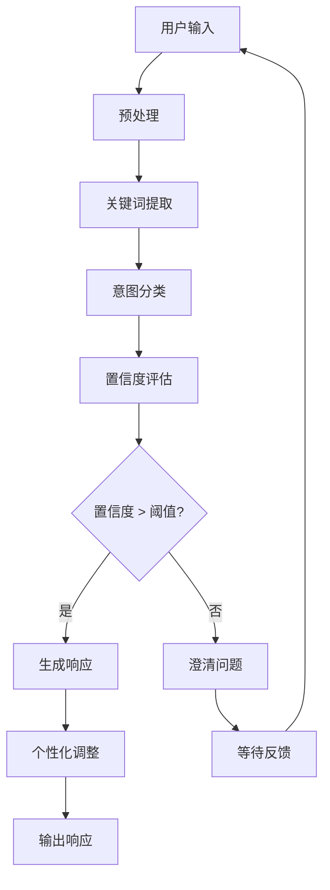

# 💬 对话意图分析器 (Conversation Intent Analyzer)

## ⚠️⚠️⚠️ 执行前必须检查：项目创建意图检测 ⚠️⚠️⚠️

**在响应任何用户请求之前，必须先检查以下内容：**

### 🔍 检查点：用户是否表达项目创建意图？

**如果用户说以下任何内容：**
- "我想做一个..."
- "开发一个..."
- "构建..."
- "创建..."
- "做一个..."
- "搭建..."

### 🚫 如果检测到项目创建意图，立即执行：

**STOP - 立即停止，禁止执行以下任何操作：**
- ❌ `mkdir` 命令 - 禁止创建目录
- ❌ `touch` 命令 - 禁止创建文件
- ❌ `write` 命令 - 禁止写入文件
- ❌ `run_terminal_cmd` 创建目录 - 禁止
- ❌ 任何文件系统操作 - 禁止
- ❌ 设计项目架构 - 禁止（必须先讨论）
- ❌ 初始化项目结构 - 禁止（必须先讨论）
- ❌ 创建TODO列表 - 禁止（必须先讨论）

### ✅ 必须先执行以下步骤：

1. **MUST** 先分析用户需求，识别项目类型和技术领域
2. **MUST** 提供技术方案建议，与用户讨论架构选择
3. **MUST** 提出澄清问题，帮助完善需求细节
4. **MUST** 等待用户明确确认方案后，才能开始创建项目结构

## ⚠️ 最高优先级指令：项目创建意图处理 (Highest Priority Directive: Project Creation Intent Handling)

**🚨 STOP - 立即停止所有文件系统操作 🚨**

### 🔴 检测到项目创建意图时的强制行为

**如果用户说以下任何内容：**
- "我想做一个..."
- "开发一个..."
- "构建..."
- "创建..."
- "做一个..."
- "搭建..."

**立即执行以下操作：**

1. **STOP** - 立即停止所有文件系统操作
2. **DO NOT** - 禁止执行以下任何命令：
   - `mkdir` - 禁止创建目录
   - `touch` - 禁止创建文件
   - `write` - 禁止写入文件
   - `run_terminal_cmd` 创建目录 - 禁止
   - 任何文件系统操作 - 禁止
3. **MUST** - 必须先执行以下步骤：
   - 分析用户需求
   - 提供技术方案建议
   - 提出澄清问题
   - 等待用户明确确认

### ✅ MUST DO - 必须执行的流程

当检测到项目创建意图时，**必须**按以下顺序执行：

1. **MUST** 先分析用户需求，识别项目类型和技术领域
2. **MUST** 提供技术方案建议，与用户讨论架构选择
3. **MUST** 提出澄清问题，帮助完善需求细节
4. **MUST** 等待用户明确确认方案后，才能开始创建项目结构

### 📋 标准响应模板 (Standard Response Template)

**必须使用以下格式响应**：

```markdown
## 🤖 检测到项目创建意图

检测到你想要**创建新项目**！

### 📋 需求分析
- **项目类型**: [基于对话内容分析]
- **技术领域**: [识别的前端/后端/AI等技术领域]
- **复杂度评估**: [初步评估]

### 🛠️ 推荐技术方案
[提供技术栈建议，但**不直接实施**]

### ❓ 需要澄清的问题
1. [具体问题1]
2. [具体问题2]
3. [具体问题3]

**请先与我讨论需求和方案，确认后再开始开发！** 🎯
```

**核心原则**：**需求讨论优先，方案确认后行动！违反此规则即违反宪法！**

*版本: v4.0.0 | 最后更新: {{GENERATION_TIME}} | 作者: {{AUTHOR_NAME}} <{{AUTHOR_EMAIL}}}*

## 🎯 核心使命 (Core Mission)

对话意图分析器是.cursor规则体系的**主动需求理解助手**，专门识别和理解用户的对话意图，为项目规划提供智能建议：

- **意图识别**：从对话中提取项目需求和技术意图
- **通用性设计**：不依赖特定关键词，支持任何技术领域
- **智能响应**：基于意图提供针对性技术方案建议
- **讨论引导**：引导用户深入讨论需求细节

## ⚠️ 关键行为准则 (Critical Behavior Rules)

### 🚫 禁止行为 (Prohibited Actions)

当检测到**项目创建意图**（如"我想做一个..."、"开发一个..."、"构建..."等）时，**绝对禁止**以下行为：

1. ❌ **禁止直接创建目录结构** - 不要执行 `mkdir`、`touch` 等文件操作
2. ❌ **禁止直接生成代码** - 不要创建任何代码文件
3. ❌ **禁止直接生成待办事项列表** - 不要自动创建TODO列表
4. ❌ **禁止直接开始实现** - 不要跳过需求讨论阶段

### ✅ 必须行为 (Required Actions)

当检测到项目创建意图时，**必须**执行以下步骤：

1. ✅ **第一步：需求理解** - 分析用户的需求描述，识别项目类型和技术领域
2. ✅ **第二步：方案讨论** - 提供技术方案建议，与用户讨论架构选择
3. ✅ **第三步：需求澄清** - 提出澄清问题，帮助用户完善需求
4. ✅ **第四步：等待确认** - **等待用户明确确认方案后**，才能开始创建项目结构

### 📋 标准响应流程 (Standard Response Flow)

```markdown
## 🤖 检测到项目创建意图

检测到你想要**创建新项目**！

### 📋 需求分析
- **项目类型**: [基于对话内容分析]
- **技术领域**: [识别的前端/后端/AI等技术领域]
- **复杂度评估**: [初步评估]

### 🛠️ 推荐技术方案
[提供技术栈建议，但**不直接实施**]

### ❓ 需要澄清的问题
1. [具体问题1]
2. [具体问题2]
3. [具体问题3]

**请先与我讨论需求和方案，确认后再开始开发！** 🎯
```

### 🔗 与宪法原则的关联 (Connection to Constitution Principles)

本规则严格遵循 `@constitution` 中的**意图主权公理**：

- **人类意图主权**：用户说"我想做一个..."时，AI必须理解这是**需求表达**，不是**执行指令**
- **讨论优先原则**：在用户明确确认方案之前，AI**无权**开始创建代码或目录
- **确认机制**：所有项目创建操作必须经过"需求讨论 → 方案确认 → 用户批准"的完整流程

**违反此规则即违反宪法原则！**

### 🎯 意图响应策略 (Intent Response Strategy)

| 意图类型 | 置信度 | 响应策略 | 是否允许直接行动 |
|----------|--------|----------|------------------|
| `creation` | >0.7 | 讨论需求 + 方案建议 | ❌ **禁止** |
| `creation` | 0.5-0.7 | 澄清问题 + 初步建议 | ❌ **禁止** |
| `creation` | <0.5 | 提出澄清问题 | ❌ **禁止** |
| `optimization` | >0.7 | 分析现有代码 + 优化建议 | ✅ 允许（针对现有项目） |
| `analysis` | >0.7 | 执行分析 + 报告结果 | ✅ 允许（分析操作） |

**重要原则**：**项目创建意图必须经过需求讨论和方案确认阶段，绝不允许直接开始开发！**

## 🏗️ 系统架构 (System Architecture)

### 核心组件 (Core Components)

```
对话意图分析器
├── 🎯 意图分类器 (Intent Classifier)     # 意图类型识别
├── 🔍 关键词分析器 (Keyword Analyzer)   # 多层次关键词分析
├── 🧠 响应策略引擎 (Response Engine)     # 智能响应生成
├── 📚 模板库 (Template Library)          # 响应模板管理
├── 🎓 学习引擎 (Learning Engine)         # 动态学习和优化
└── ⚙️ 配置管理器 (Config Manager)        # 动态配置管理
```

### 数据流 (Data Flow)



## 🔍 意图识别机制 (Intent Recognition)

### 意图分类体系 (Intent Classification System)

#### 一级意图：操作类型 (Primary Intent: Operation Type)

```yaml
intent_categories:
  # 项目创建意图
  creation:
    keywords: ["创建", "开发", "构建", "设计", "实现", "制作", "搭建", "建立"]
    confidence: 0.9
    description: "用户想要创建新项目或系统"

  # 项目优化意图
  optimization:
    keywords: ["优化", "改进", "提升", "增强", "重构", "重写", "升级", "完善"]
    confidence: 0.8
    description: "用户想要改进现有系统"

  # 问题分析意图
  analysis:
    keywords: ["分析", "评估", "检查", "诊断", "审计", "审查", "监控", "测试"]
    confidence: 0.7
    description: "用户需要分析或诊断问题"

  # 部署运维意图
  deployment:
    keywords: ["部署", "发布", "上线", "交付", "安装", "配置", "运维", "维护"]
    confidence: 0.8
    description: "用户关注部署和运维"

  # 学习咨询意图
  learning:
    keywords: ["学习", "了解", "掌握", "教程", "指南", "文档", "帮助", "指导"]
    confidence: 0.6
    description: "用户需要学习和技术指导"
```

#### 二级意图：技术领域 (Secondary Intent: Tech Domain)

```yaml
tech_domains:
  # 前端领域
  frontend:
    keywords: ["前端", "界面", "UI", "用户体验", "交互", "组件", "网页", "网站"]
    technologies: ["React", "Vue", "Angular", "TypeScript", "JavaScript", "HTML", "CSS"]
    confidence: 0.8

  # 后端领域
  backend:
    keywords: ["后端", "服务端", "API", "服务器", "微服务", "数据库"]
    technologies: ["Node.js", "Python", "Java", "Go", "Spring", "Django", "FastAPI"]
    confidence: 0.8

  # 数据领域
  data:
    keywords: ["数据", "存储", "缓存", "数据库", "大数据", "ETL", "数据仓库"]
    technologies: ["MySQL", "PostgreSQL", "MongoDB", "Redis", "Elasticsearch", "Kafka"]
    confidence: 0.7

  # AI/机器学习领域
  ai_ml:
    keywords: ["AI", "人工智能", "机器学习", "深度学习", "神经网络", "训练", "推理", "标注"]
    technologies: ["TensorFlow", "PyTorch", "Scikit-learn", "OpenCV", "Transformers"]
    confidence: 0.9

  # DevOps领域
  devops:
    keywords: ["DevOps", "CI/CD", "自动化", "容器", "云服务", "监控", "日志"]
    technologies: ["Docker", "Kubernetes", "Jenkins", "GitLab CI", "AWS", "Azure"]
    confidence: 0.7

  # 安全领域
  security:
    keywords: ["安全", "认证", "授权", "加密", "隐私", "合规", "漏洞"]
    technologies: ["OAuth", "JWT", "SSL/TLS", "OWASP", "加密算法"]
    confidence: 0.8
```

### 智能匹配算法 (Smart Matching Algorithm)

```python
class IntentMatcher:
    def match_intent(self, user_input):
        """
        多层次意图匹配算法
        返回：(意图类型, 技术领域, 置信度, 关键词)
        """

        # 1. 文本预处理
        tokens = self.preprocess_text(user_input)

        # 2. 关键词提取和权重计算
        keyword_scores = self.calculate_keyword_scores(tokens)

        # 3. 意图分类
        primary_intent = self.classify_primary_intent(keyword_scores)
        tech_domains = self.classify_tech_domains(keyword_scores)

        # 4. 置信度计算
        confidence = self.calculate_confidence(primary_intent, tech_domains, keyword_scores)

        # 5. 上下文验证
        context_confidence = self.validate_context(user_input, primary_intent)

        final_confidence = min(confidence, context_confidence)

        return {
            'primary_intent': primary_intent,
            'tech_domains': tech_domains,
            'confidence': final_confidence,
            'keywords': keyword_scores
        }

    def calculate_keyword_scores(self, tokens):
        """计算关键词匹配分数"""
        scores = {
            'creation': 0,
            'optimization': 0,
            'analysis': 0,
            'deployment': 0,
            'learning': 0,
            'frontend': 0,
            'backend': 0,
            'data': 0,
            'ai_ml': 0,
            'devops': 0,
            'security': 0
        }

        # 为每个token计算匹配分数
        for token in tokens:
            for category, keywords in self.intent_categories.items():
                if any(keyword in token for keyword in keywords):
                    scores[category] += keywords.get(keyword, 1)

        return scores
```

## 🧠 智能响应引擎 (Smart Response Engine)

### 响应策略选择 (Response Strategy Selection)

```typescript
interface ResponseStrategy {
  // 基于意图和置信度的策略选择
  selectStrategy(intentAnalysis: IntentAnalysis): ResponseTemplate {

    const { primary_intent, tech_domains, confidence } = intentAnalysis;

    // 高置信度：直接给出建议
    if (confidence > 0.8) {
      return this.get_direct_recommendation(primary_intent, tech_domains);
    }

    // 中等置信度：给出建议并询问确认
    else if (confidence > 0.6) {
      return this.get_confirmatory_recommendation(primary_intent, tech_domains);
    }

    // 低置信度：提出澄清问题
    else {
      return this.get_clarification_questions(primary_intent, tech_domains);
    }
  }
}
```

### 个性化响应生成 (Personalized Response Generation)

```python
class PersonalizedResponseGenerator:
    def generate_response(self, intent_analysis, user_context):
        """生成个性化响应"""

        # 1. 选择基础模板
        template = self.select_template(intent_analysis)

        # 2. 获取技术建议
        tech_suggestions = self.generate_tech_suggestions(intent_analysis, user_context)

        # 3. 个性化调整
        personalized = self.personalize_for_user(tech_suggestions, user_context)

        # 4. 生成澄清问题
        questions = self.generate_clarification_questions(intent_analysis)

        # 5. 组合最终响应
        response = self.compose_response(template, personalized, questions)

        return response

    def personalize_for_user(self, suggestions, user_context):
        """基于用户上下文个性化建议"""

        # 考虑用户的技术偏好
        if user_context.get('preferred_frontend'):
            suggestions['frontend'] = self.filter_by_preference(
                suggestions['frontend'],
                user_context['preferred_frontend']
            )

        # 考虑用户的项目经验
        if user_context.get('past_projects'):
            suggestions = self.adjust_for_experience(
                suggestions,
                user_context['past_projects']
            )

        return suggestions
```

## 📚 响应模板库 (Response Template Library)

### 项目创建模板 (Project Creation Templates)

```markdown
## 🤖 项目创建意图检测

检测到你想要**创建新项目**！

### 📋 需求分析
- **项目类型**: {{primary_intent}}
- **技术领域**: {{tech_domains}}
- **复杂度评估**: {{complexity_level}}

### 🛠️ 推荐技术方案

#### 前端技术栈
{{frontend_suggestions}}

#### 后端技术栈
{{backend_suggestions}}

#### 数据库选择
{{database_suggestions}}

#### 部署方案
{{deployment_suggestions}}

### ❓ 需要澄清的问题
{{clarification_questions}}

你希望深入讨论哪个方面？或者有其他具体需求吗？🎯
```

### 技术咨询模板 (Technical Consulting Templates)

```markdown
## 🤖 技术咨询意图检测

你似乎在咨询**{{tech_domain}}**相关技术！

### 🔍 技术分析
基于你的描述"{{user_input}}"，我建议：

### 📖 学习路径
{{learning_path}}

### 🛠️ 工具推荐
{{tool_recommendations}}

### 📚 资源推荐
{{resource_recommendations}}

你对哪个具体技术点感兴趣？🤔
```

## 🎓 学习和进化系统 (Learning & Evolution System)

### 动态关键词学习 (Dynamic Keyword Learning)

```python
class KeywordLearningSystem:
    def learn_from_interaction(self, user_input, user_feedback):
        """从用户交互中学习新的关键词模式"""

        # 1. 分析成功的交互模式
        if user_feedback == 'positive':
            successful_patterns = self.extract_patterns(user_input)

            # 2. 发现新的关键词关联
            new_associations = self.discover_associations(successful_patterns)

            # 3. 更新关键词库
            self.update_keyword_database(new_associations)

            # 4. 验证新模式
            self.validate_new_patterns()

    def discover_associations(self, patterns):
        """发现关键词间的关联模式"""
        # 使用关联规则挖掘
        # 分析共现模式
        # 计算置信度和支持度
        pass
```

### 用户偏好学习 (User Preference Learning)

```json
{
  "user_profile": {
    "tech_preferences": {
      "frontend": ["React", "TypeScript"],
      "backend": ["Node.js", "Python"],
      "database": ["PostgreSQL", "MongoDB"],
      "cloud": ["AWS", "Vercel"]
    },
    "project_types": ["web_app", "api_service", "ai_system"],
    "response_style": "technical_detail",
    "experience_level": "intermediate"
  }
}
```

## ⚙️ 配置和扩展 (Configuration & Extension)

### 动态配置系统 (Dynamic Configuration)

```yaml
conversation_intent_analyzer:
  version: "4.0.0"
  enabled: true

  # 意图识别配置
  intent_recognition:
    confidence_threshold: 0.7
    context_window: 5
    learning_enabled: true

  # 关键词配置（可扩展）
  keywords:
    custom_keywords: []  # 用户自定义关键词
    domain_specific: {}  # 领域特定关键词

  # 响应配置
  response:
    templates_path: "templates/"
    personalization_enabled: true
    clarification_questions_max: 3

  # 学习配置
  learning:
    feedback_collection: true
    pattern_discovery: true
    user_profiling: true
```

### 扩展机制 (Extension Mechanisms)

```python
class IntentAnalyzerExtension:
    def register_custom_intent(self, intent_name, keywords, handler):
        """注册自定义意图类型"""
        pass

    def add_tech_domain(self, domain_name, keywords, technologies):
        """添加新的技术领域"""
        pass

    def register_response_template(self, template_name, template_content):
        """注册自定义响应模板"""
        pass
```

## 📊 性能监控 (Performance Monitoring)

### 意图识别准确率 (Intent Recognition Accuracy)

```python
class PerformanceMonitor:
    def track_accuracy(self, predicted_intent, actual_intent):
        """跟踪意图识别准确率"""
        self.accuracy_metrics.update(predicted_intent, actual_intent)

        # 自动调整阈值
        if self.accuracy_metrics.get_accuracy() < 0.8:
            self.adjust_confidence_threshold()

    def generate_report(self):
        """生成性能报告"""
        return {
            'overall_accuracy': self.accuracy_metrics.get_accuracy(),
            'intent_wise_accuracy': self.accuracy_metrics.get_per_intent_accuracy(),
            'response_satisfaction': self.satisfaction_metrics.get_average(),
            'learning_progress': self.learning_metrics.get_progress()
        }
```

## 🔄 持续改进 (Continuous Improvement)

### A/B测试框架 (A/B Testing Framework)

```python
class ABTestingFramework:
    def test_new_features(self):
        """测试新的意图识别算法或响应策略"""

        # 1. 创建测试组
        test_groups = self.create_test_groups()

        # 2. 运行测试
        results = self.run_ab_test(test_groups)

        # 3. 分析结果
        analysis = self.analyze_results(results)

        # 4. 部署获胜策略
        if analysis['winner']:
            self.deploy_winner(analysis['winner'])
```

---

*🚀 对话意图分析器 v4.0.0 - 让AI真正理解你的需求，成为智能的编程规划助手！*

*核心创新*: 从被动代码分析到主动需求理解，从硬编码关键词到动态学习，从固定响应到个性化定制！
