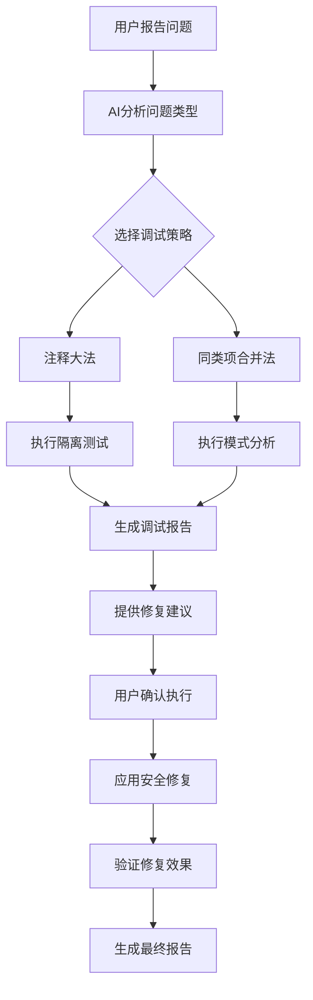

# Debug Assistant — Full Guide

# 🎯 Skills扩展: debug-assistant

Intelligent debugging assistant using isolation and pattern analysis techniques. Supports module isolation testing, error pattern recognition, and safe batch error fixing.

## 🔧 使用方法

```bash
/master skill:debug-assistant [参数]
```

## 📚 原始文档

description: Intelligent debugging assistant using isolation and pattern analysis techniques. Supports module isolation testing, error pattern recognition, and safe batch error fixing.
license: Complete terms in LICENSE.txt

## 📖 详细技术指南

### 🧠 核心调试方法

#### 1. 注释大法 (Isolation Method)
通过注释模块来隔离问题，观察系统行为变化：

```bash
# 自动隔离调试
/master 隔离调试 [模块路径]     # 智能注释模块并测试
/master 调试隔离模式           # 进入交互式隔离调试
/master 恢复隔离模块           # 恢复被注释的模块
```

**工作原理**：
- 自动识别代码块边界（函数、类、配置块）
- 创建带时间戳的备份文件
- 添加条件编译标记或注释
- 运行测试验证隔离效果
- 生成详细的隔离调试报告

#### 2. 同类项合并法 (Pattern Analysis Method)
识别和批量修复相似错误：

```bash
# 错误模式分析
/master 分析错误模式         # 自动识别错误类型和频率
/master 错误统计报告         # 生成错误分布分析图
/master 批量修复 [错误类型]   # 智能批量修复同类错误
```

**工作原理**：
- 收集所有错误日志和测试结果
- 使用AI分类错误类型和严重程度
- 统计错误频率和影响范围
- 识别最高效的修复策略
- 分批次安全应用修复

### 🔒 安全保障机制

#### 备份策略
- **时间戳备份**: 所有修改前自动创建带时间戳的备份
- **增量备份**: 只备份修改的部分，节省存储空间
- **自动清理**: 定期清理过期的备份文件

#### 风险控制
- **渐进式修复**: 小批量验证修复效果，避免连锁反应
- **影响评估**: 分析修复对系统整体的影响
- **回滚机制**: 一键恢复到任意备份点

#### 安全检查
- **语法验证**: 确保修改后的代码语法正确
- **依赖检查**: 验证修改不会破坏模块依赖
- **测试验证**: 自动运行相关测试确保功能正常

### 🎯 调试场景应用

#### 场景1: 复杂系统调试
```bash
# 当遇到复杂系统错误时
/master 隔离调试 problematic_module.js
# 系统会：
# 1. 备份原始文件
# 2. 注释可疑模块
# 3. 运行测试观察变化
# 4. 生成调试报告
```

#### 场景2: 批量错误修复
```bash
# 当发现大量相似错误时
/master 分析错误模式
# 系统会：
# 1. 扫描所有错误日志
# 2. 分类错误类型
# 3. 生成错误分布图
# 4. 建议修复优先级
```

#### 场景3: 配置问题排查
```bash
# 当怀疑配置问题时
/master 调试配置隔离 config.json
# 系统会：
# 1. 备份配置文件
# 2. 逐个注释配置项
# 3. 测试系统响应
# 4. 定位问题配置
```

### 📊 调试报告生成

#### 隔离调试报告
```json
{
  "isolation_report": {
    "target_module": "problematic_module.js",
    "isolation_method": "comment_blocks",
    "backup_created": "2026-01-16_10:30:00",
    "test_results": {
      "before_isolation": "45 errors",
      "after_isolation": "12 errors",
      "error_reduction": "73%",
      "isolation_effective": true
    },
    "recommendations": [
      "模块疑似存在严重问题",
      "建议进一步隔离子模块",
      "考虑重构或重写该模块"
    ]
  }
}
```

#### 错误模式分析报告
```json
{
  "pattern_analysis": {
    "total_errors": 156,
    "error_categories": {
      "TypeError": 45,
      "ReferenceError": 38,
      "SyntaxError": 28,
      "ImportError": 22,
      "ConfigError": 23
    },
    "high_impact_files": [
      {
        "file": "utils/validation.js",
        "error_count": 23,
        "fix_priority": "high"
      }
    ],
    "suggested_fixes": [
      {
        "pattern": "undefined variable access",
        "affected_files": 12,
        "risk_level": "low",
        "fix_method": "add_null_checks"
      }
    ]
  }
}
```

### ⚡ 智能调试流程



### 🎨 用户体验优化

#### 交互式调试
- **智能提示**: 根据错误类型提供调试建议
- **进度显示**: 实时显示调试进度和中间结果
- **一键操作**: 复杂的调试流程只需简单命令

#### 可视化报告
- **错误分布图**: 直观显示错误在文件中的分布
- **影响分析图**: 显示修复对系统整体的影响
- **修复效果图**: 量化显示修复前后的改善程度

### 🔧 高级配置选项

#### 调试策略配置
```json
{
  "debug_strategies": {
    "isolation": {
      "method": "comment_blocks",
      "backup_strategy": "timestamped",
      "test_command": "npm test",
      "max_isolation_depth": 5
    },
    "pattern_analysis": {
      "similarity_threshold": 0.8,
      "batch_fix_limit": 10,
      "safety_checks": true
    }
  }
}
```

#### 风险等级定义
```json
{
  "risk_levels": {
    "low": ["注释修复", "空值检查", "日志添加"],
    "medium": ["批量重命名", "格式修复", "类型转换"],
    "high": ["结构重组", "算法修改", "依赖变更"]
  }
}
```

### 📈 学习与进化

#### 调试模式学习
- **策略效果记录**: 记录不同调试策略的成功率
- **用户偏好学习**: 学习用户的调试习惯和偏好
- **模式识别优化**: 持续改进错误模式识别准确性

#### 自动化改进
- **智能策略选择**: 根据历史数据自动选择最有效的调试策略
- **修复模板库**: 建立常用修复模式的模板库
- **预防性建议**: 基于调试历史提供预防性改进建议

### 🛠️ 最佳实践

#### 调试安全原则
- **备份先行**: 任何修改前必须创建备份
- **小步快跑**: 每次只修改一个小范围，然后测试
- **可逆操作**: 所有操作都支持一键回滚
- **影响评估**: 在应用修复前评估对系统的影响

#### 效率优化建议
- **优先级排序**: 先修复影响最大的错误
- **批量处理**: 对于相似错误，采用批量修复策略
- **模式复用**: 学习和复用成功的调试模式
- **预防为主**: 通过调试经验改进代码质量

### 🔍 故障排除

#### 常见问题解决
- **备份文件过多**: 自动清理过期备份
- **测试运行失败**: 检查测试环境配置
- **权限不足**: 确保对目标文件有读写权限
- **语法错误**: 自动验证修改后的代码语法

#### 性能优化
- **增量扫描**: 只扫描修改的文件和相关依赖
- **缓存机制**: 缓存分析结果避免重复计算
- **并行处理**: 对于大项目，支持并行分析多个文件

---

*🎯 Cursor AI Rules v4.3.0 - 智能调试助手 | 集成注释大法和同类项合并法*

*核心创新*: 将工程实践经验转化为AI驱动的智能调试系统，实现安全、高效、自动化的调试体验！

*🚀 使用方法: `/master skill:debug-assistant` 或 `/master 调试助手`*
