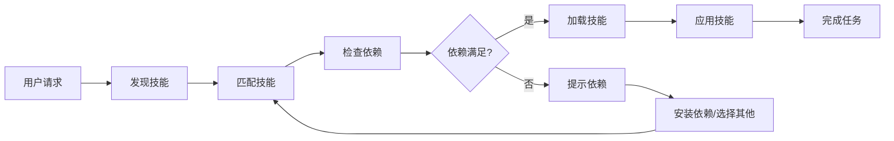

# Skill Dispatcher

智能技能调度器，用于发现、匹配和调用 `.cursor/features/skills/` 目录中的技能。

## 核心功能

### 1. 技能发现 (Skill Discovery)

自动发现和加载项目中的所有可用技能。

#### 发现流程

```bash
# 1. 读取技能注册表
.cursor/features/skills/registry.json

# 2. 扫描技能目录
.cursor/features/skills/*.md

# 3. 解析技能元数据
- name: 技能名称
- description: 技能描述
- category: 技能分类
- dependencies: 依赖关系
- auto_install: 自动安装标志
```

#### 发现命令

使用以下模式发现技能：

```
User: "有什么可用的技能？"
User: "列出所有 skills"
User: "show me all skills"
```

**响应格式**：

```markdown
## 可用技能列表

### 📊 Development (开发)
- **api-design**: API设计能力，包括RESTful、GraphQL等
- **backend-development**: 后端系统设计和开发指导
- **fullstack-development**: 前后端全栈开发指导

### 🧪 Testing (测试)
- **api-testing**: 全面的API测试和验证工具
- **test-automation**: 自动化测试框架和工具
- **webapp-testing**: 使用Playwright进行Web应用测试

### 🔒 Security (安全)
- **security-analysis**: 代码安全漏洞检测和修复
- **vulnerability-scanning**: 安全漏洞扫描和修复建议

... [按分类显示所有技能]
```

### 2. 技能匹配 (Skill Matching)

智能匹配最适合当前任务的技能。

#### 匹配策略

**优先级顺序**：

1. **关键词匹配** - 检查用户请求中的关键词
2. **语义匹配** - 理解任务意图
3. **依赖检查** - 验证技能依赖是否满足
4. **分类匹配** - 基于任务类型匹配分类
5. **自动安装** - 优先匹配 `auto_install: true` 的技能

#### 匹配示例

| 用户请求 | 匹配技能 | 匹配理由 |
|---------|---------|---------|
| "设计一个REST API" | api-design | 关键词: API, REST, 设计 |
| "后端性能优化" | backend-development + optimization-tools | 关键词: 后端, 性能, 优化 |
| "写测试用例" | test-automation | 关键词: 测试, 用例 |
| "检查代码安全" | security-analysis | 关键词: 安全, 检查 |

#### 匹配命令模式

```
User: "我需要 [任务描述]"
→ Dispatcher: "检测到该任务需要 [技能名]，正在调用..."

User: "帮我 [动词] [对象]"
→ Dispatcher: "正在查找匹配的技能..."
```

### 3. 技能调用 (Skill Invocation)

加载和执行匹配的技能。

#### 调用流程

```
1. 读取技能文件 (.cursor/features/skills/[skill-name].md)
2. 解析技能内容和指令
3. 验证依赖关系
4. 应用技能到当前任务
5. 执行技能定义的工作流
```

#### 调用语法

```markdown
## 调用技能: [skill-name]

读取技能文件: `.cursor/features/skills/[skill-name].md`

应用技能指导...

[按照技能的指令执行任务]
```

#### 技能委托

当任务需要多个技能时：

```markdown
## 技能组合调用

主要技能: backend-development
辅助技能: api-design, optimization-tools

执行顺序:
1. backend-development → 设计整体架构
2. api-design → 设计API接口
3. optimization-tools → 性能优化
```

## 使用指南

### 主动模式

当用户请求技能相关任务时，自动执行：

```markdown
User: "我需要设计一个用户认证系统"

Dispatcher:
✓ 检测到任务: 用户认证系统设计
✓ 匹配技能: api-design, security-analysis, backend-development
✓ 加载技能内容...
✓ 应用综合指导...
```

### 被动模式

当用户询问技能信息时：

```markdown
User: "你有什么技能可以帮助我？"

Dispatcher:
扫描 .cursor/features/skills/ 目录...

发现 30+ 个可用技能，分为以下分类:
- Development (开发)
- Testing (测试)
- Security (安全)
- ...

需要哪个类别的详细信息？
```

### 直接调用模式

用户明确指定技能：

```markdown
User: "@skill-dispatcher 调用 backend-development"

Dispatcher:
正在加载 backend-development 技能...
读取 .cursor/features/skills/backend-development.md
✓ 技能已加载，现在可以提供后端开发指导
```

## 技能分类

从 `registry.json` 读取的技能分类：

### Development (开发)
- api-design
- backend-development
- fullstack-development
- web-artifacts-builder

### Testing (测试)
- api-testing
- test-automation
- webapp-testing

### Security (安全)
- security-analysis
- vulnerability-scanning

### Analysis (分析)
- code-analysis
- performance-analysis
- system-analysis

### Optimization (优化)
- optimization-tools
- refactoring-tools
- ssr-optimization

### Documentation (文档)
- documentation-tools
- docx, pdf, pptx, xlsx

### Collaboration (协作)
- git-management

### Learning (学习)
- code-examples
- learning-assistant

## 技能元数据查询

查询特定技能的详细信息：

```markdown
User: "告诉我 api-design 技能的信息"

Dispatcher:
## 技能: api-design

**名称**: API设计
**描述**: 专业的API设计能力，包括RESTful、GraphQL等
**分类**: development
**自动安装**: 是
**依赖**: javascript, nodejs
**文件路径**: .cursor/features/skills/api-design.md
**来源**: cursor-ai-rules

技能功能:
- RESTful API 设计
- GraphQL API 开发
- 微服务架构设计
- API 文档生成

需要加载此技能吗？
```

## 依赖检查

在调用技能前验证依赖：

```markdown
调用前检查:
✓ javascript - 已检测到
✓ nodejs - 已检测到
✓ 所有依赖满足

正在加载 api-design 技能...
```

## 技能组合

对于复杂任务，组合多个技能：

```markdown
User: "构建一个完整的Web应用"

Dispatcher 分析:
任务复杂度: 高
需要技能组合:

1. **fullstack-development** (主技能)
   - 提供全栈开发框架

2. **frontend-design** (辅助)
   - 设计前端界面

3. **backend-development** (辅助)
   - 构建后端API

4. **api-testing** (验证)
   - 测试API接口

5. **security-analysis** (安全)
   - 确保应用安全

正在依次加载和应用这些技能...
```

## 错误处理

### 技能未找到

```markdown
Dispatcher: ⚠️ 技能 "nonexistent-skill" 未找到

可用技能: [列出所有可用技能]
是否需要相似技能推荐?
```

### 依赖缺失

```markdown
Dispatcher: ⚠️ 技能 "api-design" 需要以下依赖:

缺少: nodejs

建议:
1. 安装 Node.js
2. 或选择其他不依赖 nodejs 的技能
```

### 技能加载失败

```markdown
Dispatcher: ❌ 加载技能失败

文件: .cursor/features/skills/skill-name.md
错误: [具体错误信息]

建议操作:
- 检查文件是否存在
- 验证文件格式
```

## 最佳实践

### 技能选择原则

1. **优先自动安装** - 优先使用 `auto_install: true` 的技能
2. **满足依赖** - 确保项目满足技能的依赖要求
3. **分类匹配** - 根据任务类型选择合适的分类
4. **组合使用** - 复杂任务可以组合多个技能

### 调用时机

- 用户明确请求某个技能类型
- 任务描述包含技能关键词
- 用户询问可用技能列表
- 需要特定领域的专业知识

### 调用顺序

对于多技能任务：

1. 先调用**主技能**（核心功能）
2. 再调用**辅助技能**（支持功能）
3. 最后调用**验证技能**（测试和质量）

## 技能生命周期



## 相关资源

- **技能注册表**: `.cursor/features/skills/registry.json`
- **技能目录**: `.cursor/features/skills/`
- **技能参考**: `.cursor/features/skills/reference/`

---

**版本**: 1.0.0  
**注册表版本**: 2.0.0  
**支持的技能数量**: 30+  
**最后更新**: 2026-02-07
